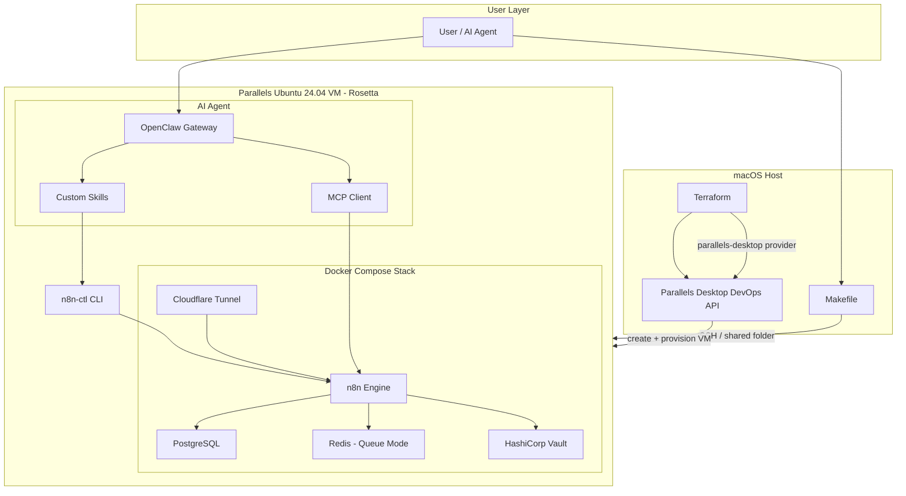
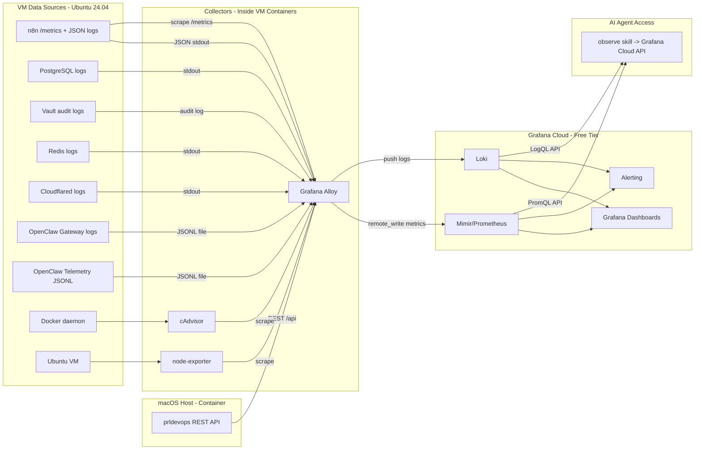
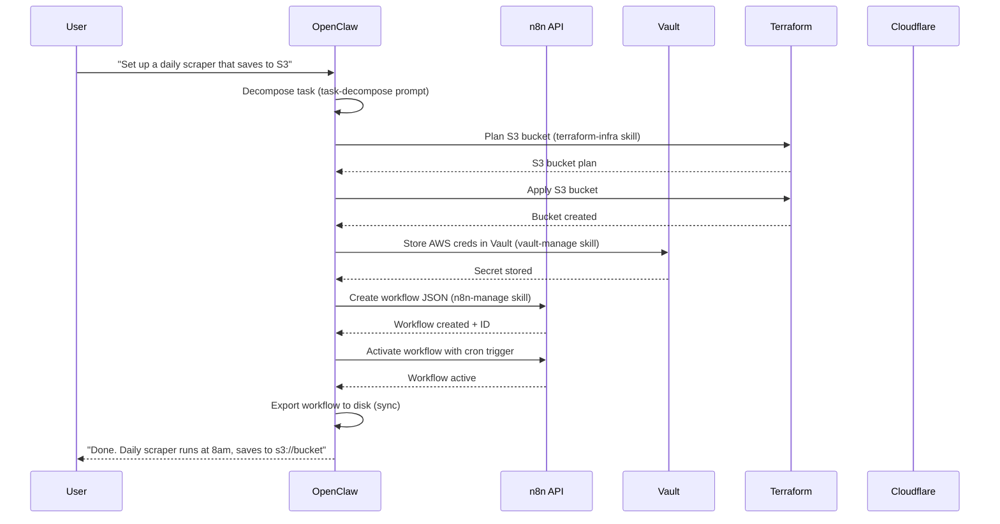
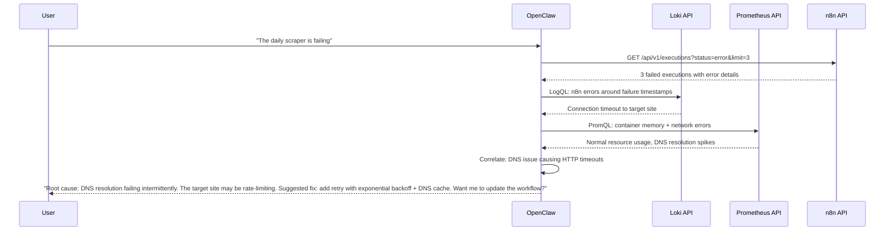
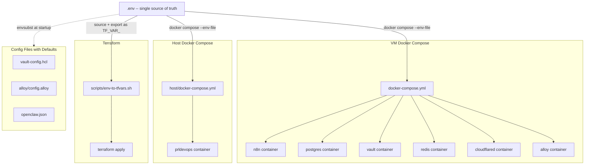

# AI-Native Personal n8n Automation System

## Architecture Overview

The system has five layers: **Infrastructure** (Docker containers), **Automation Engine** (n8n), **Secrets/State** (Vault + Terraform), **AI Agent** (OpenClaw), and **CLI/Makefile** (developer interface). Everything is versioned in a single Git repo and reproducible via `make up`.




---

## 1. Repository Structure

```
n8n/
├── Makefile                        # All slash commands and orchestration
├── docker-compose.yml              # 9-service stack: n8n, postgres, vault, vault-init, cloudflared, redis, alloy, cadvisor, node-exporter
├── .env.example                    # Template for secrets (never committed)
├── .env                            # Local secrets (gitignored)
├── .gitignore
├── README.md
│
├── config/
│   ├── vault/
│   │   ├── vault-config.hcl        # Vault server config (file storage, listener)
│   │   ├── policies/
│   │   │   └── n8n-policy.hcl      # Vault policy for n8n access
│   │   └── init.sh                 # Auto-unseal + KV engine + seed secrets
│   ├── postgres/
│   │   └── init.sql                # DB initialization
│   ├── alloy/
│   │   └── config.alloy            # Alloy pipeline: scrape + relay to Grafana Cloud
│   └── grafana-cloud/
│       ├── dashboards/             # Exported JSON dashboards (versioned, auto-provisioned)
│       │   ├── n8n-overview.json   # Workflow metrics dashboard
│       │   ├── infrastructure.json # Container + VM metrics
│       │   ├── openclaw-agent.json # OpenClaw tool calls, LLM cost, sessions
│       │   ├── parallels-host.json # Parallels VM + macOS host metrics
│       │   └── logs-explorer.json  # Log exploration
│       ├── alert-rules.yaml        # Grafana Cloud alerting rules (provisioned via API)
│       └── provisioner.sh          # Script to push dashboards + alerts to Grafana Cloud via API
│
├── terraform/                      # Infrastructure as Code
│   ├── main.tf                     # Root module (composes all modules)
│   ├── variables.tf
│   ├── outputs.tf
│   ├── providers.tf                # Parallels, Cloudflare, AWS, GitHub providers
│   ├── modules/
│   │   ├── parallels-vm/           # Parallels Desktop Ubuntu 24.04 VM
│   │   │   ├── main.tf             # VM resource + provisioning scripts
│   │   │   ├── variables.tf
│   │   │   ├── outputs.tf
│   │   │   └── scripts/
│   │   │       └── provision.sh    # VM bootstrap: Docker, Node 22, OpenClaw, etc.
│   │   ├── cloudflare/             # Tunnel, DNS, WAF rules
│   │   │   ├── main.tf
│   │   │   └── variables.tf
│   │   ├── s3/                     # S3 buckets for workflow assets
│   │   │   ├── main.tf
│   │   │   └── variables.tf
│   │   └── github/                 # GitHub repo for assets
│   │       ├── main.tf
│   │       └── variables.tf
│
├── shared/                         # ONLY directory shared with the VM (via Parallels shared folder)
│   ├── workflows/                  # Version-controlled n8n workflows (JSON)
│   │   └── .gitkeep
│   ├── credentials/                # Encrypted credential exports (gitignored)
│   │   └── .gitkeep
│   └── exchange/                   # Ephemeral file exchange between host and VM
│       └── .gitkeep
│
├── host/                           # macOS host-only files (NOT shared with VM)
│   ├── docker-compose.yml          # prldevops container
│   └── prldevops-config.yaml       # DevOps service config
│
├── data/                           # Bind-mount volumes (gitignored, created by docker compose)
│   ├── postgres/                   # PostgreSQL data
│   ├── vault/                      # Vault file storage
│   ├── n8n/                        # n8n user data
│   └── redis/                      # Redis persistence
│
├── backups/                        # Backup storage (gitignored)
│   └── .gitkeep
│
├── scripts/                        # Operational scripts (synced into VM via SCP)
│   ├── n8n-ctl.sh                  # Main CLI wrapper (n8n API + workflow sync)
│   ├── sync-workflows.sh           # Export/import workflows to/from disk
│   ├── health-check.sh             # Stack health verification
│   ├── backup.sh                   # Full backup (DB + workflows + vault snapshot)
│   ├── env-to-tfvars.sh            # Maps .env vars to TF_VAR_ exports (no separate tfvars needed)
│   └── openclaw-setup.sh           # Pulls secrets from Vault, templates openclaw.json, starts daemon
│
├── openclaw/                       # OpenClaw AI agent configuration
│   ├── workspace/
│   │   ├── AGENTS.md               # System prompt for AI agent
│   │   ├── SOUL.md                 # Agent personality/behavior
│   │   ├── TOOLS.md                # Available tools documentation
│   │   └── skills/
│   │       ├── n8n-manage/
│   │       │   └── SKILL.md        # Skill: manage n8n workflows
│   │       ├── n8n-debug/
│   │       │   └── SKILL.md        # Skill: debug and inspect workflows
│   │       ├── observe/
│   │       │   └── SKILL.md        # Skill: query logs, metrics, health
│   │       ├── vault-manage/
│   │       │   └── SKILL.md        # Skill: manage Vault secrets
│   │       ├── terraform-infra/
│   │       │   └── SKILL.md        # Skill: manage Terraform resources
│   │       └── system-ops/
│   │           └── SKILL.md        # Skill: stack lifecycle management
│   └── openclaw.json               # OpenClaw configuration
│
├── prompts/                        # AI prompt templates
│   ├── workflow-design.md          # Prompt: design a new workflow from idea
│   ├── workflow-debug.md           # Prompt: debug a failing workflow
│   ├── resource-plan.md            # Prompt: plan infrastructure for a task
│   └── task-decompose.md           # Prompt: break user idea into n8n workflows
│
└── docs/
    ├── architecture.md
    ├── setup-guide.md
    ├── operations.md
    └── observability.md
```

---

## 2. Docker Compose Stack

Two compose files: one inside the VM (`docker-compose.yml`), one on the macOS host (`host/docker-compose.yml`).

### VM Docker Compose (`docker-compose.yml`) -- 9 services


| Service         | Image                           | Purpose                                      | Port            |
| --------------- | ------------------------------- | -------------------------------------------- | --------------- |
| `n8n`           | `n8nio/n8n:latest`              | Workflow engine                              | 5678            |
| `postgres`      | `postgres:16-alpine`            | n8n persistent DB                            | 5432 (internal) |
| `vault`         | `hashicorp/vault:latest`        | Secrets management                           | 8200            |
| `vault-init`    | `hashicorp/vault:latest`        | One-shot: unseal + seed                      | -               |
| `cloudflared`   | `cloudflare/cloudflared:latest` | Tunnel for webhooks                          | -               |
| `redis`         | `redis:7-alpine`                | Queue mode for n8n                           | 6379 (internal) |
| `alloy`         | `grafana/alloy:latest`          | Collect logs+metrics, relay to Grafana Cloud | - (internal)    |
| `cadvisor`      | `gcr.io/cadvisor/cadvisor`      | Container metrics (scraped by Alloy)         | 8080 (internal) |
| `node-exporter` | `prom/node-exporter:latest`     | VM system metrics (scraped by Alloy)         | 9100 (internal) |


**Removed from local stack** (offloaded to Grafana Cloud free tier):

- ~~Grafana~~ -- dashboards + alerting now in Grafana Cloud
- ~~Loki~~ -- log storage now in Grafana Cloud Loki
- ~~Prometheus~~ -- metric storage now in Grafana Cloud Mimir
- ~~Alertmanager~~ -- alerting now in Grafana Cloud Alerting

### macOS Host Docker Compose (`host/docker-compose.yml`) -- 1 service


| Service     | Image                          | Purpose                                  | Port |
| ----------- | ------------------------------ | ---------------------------------------- | ---- |
| `prldevops` | `parallels/prl-devops-service` | Parallels DevOps API (VM mgmt + metrics) | 8080 |


The `prldevops` container runs on the Mac host (not inside the VM). It exposes the REST API on port 8080 that the Terraform provider talks to, and also exposes VM metrics (CPU load, memory load, disk I/O, power state) that Alloy inside the VM scrapes via `http://HOST_IP:8080/api/...`.

### Data Persistence (Bind Mounts)

All stateful services use bind mounts to `./data/` for easy backup and visibility:

```yaml
volumes:
  # Per-service bind mounts
  postgres: ./data/postgres:/var/lib/postgresql/data
  vault:    ./data/vault:/vault/file
  n8n:      ./data/n8n:/home/node/.n8n
  redis:    ./data/redis:/data
```

The `data/` directory is gitignored. Created automatically on first `docker compose up`.

### Key design decisions:

- **PostgreSQL** over SQLite for production reliability and concurrent access
- **Vault in dev mode** for local use (auto-unsealed, in-memory or file storage). For production, switch to file storage + auto-unseal via `config/vault/vault-config.hcl`
- **Redis** enables n8n queue mode for parallel execution
- **Cloudflare Tunnel** runs as a sidecar, routing `n8n.yourdomain.com` to `http://n8n:5678`
- **Grafana Cloud** for all observability storage, dashboards, and alerting (free tier: 10k metric series, 50GB logs/month, 14 days retention)
- **Grafana Alloy** is the single relay container: scrapes n8n `/metrics`, cAdvisor, node-exporter, prldevops API, and Docker container logs, then `remote_write` to Grafana Cloud
- **Nothing runs directly on the macOS host** except `prldevops` in a container
- n8n connects to Vault via `VAULT_ADDR=http://vault:8200` for external secrets
- n8n environment: `N8N_PUBLIC_API_DISABLED=false`, `EXECUTIONS_MODE=queue`, `QUEUE_BULL_REDIS_HOST=redis`, `WEBHOOK_URL=https://n8n.yourdomain.com/`
- n8n observability env: `N8N_METRICS=true`, `N8N_METRICS_INCLUDE_QUEUE_METRICS=true`, `N8N_METRICS_INCLUDE_WORKFLOW_ID_LABEL=true`, `N8N_METRICS_INCLUDE_NODE_TYPE_LABEL=true`, `N8N_METRICS_INCLUDE_API_ENDPOINTS=true`, `N8N_LOG_LEVEL=info`, `N8N_LOG_FORMAT=json` (structured JSON logs for Grafana Cloud Loki)

---

## 3. HashiCorp Vault Setup

- **KV v2 secrets engine** at path `secret/n8n/`
- **Vault policy** `n8n-policy.hcl` grants n8n read-only access to `secret/data/n8n/*`
- **Init script** (`config/vault/init.sh`): enables KV engine, creates policy, generates AppRole or token for n8n
- n8n accesses Vault via its **External Secrets** feature (Settings > External Secrets > HashiCorp Vault)
- Secret naming: `secret/n8n/{credential_name}` with underscore-separated keys (n8n constraint: alphanumeric + underscore only)

---

## 4. Cloudflare Tunnel

- **Token-based tunnel** (remotely managed) -- all ingress rules configured in the Cloudflare dashboard, no local config file needed
- Tunnel token set via `CLOUDFLARE_TUNNEL_TOKEN` in `.env`
- User creates tunnel in Cloudflare dashboard or via `cloudflared tunnel create`
- Ingress maps: `n8n.yourdomain.com -> http://n8n:5678` for both UI and webhooks (configured in dashboard)
- Terraform module (`terraform/modules/cloudflare/`) manages DNS records as code
- Webhook URL env: `WEBHOOK_URL=https://n8n.yourdomain.com/`
- The `cloudflared` container runs with `tunnel run --token ${CLOUDFLARE_TUNNEL_TOKEN}` -- no local `config.yml` required

Setup steps for user (guided):

1. Log in to Cloudflare dashboard > Zero Trust > Tunnels
2. Create a tunnel named `n8n-local`, configure ingress rule: `n8n.yourdomain.com -> http://n8n:5678`
3. Copy the tunnel token to `.env` as `CLOUDFLARE_TUNNEL_TOKEN`
4. `make up` handles the rest

---

## 5. Workflow Versioning

**Sync mechanism** (`scripts/sync-workflows.sh`):

- **Export**: Calls n8n REST API `GET /api/v1/workflows` to fetch all workflows, saves each as `shared/workflows/{workflow-name}.json` (pretty-printed, sorted keys for clean diffs)
- **Import**: Reads `shared/workflows/*.json`, calls `POST /api/v1/workflows` or `PUT /api/v1/workflows/{id}` to sync back
- **Git hooks**: Optional pre-commit hook that auto-exports before commit
- **Makefile targets**: `make workflows-export`, `make workflows-import`, `make workflows-diff`

Credentials are NOT exported to disk in plaintext. They reference Vault paths.

---

## 6. Makefile / Slash Commands

All operations via `make` targets:

**Configuration:**

- `make check-env` -- Validate all required variables are set in `.env` (runs automatically before `make up`)
- `make generate-secrets` -- Auto-generate random values for internal secrets (Postgres, Vault, n8n encryption key)

**Lifecycle (VM + Stack):**

- `make up` -- Full bootstrap: `check-env` + `terraform apply` (creates VM if needed, provisions, starts Docker stack inside VM)
- `make start` -- Start existing VM + Docker stack (no Terraform, just `prlctl start` + `docker compose up`)
- `make stop` -- Stop Docker stack + suspend VM
- `make down` -- Stop Docker stack gracefully (VM stays running)
- `make destroy` -- Full teardown: Terraform destroy (on_destroy_script + remove VM + cloud resources)
- `make restart` -- Restart Docker stack inside VM
- `make status` -- Show VM state, container health, n8n version, Vault seal status

**VM Management:**

- `make vm-create` -- Create + provision VM only (Terraform target)
- `make vm-destroy` -- Destroy VM only
- `make vm-ssh` -- SSH into the VM (`ssh -p 2222 parallels@localhost`)
- `make vm-status` -- VM health from DevOps API
- `make vm-reprovision` -- Re-run provisioning scripts on existing VM

**Workflow Management:**

- `make workflow-add NAME="my-workflow"` -- Create new workflow from template via API, export to disk
- `make workflow-update NAME="my-workflow"` -- Push local JSON changes to running n8n
- `make workflow-delete NAME="my-workflow"` -- Delete workflow (with confirmation)
- `make workflow-archive NAME="my-workflow"` -- Deactivate + tag as archived
- `make workflow-disable NAME="my-workflow"` -- Deactivate workflow
- `make workflow-enable NAME="my-workflow"` -- Activate workflow
- `make workflow-trigger NAME="my-workflow"` -- Manually execute a workflow
- `make workflow-list` -- List all workflows with status
- `make workflows-export` -- Sync all workflows from n8n to disk
- `make workflows-import` -- Sync all workflows from disk to n8n

**Debugging / Logs:**

- `make logs [SERVICE=n8n]` -- Tail container logs
- `make workflow-logs NAME="my-workflow"` -- Fetch recent executions from API
- `make workflow-debug NAME="my-workflow"` -- Show last execution with error details
- `make health` -- Run health checks across all services

**Secrets:**

- `make vault-ui` -- Open Vault UI in browser
- `make vault-set KEY=name VALUE=secret` -- Write secret to Vault
- `make vault-get KEY=name` -- Read secret from Vault
- `make vault-list` -- List all n8n secrets in Vault

**Infrastructure:**

- `make tf-init` -- Initialize Terraform
- `make tf-plan` -- Preview infrastructure changes
- `make tf-apply` -- Apply infrastructure changes
- `make tf-destroy` -- Tear down managed infrastructure

**Backup:**

- `make backup` -- Full backup (DB dump + workflow export + Vault snapshot)
- `make restore BACKUP=path` -- Restore from backup

**AI Agent:**

- `make agent MSG="..."` -- Send a message to OpenClaw via CLI (SSH into VM, invoke `openclaw chat`)

**Internal (called by other targets, not typically invoked directly):**

- `make setup-noninteractive` -- Runs inside VM: `docker compose up -d`, wait for Vault, run `openclaw-setup.sh`, health check. Called by `make up` after VM sync.
- `make vm-sync` -- Rsync repo files (docker-compose, config, scripts, openclaw, prompts) from host to VM via SSH. Excludes `.env`, `.terraform/`, `terraform.tfstate*`, `.git/`, `host/`, `data/`, `backups/`.
- `make vault-seed` -- Write OpenClaw API key and other agent secrets from `.env` into Vault via the port-forwarded API (host-side, runs after `docker compose up` inside VM).

---

## 7. Terraform Modules

Four modules in `terraform/modules/`:

### parallels-vm/ -- Parallels Desktop Ubuntu 24.04 VM (Ansible NOT needed)

Uses the official `[parallels/parallels-desktop](https://registry.terraform.io/providers/Parallels/parallels-desktop/latest/docs)` Terraform provider (requires **Parallels Desktop Pro or Business edition**).

**Architecture:** Two-step process:

1. `parallels-desktop_deploy` resource installs the Parallels DevOps API on the macOS host (via SSH to localhost). This API is the control plane Terraform talks to.
2. `parallels-desktop_remote_vm` resource creates the Ubuntu 24.04 VM with full lifecycle management.

**Why Ansible is NOT needed:** The `parallels-desktop_remote_vm` resource has a `post_processor_script` block that runs arbitrary shell commands inside the VM after creation, with retry support. For provisioning a single VM, this is cleaner than adding an Ansible dependency. Everything stays in one Terraform state.

**Key VM configuration:**

```hcl
resource "parallels-desktop_remote_vm" "n8n_worker" {
  host       = "http://localhost:8080"  # local DevOps API
  name       = "n8n-ai-worker"
  catalog_id = "ubuntu-24.04-arm64"

  config {
    start_headless    = true
    enable_rosetta    = true       # x86_64 binary support
    auto_start_on_host = true      # survives host reboot
  }

  specs {
    cpu_count   = "4"
    memory_size = "8192"           # 8 GB RAM
  }

  # Port forwarding: SSH, n8n, Vault, OpenClaw Gateway
  reverse_proxy_host {
    port = "2222"
    tcp_route { target_port = "22" }
  }
  reverse_proxy_host {
    port = "5678"
    tcp_route { target_port = "5678" }
  }
  reverse_proxy_host {
    port = "8200"
    tcp_route { target_port = "8200" }
  }
  reverse_proxy_host {
    port = "18789"
    tcp_route { target_port = "18789" }
  }
  # No Grafana/Prometheus ports -- dashboards are in Grafana Cloud

  # ONLY share the /shared subdirectory -- no host data leaks into VM
  shared_folder {
    name = "n8n_shared"
    path = "/Users/sumitagrawal/CODE/sumit/n8n/shared"
  }
  # VM sees this at: /media/psf/n8n_shared (Parallels default mount)
  # The rest of the repo (Terraform, .env, host configs) is NOT visible to the VM

  # Base provisioning -- installs packages only. Repo files delivered via SCP (make vm-sync).
  post_processor_script {
    retry {
      attempts              = 3
      wait_between_attempts = "15s"
    }
    inline = [
      "#!/bin/bash",
      "set -euo pipefail",
      # System updates
      "sudo apt-get update && sudo apt-get upgrade -y",
      # Docker
      "curl -fsSL https://get.docker.com | sudo sh",
      "sudo usermod -aG docker $USER",
      # Docker Compose plugin
      "sudo apt-get install -y docker-compose-plugin",
      # Node.js 22 (for OpenClaw)
      "curl -fsSL https://deb.nodesource.com/setup_22.x | sudo -E bash -",
      "sudo apt-get install -y nodejs",
      # Utilities
      "sudo apt-get install -y jq git curl make rsync",
      # OpenClaw
      "sudo npm install -g openclaw@latest",
      # Create project directory (files arrive via SCP in next step)
      "mkdir -p /home/parallels/n8n",
    ]
  }
  # NOTE: After VM creation, `make up` runs:
  #   1. make vm-sync  -- SCP/rsync repo files (docker-compose, config, scripts, etc.) into VM
  #   2. SSH: make setup-noninteractive  -- docker compose up, vault init, openclaw-setup.sh

  on_destroy_script {
    retry { attempts = 2; wait_between_attempts = "5s" }
    inline = [
      "cd /home/parallels/n8n && make destroy || true"
    ]
  }

  keep_running = true
}
```

**Makefile targets for VM lifecycle:**

- `make vm-create` -- `terraform apply -target=module.parallels_vm` (creates + provisions VM)
- `make vm-destroy` -- `terraform destroy -target=module.parallels_vm` (runs on_destroy_script, then removes VM)
- `make vm-ssh` -- `ssh -p 2222 parallels@localhost` (connect to running VM)
- `make vm-status` -- Query Parallels DevOps API for VM health

### cloudflare/ -- Manages:

- Cloudflare Tunnel resource
- DNS CNAME records (`n8n.yourdomain.com`)
- WAF rules (optional rate limiting on webhook endpoints)
- Page rules (cache bypass for API)

### s3/ -- Manages:

- S3 bucket for workflow assets/artifacts
- Bucket policy and lifecycle rules
- IAM user/role for n8n S3 node access

### github/ -- Manages:

- GitHub repository for workflow assets
- Branch protection rules
- Webhook for CI integration

All state stored locally in `terraform/terraform.tfstate` (gitignored) or remote backend (configurable).

---

## 8. Observability Stack (AI-Native)

The observability layer serves two audiences: **the human** (via Grafana dashboards) and **the AI agent** (via REST APIs). Every component exposes a queryable API so the OpenClaw agent can programmatically diagnose issues without needing a browser.

### Architecture




### Components

**Grafana Alloy** (single relay container inside VM):

- Unified OpenTelemetry collector -- the ONLY observability container that does heavy lifting
- Scrapes all Docker container stdout/stderr via Docker socket mount (logs)
- Scrapes n8n `/metrics`, cAdvisor `/metrics`, node-exporter `/metrics` (metrics)
- Scrapes prldevops REST API on macOS host for VM metrics (via host IP)
- Scrapes OpenClaw JSONL logs (gateway + telemetry files)
- `prometheus.remote_write` -> Grafana Cloud Mimir endpoint
- `loki.write` -> Grafana Cloud Loki endpoint
- Credentials injected via env: `GRAFANA_CLOUD_PROMETHEUS_URL`, `GRAFANA_CLOUD_LOKI_URL`, `GRAFANA_CLOUD_USER`, `GRAFANA_CLOUD_API_KEY`
- Config: `config/alloy/config.alloy`

**Grafana Cloud** (free tier -- replaces 4 local containers):

- **Mimir/Prometheus**: 10,000 active metric series, 14 days retention
- **Loki**: 50 GB logs/month, 14 days retention
- **Grafana**: dashboards pre-provisioned via HTTP API from versioned JSON in `config/grafana-cloud/dashboards/`
- **Alerting**: rules provisioned via HTTP API from versioned YAML in `config/grafana-cloud/alert-rules.yaml`
- AI agent queries via [Grafana Cloud HTTP API](https://grafana.com/docs/grafana-cloud/developer-resources/api-reference/):
  - PromQL: `POST https://<PROM_URL>/api/v1/query` (with basic auth)
  - LogQL: `POST https://<LOKI_URL>/loki/api/v1/query_range` (with basic auth)
- `make dashboards-push` and `make alerts-push` provision everything from the repo to Grafana Cloud (idempotent, versioned)

**cAdvisor** (container metrics):

- Exposes per-container CPU, memory, network, filesystem usage
- Scraped by Alloy, relayed to Grafana Cloud
- Lightweight, single binary

**node-exporter** (host/VM metrics):

- Exposes Ubuntu VM system metrics (CPU, RAM, disk, network)
- Scraped by Alloy, relayed to Grafana Cloud

### OpenClaw (moltbot) Monitoring

OpenClaw exposes rich telemetry across three surfaces:

**1. Gateway Logs (JSONL file):**

- Rolling daily logs at `~/.openclaw/logs/openclaw-YYYY-MM-DD.log` (JSONL format)
- Configurable log levels: file (`logging.level`) and console (`logging.consoleLevel`)
- Per-subsystem filtering (e.g., `openclaw channels logs --channel whatsapp`)
- Alloy scrapes this file and pushes to Loki with labels `{service="openclaw", subsystem="..."}`

**2. Telemetry Plugin ([knostic/openclaw-telemetry](https://github.com/knostic/openclaw-telemetry)):**

- Installed as an OpenClaw plugin, writes to `~/.openclaw/logs/telemetry.jsonl`
- Captures every event the AI agent performs:
  - `tool.start` / `tool.end` -- every tool invocation with params, success/failure, duration
  - `llm.usage` -- every LLM API call with model, tokens, cost, duration
  - `message.in` / `message.out` -- every inbound/outbound message
  - `agent.start` / `agent.end` -- agent session lifecycle
- Built-in sensitive data redaction (API keys, tokens, passwords)
- Cryptographic hash chain for tamper detection
- Rate limiting (token bucket, 100 events/sec default)
- Log rotation (10MB default, 5 files, gzip compressed)
- Alloy scrapes this JSONL file and pushes to Loki with labels `{service="openclaw_telemetry", event_type="..."}`

**3. Health Checks (CLI + WebSocket):**

- `openclaw status` -- gateway reachability, session count, recent activity
- `openclaw status --deep` -- per-channel diagnostics (WhatsApp, Telegram, etc.)
- `openclaw health --json` -- full health snapshot (credential age, channel probes, session store)
- `/status` chat command for agent-based health replies
- Usage tracking: `openclaw status --usage` for per-provider token/cost breakdowns

**OpenClaw configuration for monitoring** (`openclaw/openclaw.json`):

```json
{
  "logging": {
    "level": "info",
    "consoleLevel": "warn"
  },
  "plugins": {
    "entries": {
      "telemetry": {
        "enabled": true,
        "config": {
          "enabled": true,
          "redact": { "enabled": true },
          "integrity": { "enabled": true },
          "rateLimit": { "enabled": true, "maxEventsPerSecond": 100 },
          "rotate": { "enabled": true, "maxSizeBytes": 52428800, "maxFiles": 10 }
        }
      }
    }
  }
}
```

**Grafana dashboard: "OpenClaw Agent Activity":**

- Tool call frequency and duration (from telemetry JSONL)
- LLM token usage and cost over time
- Agent session count and duration
- Failed tool calls and error patterns
- Message throughput (in/out per channel)

**AI agent self-monitoring queries:**

- "How much have I spent on LLM calls today?" -> `jq 'select(.type=="llm.usage") | .costUsd' telemetry.jsonl | sum`
- "Which tool calls are failing?" -> `jq 'select(.type=="tool.end" and .success==false)'`
- "Show my session activity" -> `jq 'select(.sessionKey=="telegram:123")'`

### Parallels Desktop Monitoring (macOS Host -- All Containerized)

`prldevops` runs as a **Docker container on the macOS host** (`host/docker-compose.yml`). Nothing runs directly on the host. The prldevops container has access to `prlctl` and `prl_perf_ctl` via the Parallels Desktop installation, and exposes a REST API.

**prldevops container setup (on macOS host):**

```yaml
# host/docker-compose.yml
services:
  prldevops:
    image: parallels/prl-devops-service:latest
    restart: unless-stopped
    ports:
      - "8080:80"
    volumes:
      - /var/run:/var/run    # Access to Parallels socket
    environment:
      - ROOT_PASSWORD=${PRLDEVOPS_ROOT_PASSWORD}
      - LOG_LEVEL=INFO
```

**Data exposed via prldevops REST API:**

- `GET /api/health/probe` -- service health
- `GET /api/v1/vms` -- list all VMs with state, CPU, memory, disk
- `GET /api/v1/vms/{id}/status` -- individual VM status (CPU load, memory load, disk I/O, power state)
- `GET /api/diagnostics` -- infrastructure health

**How Alloy (inside VM) scrapes the macOS host:**

Alloy reaches the prldevops API via the VM's default gateway (the Mac host). Parallels networking exposes the host at a known IP (e.g., `10.211.55.2` or configurable). Alloy config:

```
// config/alloy/config.alloy (Parallels section)
prometheus.scrape "prldevops" {
  targets    = [{"__address__" = "${HOST_IP}:8080"}]
  forward_to = [prometheus.remote_write.grafana_cloud.receiver]
  metrics_path = "/api/v1/metrics"  // or custom endpoint
  scrape_interval = "15s"
}
```

**Grafana Cloud dashboard: "Parallels Desktop / VM Host":**

- VM CPU and memory load
- VM disk I/O rates
- VM network throughput
- VM state (running/stopped/suspended)
- Provisioned automatically via `make dashboards-push`

**Grafana Cloud alert rules for Parallels:**


| Alert          | Condition                     | Severity |
| -------------- | ----------------------------- | -------- |
| `VMStopped`    | VM state != running for 1min  | critical |
| `VMHighCPU`    | VM CPU load > 90% for 5min    | warning  |
| `VMHighMemory` | VM memory load > 90% for 5min | warning  |


Provisioned automatically via `make alerts-push`.

**AI agent queries for Parallels (via Grafana Cloud API):**

- "Is my VM healthy?" -> PromQL query to Grafana Cloud
- "Why is everything slow?" -> correlate VM metrics + container metrics + n8n queue depth

All dashboards and alerts are **version-controlled as JSON/YAML** in the repo and auto-provisioned to Grafana Cloud via the HTTP API. Zero manual dashboard creation.

- **5 pre-built dashboards** in `config/grafana-cloud/dashboards/`:
  - **n8n Overview** (`n8n-overview.json`): workflow executions, success/failure rate, queue depth, execution duration histograms
  - **Infrastructure** (`infrastructure.json`): container CPU/memory (cAdvisor), VM system metrics (node-exporter)
  - **OpenClaw Agent Activity** (`openclaw-agent.json`): tool calls, LLM usage/cost, session lifecycle, message throughput, failed tools
  - **Parallels Desktop / VM Host** (`parallels-host.json`): VM CPU/memory/disk/network, VM state
  - **Logs Explorer** (`logs-explorer.json`): filterable by service, level, time range
- **Alert rules** in `config/grafana-cloud/alert-rules.yaml` (17 rules total)
- **Provisioning**: `make dashboards-push` calls Grafana Cloud API to create/update all dashboards; `make alerts-push` does the same for alerts. Both are idempotent and run automatically during `make up`.
- **Alerting**: Grafana Cloud alerts notify via webhook -> n8n workflow -> OpenClaw/Telegram/Slack
- Accessible at `https://<your-stack>.grafana.net` (Grafana Cloud URL)

### n8n Observability Configuration

All enabled via environment variables in docker-compose:

```yaml
# n8n service environment (observability-related)
N8N_METRICS: "true"
N8N_METRICS_INCLUDE_DEFAULT_METRICS: "true"
N8N_METRICS_INCLUDE_QUEUE_METRICS: "true"
N8N_METRICS_INCLUDE_WORKFLOW_ID_LABEL: "true"
N8N_METRICS_INCLUDE_NODE_TYPE_LABEL: "true"
N8N_METRICS_INCLUDE_CREDENTIAL_TYPE_LABEL: "true"
N8N_METRICS_INCLUDE_API_ENDPOINTS: "true"
N8N_LOG_LEVEL: "info"            # info for prod, debug for troubleshooting
N8N_LOG_FORMAT: "json"           # structured JSON for Loki ingestion
N8N_LOG_OUTPUT: "console"        # stdout -> Docker -> Alloy -> Loki
```

Key n8n metrics exposed at `/metrics`:

- `n8n_workflow_execution_total{status="success|error"}` -- execution count by status
- `n8n_workflow_execution_duration_seconds` -- execution duration histogram
- `n8n_scaling_mode_queue_jobs_waiting` -- pending jobs in queue
- `n8n_scaling_mode_queue_jobs_active` -- currently executing
- `n8n_scaling_mode_queue_jobs_failed` -- failed queue jobs
- `n8n_http_request_duration_seconds` -- API endpoint latency

### AI-Native Observability: The `observe` Skill

The OpenClaw `observe` skill is the AI agent's eyes into the system. It wraps all observability APIs into natural-language-invocable actions:

**Log queries** (via Loki API):

- "Show me n8n errors from the last hour" -> `{container_name="n8n"} |= "error" | json | level="error"` -> `GET /loki/api/v1/query_range`
- "What happened in Vault in the last 10 minutes?" -> `{container_name="vault"}` with time range
- "Show me all logs around timestamp X" -> correlated multi-service query

**Metric queries** (via Prometheus API):

- "How many workflows failed today?" -> `sum(increase(n8n_workflow_execution_total{status="error"}[24h]))`
- "What's the average execution time?" -> `avg(rate(n8n_workflow_execution_duration_seconds_sum[1h]) / rate(n8n_workflow_execution_duration_seconds_count[1h]))`
- "Is the VM running low on memory?" -> `node_memory_MemAvailable_bytes / node_memory_MemTotal_bytes * 100`
- "Which container is using the most CPU?" -> `sort_desc(rate(container_cpu_usage_seconds_total[5m]))`
- "Is the n8n job queue backing up?" -> `n8n_scaling_mode_queue_jobs_waiting`

**Execution inspection** (via n8n REST API):

- "Why did workflow X fail?" -> `GET /api/v1/executions?workflowId=X&status=error&limit=1` -> parse error node + message
- "Show me the last 5 executions of workflow Y" -> `GET /api/v1/executions?workflowId=Y&limit=5`
- "Re-run the failed execution" -> guide user to debug-in-editor or trigger re-execution

**OpenClaw agent introspection** (via telemetry JSONL + Loki):

- "How much did LLM calls cost today?" -> Loki query on `{service="openclaw_telemetry"}` filtering `llm.usage` events, sum `costUsd`
- "Which tool calls are failing?" -> Loki query for `tool.end` events with `success=false`
- "Show my session activity" -> Loki query filtered by sessionKey
- "Is the OpenClaw gateway healthy?" -> `openclaw health --json` + Loki error rate for `{service="openclaw"}`

**Parallels Desktop / VM host** (via Prometheus):

- "Is my VM healthy?" -> `parallels_vm_state`, `parallels_vm_cpu_load`, `parallels_vm_memory_load`
- "Is the Mac running out of resources?" -> `parallels_host_cpu_percent`, `parallels_host_memory_percent`
- "What's the VM disk I/O?" -> `parallels_vm_disk_read_bytes`, `parallels_vm_disk_write_bytes`

**Health correlation** (multi-source):

- "Why is everything slow?" -> Check: Parallels VM metrics (host overloaded?) + Prometheus container metrics (CPU/memory) + Loki (error spikes) + n8n (queue depth) + OpenClaw telemetry (LLM latency)
- "Is the system healthy?" -> Composite check: VM running + host has headroom + all containers running + no error log spikes + queue not backed up + OpenClaw gateway reachable

### Alert Rules (`config/grafana-cloud/alert-rules.yaml`)

Pre-configured Grafana Cloud alert rules (provisioned via API from versioned YAML):

**n8n + Infrastructure:**


| Alert                    | Condition                            | Severity |
| ------------------------ | ------------------------------------ | -------- |
| `N8nWorkflowFailureRate` | Error rate > 20% over 5min           | warning  |
| `N8nQueueBacklog`        | Waiting jobs > 50 for 5min           | warning  |
| `N8nDown`                | n8n `/metrics` unreachable for 1min  | critical |
| `VaultSealed`            | Vault seal status = 1                | critical |
| `HighMemoryUsage`        | VM memory > 85% for 5min             | warning  |
| `HighDiskUsage`          | VM disk > 80%                        | warning  |
| `ContainerRestarting`    | Container restart count > 3 in 15min | warning  |
| `PostgresDown`           | PostgreSQL exporter unreachable      | critical |


**OpenClaw (moltbot):**


| Alert                      | Condition                            | Severity |
| -------------------------- | ------------------------------------ | -------- |
| `OpenClawGatewayDown`      | OpenClaw health unreachable for 2min | critical |
| `OpenClawHighLLMCost`      | LLM cost > $10 in rolling 1 hour     | warning  |
| `OpenClawToolFailureSpike` | Tool failure rate > 30% over 5min    | warning  |
| `OpenClawHighTokenBurn`    | Token usage > 500k in 1 hour         | warning  |


**Parallels Desktop (macOS host):**


| Alert           | Condition                                    | Severity |
| --------------- | -------------------------------------------- | -------- |
| `VMStopped`     | parallels_vm_state == 0 for 1min             | critical |
| `VMHighCPU`     | parallels_vm_cpu_load > 90% for 5min         | warning  |
| `VMHighMemory`  | parallels_vm_memory_load > 90% for 5min      | warning  |
| `HostHighCPU`   | parallels_host_cpu_percent > 85% for 5min    | warning  |
| `HostLowMemory` | parallels_host_memory_percent > 85% for 5min | warning  |


Alerts flow: Grafana Cloud Alerting -> webhook -> n8n workflow -> n8n sends to OpenClaw/Telegram/Slack.

### Config Files (Observability)

```
config/
├── alloy/
│   └── config.alloy                 # Alloy: scrape all sources + relay to Grafana Cloud
└── grafana-cloud/
    ├── dashboards/                  # Versioned JSON dashboards (auto-provisioned)
    │   ├── n8n-overview.json
    │   ├── infrastructure.json
    │   ├── openclaw-agent.json
    │   ├── parallels-host.json
    │   └── logs-explorer.json
    ├── alert-rules.yaml             # All 17 alert rules (auto-provisioned)
    └── provisioner.sh               # Push dashboards + alerts to Grafana Cloud API

host/
├── docker-compose.yml               # prldevops container (macOS host only)
└── prldevops-config.yaml            # DevOps service config
```

### Makefile Targets (Observability)

- `make logs` -- Tail all container logs (docker compose logs -f)
- `make logs SERVICE=n8n` -- Tail specific service logs
- `make logs-query QUERY='{container_name="n8n"} |= "error"' START=1h` -- Query Grafana Cloud Loki via API
- `make metrics-query QUERY='n8n_workflow_execution_total'` -- Query Grafana Cloud Prometheus via API
- `make grafana` -- Open Grafana Cloud in browser
- `make health` -- Composite health check (all services + metrics + log error rate)
- `make alerts` -- Show currently firing alerts from Grafana Cloud
- `make debug-workflow NAME="my-workflow"` -- Fetch last failed execution + surrounding logs + metrics
- `make dashboards-push` -- Push versioned dashboard JSON to Grafana Cloud (idempotent)
- `make alerts-push` -- Push versioned alert rules to Grafana Cloud (idempotent)

### Port Forwarding (Parallels VM)

No additional ports needed for observability -- all dashboards and queries go through Grafana Cloud (internet). Only the existing n8n, Vault, and OpenClaw ports are forwarded.

---

## 9. OpenClaw AI Agent Integration

OpenClaw runs on the **Parallels Desktop Ubuntu 24.04** VM and connects to the n8n stack.

### Setup Path

1. Install OpenClaw on Ubuntu VM: `npm install -g openclaw@latest && openclaw onboard --install-daemon`
2. Configure `openclaw/openclaw.json` with model preferences (Anthropic Claude Opus 4.6 recommended)
3. Symlink or copy `openclaw/workspace/` to `~/.openclaw/workspace/`
4. Skills auto-discovered from `workspace/skills/`

### Custom Skills (6 total)

**n8n-manage** (`openclaw/workspace/skills/n8n-manage/SKILL.md`):

- List, create, update, delete, enable, disable workflows
- Wraps `scripts/n8n-ctl.sh` and n8n REST API
- Accepts natural language workflow descriptions, converts to API calls

**n8n-debug** (`openclaw/workspace/skills/n8n-debug/SKILL.md`):

- Fetch execution logs, inspect errors
- Parse n8n execution data and present human-readable summaries
- Suggest fixes based on error patterns

**observe** (`openclaw/workspace/skills/observe/SKILL.md`):

- Query Loki (LogQL) for logs from any container by name, level, time range, keyword
- Query Prometheus (PromQL) for metrics: workflow stats, container resources, VM health, queue depth
- Fetch n8n execution data via REST API for workflow-level debugging
- Composite health checks: correlate logs + metrics + container state
- Translate natural language questions ("why is n8n slow?") into multi-source queries
- Parse and summarize results in human-readable format with root cause suggestions

**vault-manage** (`openclaw/workspace/skills/vault-manage/SKILL.md`):

- CRUD operations on Vault KV secrets
- Rotate credentials
- Audit secret access

**terraform-infra** (`openclaw/workspace/skills/terraform-infra/SKILL.md`):

- Plan and apply Terraform changes
- Show current resource state
- Add new modules for additional resources

**system-ops** (`openclaw/workspace/skills/system-ops/SKILL.md`):

- Start/stop/restart the Docker stack
- Health checks and diagnostics
- Backup and restore

### MCP Integration

- n8n exposes workflows as MCP tools via its **instance-level MCP server** (`Settings > Instance-level MCP`)
- OpenClaw connects as an MCP client via `openclaw.json` MCP configuration
- This allows the AI to directly invoke any enabled n8n workflow as a tool

### AGENTS.md (System Prompt)

Defines the AI's role as an automation operator:

- "You are an AI automation engineer operating a personal n8n system"
- Describes available skills, tools, and the Make-based CLI
- Instructs the AI to decompose user ideas into workflows, create them, wire resources, and test

### Prompt Templates (`prompts/`)

- **workflow-design.md**: Takes a user's idea, outputs an n8n workflow JSON spec
- **workflow-debug.md**: Takes execution error data, outputs root cause + fix
- **resource-plan.md**: Takes workflow requirements, outputs Terraform resource plan
- **task-decompose.md**: Takes a high-level goal, outputs a series of n8n workflows + resources needed

---

## 10. AI-Native Operation Flow

When the user gives an idea/task to the AI (via OpenClaw):




**When something goes wrong** (AI-driven debugging with observability):




---

## 11. Full Bootstrap -- Single Command

**Pre-requisites on the macOS host only:**

- Parallels Desktop Pro or Business edition (for DevOps API / Terraform provider)
- Terraform CLI (`brew install terraform`)
- Git

Everything else (Docker, Node.js, OpenClaw, cloudflared, etc.) is installed **inside the VM** automatically by Terraform's `post_processor_script`.

**One-command bootstrap from a fresh clone:**

```bash
# 1. Clone the repo on macOS host
git clone <repo-url> ~/CODE/sumit/n8n && cd ~/CODE/sumit/n8n

# 2. Copy and fill in secrets (single file -- all config in one place)
cp .env.example .env
# Auto-generate internal secrets (Postgres password, Vault token, n8n encryption key)
make generate-secrets
# Edit .env with your external secrets (Cloudflare, Grafana Cloud, OpenClaw API key, domain)

# 3. Single command: creates VM + provisions everything + starts n8n stack + configures OpenClaw
make up
```

**What `make up` does under the hood:**

```mermaid
graph LR
  A["make up"] --> A1["check-env"]
  A1 --> B["terraform init"]
  B --> C["terraform apply"]
  C --> D["parallels-desktop_deploy: Install DevOps API on host"]
  D --> E["parallels-desktop_remote_vm: Create Ubuntu 24.04"]
  E --> F["post_processor_script: Install Docker, Node, OpenClaw CLI"]
  F --> G["make vm-sync: SCP repo files into VM"]
  G --> G1["make vault-seed: Write OpenClaw secrets to Vault"]
  G1 --> H["SSH: make setup-noninteractive"]
  H --> H1["docker compose up -d"]
  H1 --> H2["Wait for Vault unseal + seed"]
  H2 --> H3["scripts/openclaw-setup.sh: Pull secrets from Vault, template config"]
  H3 --> I["openclaw onboard --install-daemon"]
  I --> J["make dashboards-push + alerts-push"]
  J --> K["Health check: all services green"]
```




**For an existing clone (already provisioned):**

```bash
# Start the existing VM and its Docker stack
make start

# Or just SSH in and interact
make vm-ssh

# Talk to the AI
make agent MSG="What workflows are running?"
```

**Tear everything down:**

```bash
# Destroys VM (runs on_destroy_script first), removes all Terraform-managed resources
make destroy
```

---

## 12. Configuration

The single `.env` file at the repo root is the **only file a user edits** to configure the entire system. Sensible defaults are hardcoded in `docker-compose.yml`, config files, and Terraform `variables.tf` -- the `.env` only needs values for secrets and anything the user wants to override.

### Design Principles

- **Single `.env**` at repo root -- no per-component env files
- **Secrets are required** (no defaults) -- marked with `# REQUIRED` in `.env.example`
- **Configuration has defaults** -- marked with `# DEFAULT: <value>` in `.env.example`, only set in `.env` to override
- **Terraform reads from `.env**` via `scripts/env-to-tfvars.sh` helper that exports `TF_VAR_` prefixed variables -- no separate `terraform.tfvars` to maintain
- `**docker-compose.yml**` references `${VAR:-default}` syntax for optional config, `${VAR}` (no default) for required secrets
- `**.env.example**` is committed, `.env` is gitignored
- **Grouped by component** with clear section headers and inline documentation

### `.env.example` -- Complete Variable Catalog

**Section 1: Parallels Desktop / VM** (used by Terraform + host Docker)


| Variable                  | Required | Default         | Used By                        | Description                                               |
| ------------------------- | -------- | --------------- | ------------------------------ | --------------------------------------------------------- |
| `PRLDEVOPS_ROOT_PASSWORD` | REQUIRED | --              | Terraform, host/docker-compose | Root password for prldevops REST API                      |
| `VM_NAME`                 | optional | `n8n-ai-worker` | Terraform                      | VM display name                                           |
| `VM_CPU_COUNT`            | optional | `4`             | Terraform                      | vCPUs allocated to VM                                     |
| `VM_MEMORY_MB`            | optional | `8192`          | Terraform                      | RAM in MB                                                 |
| `VM_DISK_SIZE_MB`         | optional | `65536`         | Terraform                      | Disk size in MB (64 GB)                                   |
| `VM_SSH_PORT`             | optional | `2222`          | Terraform, Makefile            | Host port forwarded to VM SSH                             |
| `VM_USER`                 | optional | `parallels`     | Makefile, scripts              | SSH user inside VM                                        |
| `HOST_IP`                 | optional | `10.211.55.2`   | docker-compose (Alloy)         | macOS host IP visible from VM (Parallels default gateway) |


**Section 2: n8n Workflow Engine**


| Variable                  | Required | Default   | Used By                                 | Description                                                |
| ------------------------- | -------- | --------- | --------------------------------------- | ---------------------------------------------------------- |
| `N8N_ENCRYPTION_KEY`      | REQUIRED | --        | docker-compose (n8n)                    | Encryption key for stored credentials                      |
| `N8N_HOST`                | optional | `0.0.0.0` | docker-compose (n8n)                    | Listen address                                             |
| `N8N_PORT`                | optional | `5678`    | docker-compose (n8n)                    | Listen port                                                |
| `N8N_PROTOCOL`            | optional | `https`   | docker-compose (n8n)                    | Public protocol                                            |
| `N8N_WEBHOOK_URL`         | REQUIRED | --        | docker-compose (n8n)                    | Public webhook URL (e.g., `https://n8n.yourdomain.com/`)   |
| `N8N_BASIC_AUTH_USER`     | optional | --        | docker-compose (n8n)                    | Basic auth username for n8n UI (empty = disabled)          |
| `N8N_BASIC_AUTH_PASSWORD` | optional | --        | docker-compose (n8n)                    | Basic auth password for n8n UI                             |
| `N8N_LOG_LEVEL`           | optional | `info`    | docker-compose (n8n)                    | Log verbosity: `debug`, `info`, `warn`, `error`            |
| `N8N_LOG_FORMAT`          | optional | `json`    | docker-compose (n8n)                    | Log format for Loki: `json` or `text`                      |
| `N8N_METRICS`             | optional | `true`    | docker-compose (n8n)                    | Enable Prometheus /metrics endpoint                        |
| `N8N_EXECUTIONS_MODE`     | optional | `queue`   | docker-compose (n8n)                    | `regular` or `queue` (Redis-backed)                        |
| `N8N_API_KEY`             | REQUIRED | --        | docker-compose (n8n), scripts, AI agent | API key for n8n REST API (auto-generated, seeded to Vault) |


**Section 3: PostgreSQL**


| Variable            | Required | Default | Used By                        | Description                         |
| ------------------- | -------- | ------- | ------------------------------ | ----------------------------------- |
| `POSTGRES_DB`       | optional | `n8n`   | docker-compose (postgres, n8n) | Database name                       |
| `POSTGRES_USER`     | optional | `n8n`   | docker-compose (postgres, n8n) | Database user                       |
| `POSTGRES_PASSWORD` | REQUIRED | --      | docker-compose (postgres, n8n) | Database password                   |
| `POSTGRES_PORT`     | optional | `5432`  | docker-compose (postgres)      | Internal port (not exposed to host) |


**Section 4: HashiCorp Vault**


| Variable             | Required | Default | Used By                         | Description                     |
| -------------------- | -------- | ------- | ------------------------------- | ------------------------------- |
| `VAULT_ROOT_TOKEN`   | REQUIRED | --      | docker-compose (vault), scripts | Root token for Vault (dev mode) |
| `VAULT_PORT`         | optional | `8200`  | docker-compose (vault)          | Vault API port                  |
| `VAULT_STORAGE_TYPE` | optional | `file`  | config/vault/vault-config.hcl   | `file` or `inmem` (dev)         |
| `VAULT_LOG_LEVEL`    | optional | `info`  | docker-compose (vault)          | Vault log verbosity             |


**Section 5: Redis**


| Variable          | Required | Default | Used By                     | Description                      |
| ----------------- | -------- | ------- | --------------------------- | -------------------------------- |
| `REDIS_PASSWORD`  | optional | --      | docker-compose (redis, n8n) | Redis password (empty = no auth) |
| `REDIS_PORT`      | optional | `6379`  | docker-compose (redis)      | Internal port                    |
| `REDIS_MAXMEMORY` | optional | `256mb` | docker-compose (redis)      | Memory limit                     |


**Section 6: Cloudflare Tunnel**


| Variable                  | Required | Default | Used By                       | Description                             |
| ------------------------- | -------- | ------- | ----------------------------- | --------------------------------------- |
| `CLOUDFLARE_TUNNEL_TOKEN` | REQUIRED | --      | docker-compose (cloudflared)  | Tunnel authentication token             |
| `CLOUDFLARE_DOMAIN`       | REQUIRED | --      | Terraform (cloudflare module) | Your domain (e.g., `yourdomain.com`)    |
| `CLOUDFLARE_API_TOKEN`    | REQUIRED | --      | Terraform (cloudflare module) | API token with DNS + Tunnel permissions |
| `CLOUDFLARE_ACCOUNT_ID`   | REQUIRED | --      | Terraform (cloudflare module) | Cloudflare account ID                   |


**Section 7: Grafana Cloud (Observability)**


| Variable                       | Required | Default                | Used By                          | Description                                           |
| ------------------------------ | -------- | ---------------------- | -------------------------------- | ----------------------------------------------------- |
| `GRAFANA_CLOUD_PROMETHEUS_URL` | REQUIRED | --                     | docker-compose (alloy)           | Mimir remote_write endpoint                           |
| `GRAFANA_CLOUD_LOKI_URL`       | REQUIRED | --                     | docker-compose (alloy)           | Loki push endpoint                                    |
| `GRAFANA_CLOUD_USER`           | REQUIRED | --                     | docker-compose (alloy), scripts  | Grafana Cloud instance ID (numeric)                   |
| `GRAFANA_CLOUD_API_KEY`        | REQUIRED | --                     | docker-compose (alloy), scripts  | API key for metrics + logs push                       |
| `GRAFANA_CLOUD_STACK_URL`      | REQUIRED | --                     | Makefile, scripts, observe skill | Dashboard URL (e.g., `https://yourstack.grafana.net`) |
| `GRAFANA_CLOUD_ALERTING_URL`   | optional | derived from STACK_URL | scripts/provisioner.sh           | Alerting API base URL                                 |
| `ALLOY_SCRAPE_INTERVAL`        | optional | `15s`                  | config/alloy/config.alloy        | Metrics scrape frequency                              |


**Section 8: AWS** (Terraform -- S3 module, optional)


| Variable                | Required | Default      | Used By               | Description                              |
| ----------------------- | -------- | ------------ | --------------------- | ---------------------------------------- |
| `AWS_ACCESS_KEY_ID`     | optional | --           | Terraform (s3 module) | AWS access key (only if using S3 module) |
| `AWS_SECRET_ACCESS_KEY` | optional | --           | Terraform (s3 module) | AWS secret key                           |
| `AWS_REGION`            | optional | `us-east-1`  | Terraform (s3 module) | S3 bucket region                         |
| `S3_BUCKET_PREFIX`      | optional | `n8n-assets` | Terraform (s3 module) | Bucket name prefix                       |


**Section 9: GitHub** (Terraform -- GitHub module, optional)


| Variable       | Required | Default | Used By                   | Description                              |
| -------------- | -------- | ------- | ------------------------- | ---------------------------------------- |
| `GITHUB_TOKEN` | optional | --      | Terraform (github module) | GitHub PAT (only if using GitHub module) |
| `GITHUB_OWNER` | optional | --      | Terraform (github module) | GitHub org or user                       |


**Section 10: OpenClaw (AI Agent)**


| Variable                     | Required | Default                    | Used By                | Description             |
| ---------------------------- | -------- | -------------------------- | ---------------------- | ----------------------- |
| `OPENCLAW_MODEL_PROVIDER`    | optional | `anthropic`                | openclaw/openclaw.json | LLM provider            |
| `OPENCLAW_MODEL`             | optional | `claude-sonnet-4-20250514` | openclaw/openclaw.json | Model name              |
| `OPENCLAW_API_KEY`           | REQUIRED | --                         | openclaw/openclaw.json | LLM provider API key    |
| `OPENCLAW_LOG_LEVEL`         | optional | `info`                     | openclaw/openclaw.json | Gateway log verbosity   |
| `OPENCLAW_TELEMETRY_ENABLED` | optional | `true`                     | openclaw/openclaw.json | Enable telemetry plugin |
| `OPENCLAW_PORT`              | optional | `18789`                    | openclaw/openclaw.json | Gateway port            |


**Section 11: System / General**


| Variable           | Required | Default     | Used By                  | Description                              |
| ------------------ | -------- | ----------- | ------------------------ | ---------------------------------------- |
| `PROJECT_NAME`     | optional | `n8n-ai`    | docker-compose, Makefile | Docker Compose project name              |
| `SHARED_DIR`       | optional | `./shared`  | docker-compose, Makefile | Host path to shared directory            |
| `BACKUP_DIR`       | optional | `./backups` | scripts/backup.sh        | Backup storage path                      |
| `TZ`               | optional | `UTC`       | docker-compose (all)     | Timezone for all containers              |
| `COMPOSE_PROFILES` | optional | --          | docker-compose           | Enable optional profiles (e.g., `debug`) |


### How Configuration Flows




### docker-compose.yml Pattern -- Defaults via `${VAR:-default}`

```yaml
services:
  n8n:
    image: n8nio/n8n:latest
    environment:
      - DB_TYPE=postgresdb
      - DB_POSTGRESDB_HOST=postgres
      - DB_POSTGRESDB_DATABASE=${POSTGRES_DB:-n8n}
      - DB_POSTGRESDB_USER=${POSTGRES_USER:-n8n}
      - DB_POSTGRESDB_PASSWORD=${POSTGRES_PASSWORD}          # REQUIRED, no default
      - N8N_ENCRYPTION_KEY=${N8N_ENCRYPTION_KEY}              # REQUIRED, no default
      - WEBHOOK_URL=${N8N_WEBHOOK_URL}                        # REQUIRED, no default
      - N8N_API_KEY=${N8N_API_KEY}                              # REQUIRED, no default
      - N8N_HOST=${N8N_HOST:-0.0.0.0}
      - N8N_PORT=${N8N_PORT:-5678}
      - N8N_LOG_LEVEL=${N8N_LOG_LEVEL:-info}
      - N8N_LOG_FORMAT=${N8N_LOG_FORMAT:-json}
      - N8N_METRICS=${N8N_METRICS:-true}
      - EXECUTIONS_MODE=${N8N_EXECUTIONS_MODE:-queue}
      - QUEUE_BULL_REDIS_HOST=redis
      - QUEUE_BULL_REDIS_PASSWORD=${REDIS_PASSWORD:-}
      - VAULT_ADDR=http://vault:${VAULT_PORT:-8200}
      - TZ=${TZ:-UTC}
      # ... additional metric flags with hardcoded defaults ...
```

### Terraform Reads from `.env` via Helper

`scripts/env-to-tfvars.sh` -- sourced by Makefile before `terraform apply`:

```bash
#!/bin/bash
# Reads .env, exports matching TF_VAR_ prefixed variables
set -a
source "$(dirname "$0")/../.env"
set +a

# Map .env vars to Terraform variable names
export TF_VAR_parallels_password="${PRLDEVOPS_ROOT_PASSWORD}"
export TF_VAR_vm_name="${VM_NAME:-n8n-ai-worker}"
export TF_VAR_vm_cpu="${VM_CPU_COUNT:-4}"
export TF_VAR_vm_memory="${VM_MEMORY_MB:-8192}"
export TF_VAR_cloudflare_api_token="${CLOUDFLARE_API_TOKEN}"
export TF_VAR_cloudflare_account_id="${CLOUDFLARE_ACCOUNT_ID}"
export TF_VAR_cloudflare_domain="${CLOUDFLARE_DOMAIN}"
export TF_VAR_aws_access_key="${AWS_ACCESS_KEY_ID:-}"
export TF_VAR_aws_secret_key="${AWS_SECRET_ACCESS_KEY:-}"
export TF_VAR_aws_region="${AWS_REGION:-us-east-1}"
export TF_VAR_github_token="${GITHUB_TOKEN:-}"
export TF_VAR_github_owner="${GITHUB_OWNER:-}"
```

This eliminates the need for a separate `terraform.tfvars` file.

### Makefile Validates Required Variables at Startup

```makefile
# Required variables -- fail fast with clear error messages
REQUIRED_VARS := POSTGRES_PASSWORD N8N_ENCRYPTION_KEY N8N_WEBHOOK_URL N8N_API_KEY \
                 CLOUDFLARE_TUNNEL_TOKEN CLOUDFLARE_DOMAIN CLOUDFLARE_API_TOKEN \
                 CLOUDFLARE_ACCOUNT_ID VAULT_ROOT_TOKEN \
                 GRAFANA_CLOUD_PROMETHEUS_URL GRAFANA_CLOUD_LOKI_URL \
                 GRAFANA_CLOUD_USER GRAFANA_CLOUD_API_KEY GRAFANA_CLOUD_STACK_URL \
                 PRLDEVOPS_ROOT_PASSWORD OPENCLAW_API_KEY

.PHONY: check-env
check-env:
	@missing=""; \
	for var in $(REQUIRED_VARS); do \
	  [ -z "$$(grep -E "^$$var=" .env 2>/dev/null | cut -d= -f2-)" ] && missing="$$missing $$var"; \
	done; \
	if [ -n "$$missing" ]; then \
	  echo "ERROR: Missing required variables in .env:$$missing"; \
	  echo "Copy .env.example to .env and fill in required values."; \
	  exit 1; \
	fi
```

### `make generate-secrets` -- Auto-Generate Internal Secrets

```makefile
.PHONY: generate-secrets
generate-secrets:  ## Generate random values for secrets that can be auto-generated
	@echo "Generating secrets..."
	@grep -q '^N8N_ENCRYPTION_KEY=$$' .env && \
	  sed -i '' "s/^N8N_ENCRYPTION_KEY=$$/N8N_ENCRYPTION_KEY=$$(openssl rand -hex 32)/" .env || true
	@grep -q '^POSTGRES_PASSWORD=$$' .env && \
	  sed -i '' "s/^POSTGRES_PASSWORD=$$/POSTGRES_PASSWORD=$$(openssl rand -base64 24)/" .env || true
	@grep -q '^VAULT_ROOT_TOKEN=$$' .env && \
	  sed -i '' "s/^VAULT_ROOT_TOKEN=$$/VAULT_ROOT_TOKEN=$$(openssl rand -hex 16)/" .env || true
	@grep -q '^PRLDEVOPS_ROOT_PASSWORD=$$' .env && \
	  sed -i '' "s/^PRLDEVOPS_ROOT_PASSWORD=$$/PRLDEVOPS_ROOT_PASSWORD=$$(openssl rand -base64 24)/" .env || true
	@grep -q '^N8N_API_KEY=$$' .env && \
	  sed -i '' "s/^N8N_API_KEY=$$/N8N_API_KEY=$$(openssl rand -hex 24)/" .env || true
	@grep -q '^REDIS_PASSWORD=$$' .env && \
	  sed -i '' "s/^REDIS_PASSWORD=$$/REDIS_PASSWORD=$$(openssl rand -base64 16)/" .env || true
	@echo "Done. Review .env and fill in remaining REQUIRED values (Cloudflare, Grafana Cloud, OpenClaw API key)."
```

Secrets that can be auto-generated (internal, no external dependency): `N8N_ENCRYPTION_KEY`, `N8N_API_KEY`, `POSTGRES_PASSWORD`, `VAULT_ROOT_TOKEN`, `PRLDEVOPS_ROOT_PASSWORD`, `REDIS_PASSWORD`. Secrets that must be provided by the user (external services): `CLOUDFLARE_TUNNEL_TOKEN`, `CLOUDFLARE_API_TOKEN`, `CLOUDFLARE_ACCOUNT_ID`, `CLOUDFLARE_DOMAIN`, `N8N_WEBHOOK_URL`, `GRAFANA_CLOUD_*`, `OPENCLAW_API_KEY`, `AWS_*`, `GITHUB_*`.

---

## 13. Key Configuration Files to Create


| File                                                                                                         | Purpose                                                       |
| ------------------------------------------------------------------------------------------------------------ | ------------------------------------------------------------- |
| `[docker-compose.yml](docker-compose.yml)`                                                                   | 9-service Docker stack                                        |
| `[Makefile](Makefile)`                                                                                       | All slash commands (~30 targets)                              |
| `[.env.example](.env.example)`                                                                               | Single config surface: all 50+ vars grouped by component      |
| `[config/vault/vault-config.hcl](config/vault/vault-config.hcl)`                                             | Vault server configuration                                    |
| `[config/vault/init.sh](config/vault/init.sh)`                                                               | Vault bootstrap script                                        |
| `[config/vault/policies/n8n-policy.hcl](config/vault/policies/n8n-policy.hcl)`                               | Vault access policy                                           |
| `[config/postgres/init.sql](config/postgres/init.sql)`                                                       | DB init                                                       |
| `[config/alloy/config.alloy](config/alloy/config.alloy)`                                                     | Alloy: scrape + relay to Grafana Cloud                        |
| `[config/grafana-cloud/dashboards/n8n-overview.json](config/grafana-cloud/dashboards/n8n-overview.json)`     | n8n workflow metrics dashboard (versioned)                    |
| `[config/grafana-cloud/dashboards/infrastructure.json](config/grafana-cloud/dashboards/infrastructure.json)` | Container + VM metrics dashboard (versioned)                  |
| `[config/grafana-cloud/dashboards/openclaw-agent.json](config/grafana-cloud/dashboards/openclaw-agent.json)` | OpenClaw tool/LLM/session dashboard (versioned)               |
| `[config/grafana-cloud/dashboards/parallels-host.json](config/grafana-cloud/dashboards/parallels-host.json)` | Parallels VM metrics dashboard (versioned)                    |
| `[config/grafana-cloud/dashboards/logs-explorer.json](config/grafana-cloud/dashboards/logs-explorer.json)`   | Log exploration dashboard (versioned)                         |
| `[config/grafana-cloud/alert-rules.yaml](config/grafana-cloud/alert-rules.yaml)`                             | All 17 alert rules (versioned, provisioned via API)           |
| `[config/grafana-cloud/provisioner.sh](config/grafana-cloud/provisioner.sh)`                                 | Push dashboards + alerts to Grafana Cloud API                 |
| `[host/docker-compose.yml](host/docker-compose.yml)`                                                         | macOS host prldevops container                                |
| `[host/prldevops-config.yaml](host/prldevops-config.yaml)`                                                   | Parallels DevOps Service config                               |
| `[scripts/n8n-ctl.sh](scripts/n8n-ctl.sh)`                                                                   | Main CLI for n8n API operations                               |
| `[scripts/sync-workflows.sh](scripts/sync-workflows.sh)`                                                     | Workflow export/import                                        |
| `[scripts/health-check.sh](scripts/health-check.sh)`                                                         | Stack health verification                                     |
| `[scripts/backup.sh](scripts/backup.sh)`                                                                     | Full backup                                                   |
| `[scripts/env-to-tfvars.sh](scripts/env-to-tfvars.sh)`                                                       | Maps .env vars to TF_VAR_ exports for Terraform               |
| `[scripts/openclaw-setup.sh](scripts/openclaw-setup.sh)`                                                     | Pull secrets from Vault, template openclaw.json, start daemon |
| `[terraform/main.tf](terraform/main.tf)`                                                                     | Root Terraform config                                         |
| `[terraform/modules/parallels-vm/main.tf](terraform/modules/parallels-vm/main.tf)`                           | Parallels VM creation + provisioning                          |
| `[terraform/modules/parallels-vm/scripts/provision.sh](terraform/modules/parallels-vm/scripts/provision.sh)` | VM bootstrap script (Docker, Node, OpenClaw)                  |
| `[terraform/modules/cloudflare/main.tf](terraform/modules/cloudflare/main.tf)`                               | Cloudflare resources                                          |
| `[terraform/modules/s3/main.tf](terraform/modules/s3/main.tf)`                                               | S3 resources                                                  |
| `[terraform/modules/github/main.tf](terraform/modules/github/main.tf)`                                       | GitHub resources                                              |
| `[openclaw/workspace/AGENTS.md](openclaw/workspace/AGENTS.md)`                                               | AI system prompt                                              |
| `[openclaw/workspace/skills/n8n-manage/SKILL.md](openclaw/workspace/skills/n8n-manage/SKILL.md)`             | Workflow management skill                                     |
| `[openclaw/workspace/skills/n8n-debug/SKILL.md](openclaw/workspace/skills/n8n-debug/SKILL.md)`               | Debug skill                                                   |
| `[openclaw/workspace/skills/observe/SKILL.md](openclaw/workspace/skills/observe/SKILL.md)`                   | Observability: logs, metrics, OpenClaw telemetry, Parallels   |
| `[openclaw/workspace/skills/vault-manage/SKILL.md](openclaw/workspace/skills/vault-manage/SKILL.md)`         | Vault skill                                                   |
| `[openclaw/workspace/skills/terraform-infra/SKILL.md](openclaw/workspace/skills/terraform-infra/SKILL.md)`   | Terraform skill                                               |
| `[openclaw/workspace/skills/system-ops/SKILL.md](openclaw/workspace/skills/system-ops/SKILL.md)`             | System operations skill                                       |
| `[openclaw/workspace/SOUL.md](openclaw/workspace/SOUL.md)`                                                   | Agent personality/behavior                                    |
| `[openclaw/workspace/TOOLS.md](openclaw/workspace/TOOLS.md)`                                                 | Available tools documentation                                 |
| `[openclaw/openclaw.json](openclaw/openclaw.json)`                                                           | OpenClaw configuration (template, secrets from Vault)         |
| `[prompts/workflow-design.md](prompts/workflow-design.md)`                                                   | Workflow design prompt                                        |
| `[prompts/workflow-debug.md](prompts/workflow-debug.md)`                                                     | Workflow debug prompt                                         |
| `[prompts/resource-plan.md](prompts/resource-plan.md)`                                                       | Resource planning prompt                                      |
| `[prompts/task-decompose.md](prompts/task-decompose.md)`                                                     | Task decomposition prompt                                     |
| `[.gitignore](.gitignore)`                                                                                   | Git exclusions for secrets, state, data                       |
| `[README.md](README.md)`                                                                                     | Project overview and quick start guide                        |
| `[docs/architecture.md](docs/architecture.md)`                                                               | System architecture documentation                             |
| `[docs/setup-guide.md](docs/setup-guide.md)`                                                                 | Step-by-step setup guide                                      |
| `[docs/operations.md](docs/operations.md)`                                                                   | Day-to-day operations and Makefile reference                  |
| `[docs/observability.md](docs/observability.md)`                                                             | Monitoring, dashboards, and query reference                   |


---

## 14. Security and Isolation

`**.gitignore` contents:**

```gitignore
# Secrets -- never commit
.env
*.tfvars

# Terraform state
.terraform/
terraform.tfstate
terraform.tfstate.backup

# Data volumes (bind mounts)
data/

# Backups
backups/

# Shared ephemeral/credentials
shared/credentials/*
!shared/credentials/.gitkeep
shared/exchange/*
!shared/exchange/.gitkeep

# OS / IDE
.DS_Store
*.swp
.vscode/
.idea/
node_modules/
```

**Secrets:**

- `.env`, `terraform.tfstate` are gitignored (contain secrets; no `terraform.tfvars` needed -- all config flows from `.env` via `scripts/env-to-tfvars.sh`)
- Vault root token is only used during init; operational access via AppRole or scoped tokens
- n8n API key stored in Vault, injected at startup
- Cloudflare tunnel token stored in `.env` and Vault
- Grafana Cloud API key stored in `.env` (never committed)
- No plaintext credentials on disk -- all secrets flow through Vault

**VM isolation -- no host data leaks:**

- Only `shared/` subdirectory is mounted into the VM (via Parallels shared folder)
- VM cannot see: Terraform state, `.env`, `host/` configs, `.git/`, macOS filesystem
- Ports exposed from VM to host are explicitly listed (5678, 8200, 18789, 2222) -- nothing else
- prldevops on Mac host is containerized (no direct host process)

**Grafana Cloud:**

- API key scoped to specific stack (read/write metrics + logs + dashboards)
- All data in transit encrypted (HTTPS to Grafana Cloud endpoints)
- OpenClaw telemetry redaction enabled (strips API keys, tokens before logging)

## 15. Versioning and Documentation

**Everything is versioned in Git** -- the entire system can be understood by reading the repo:

- `docs/architecture.md` -- system architecture, data flows, component roles
- `docs/setup-guide.md` -- step-by-step setup including Parallels license, Grafana Cloud account, Cloudflare
- `docs/operations.md` -- day-to-day operations, Makefile reference, troubleshooting
- `docs/observability.md` -- what's monitored, where dashboards are, how to query
- `config/grafana-cloud/dashboards/*.json` -- dashboard definitions (change tracked in git)
- `config/grafana-cloud/alert-rules.yaml` -- alert rules (change tracked in git)
- `config/alloy/config.alloy` -- observability pipeline config
- `workflows/*.json` (in `shared/`) -- n8n workflow definitions
- `openclaw/workspace/AGENTS.md` -- AI agent system prompt (describes the entire system)
- `openclaw/workspace/TOOLS.md` -- documents every available tool for the agent

**The AI agent can understand the system by reading these files.** The `AGENTS.md` system prompt explicitly references all documentation, and the `observe` skill knows the exact Grafana Cloud API endpoints and dashboard IDs to query.

## References

- [Parallels Desktop Terraform Provider](https://registry.terraform.io/providers/Parallels/parallels-desktop/latest/docs) -- Official provider on Terraform Registry
- [Parallels Terraform Provider GitHub + examples](https://github.com/Parallels/terraform-provider-parallels-desktop) -- Source code, VM resource examples with post_processor_script
- [Parallels Desktop DevOps API](https://docs.parallels.com/parallels-rest-api-20/api-reference) -- REST API the Terraform provider talks to
- [Parallels prlctl CLI reference](https://docs.parallels.com/parallels-desktop-developers-guide/command-line-interface-utility/manage-virtual-machines-from-cli) -- Direct VM management
- [n8n Docker Compose setup](https://docs.n8n.io/hosting/installation/server-setups/docker-compose/)
- [n8n External Secrets (Vault)](https://docs.n8n.io/external-secrets/)
- [n8n REST API](https://docs.n8n.io/api/)
- [n8n CLI commands](https://docs.n8n.io/hosting/cli-commands/)
- [n8n MCP Server](https://docs.n8n.io/advanced-ai/accessing-n8n-mcp-server/)
- [Vault Dev Server in Docker Compose](https://penkovski.com/post/vault-dev-server-docker-compose/)
- [Cloudflare Tunnel + n8n community guide](https://community.n8n.io/t/securely-self-hosting-n8n-with-docker-cloudflare-tunnel-the-arguably-less-painful-way/93801)
- [OpenClaw GitHub](https://github.com/openclaw/openclaw)
- [OpenClaw Skills docs](https://docs.clawd.bot/tools/skills)
- [n8n self-hosted starter with Cloudflare](https://github.com/dalenguyen/n8n-self-hosted-starter)
- [n8n Prometheus Metrics](https://docs.n8n.io/hosting/configuration/configuration-examples/prometheus) -- Enable /metrics endpoint
- [n8n Logging Environment Variables](https://docs.n8n.io/hosting/configuration/environment-variables/logs/) -- N8N_LOG_FORMAT=json for structured logging
- [Grafana Alloy](https://grafana.com/oss/alloy-opentelemetry-collector) -- Replaces deprecated Promtail (EOL Feb 2026)
- [Loki HTTP API / LogQL](https://grafana.com/docs/loki/latest/reference/loki-http-api/) -- Programmatic log querying
- [Prometheus HTTP API / PromQL](https://prometheus.io/docs/prometheus/latest/querying/api) -- Programmatic metric querying
- [Loki Docker Compose setup](https://grafana.com/docs/loki/latest/setup/install/docker/) -- Official Docker install guide
- [OpenClaw Health Checks](https://docs.clawd.bot/gateway/health) -- `openclaw status` and `openclaw health --json`
- [OpenClaw Logging](https://docs.clawd.bot/gateway/logging) -- JSONL file logs, per-subsystem filtering
- [OpenClaw Usage Tracking](https://docs.clawd.bot/concepts/usage-tracking) -- Per-provider token/cost tracking
- [OpenClaw Telemetry Plugin](https://github.com/knostic/openclaw-telemetry) -- Tool calls, LLM usage, sessions, redaction, hash chains
- [Parallels prl_perf_ctl](https://kb.parallels.com/en/111209) -- VM performance counter monitoring
- [Parallels DevOps REST API](https://docs.parallels.com/parallels-rest-api-20/api-reference) -- VM status, diagnostics, reporting
- [Parallels prlctl list/info](https://docs.parallels.com/parallels-desktop-developers-guide/command-line-interface-utility/manage-virtual-machines-from-cli/general-virtual-machine-management/list-virtual-machines) -- VM state via CLI

