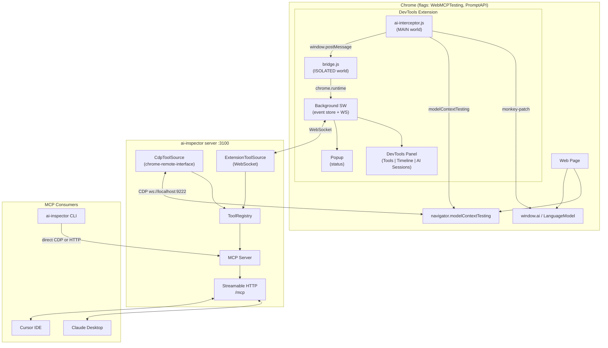
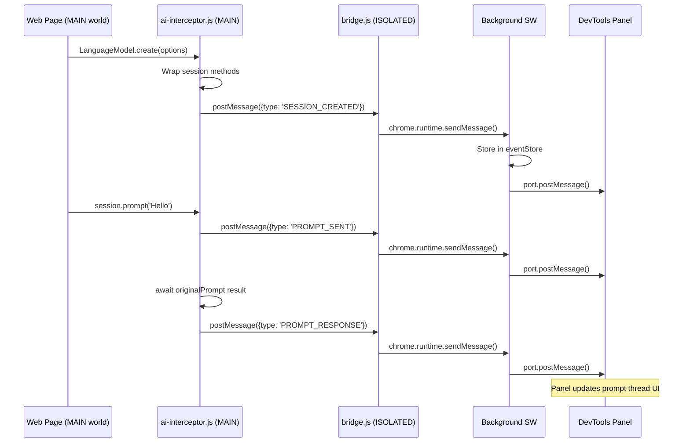

# AI Inspector -- Unified Plan

> Merged from two prior plans, updated with findings from reference repo analysis.

## Reference Repo Analysis Summary

Five repos cloned to `projects/webmcp/sources/cdp-extensions/`. Key findings:

### crx-mcp-over-cdp (adam-s) -- Most Architecturally Relevant

- **Monorepo**: pnpm workspaces + Turbo, Vite 5 for all builds
- **Extension structure**: Manifest V3, side panel (not DevTools panel), background service worker
- **CDP access**: Uses `chrome.debugger` API (attaches via `chrome.debugger.attach({tabId}, '1.3')`) -- we do NOT need this since we use `chrome.devtools.inspectedWindow.eval()` and content scripts instead
- **Content scripts**: Two worlds confirmed working -- ISOLATED (`content/`) and MAIN (`content-main/`), both compiled to IIFE format via Vite
- **MCP implementation**: Custom `ExtensionTransport` using `chrome.runtime.onMessage` with retry logic (max 3). 17 browser automation tools. Uses `@modelcontextprotocol/sdk` v1.17.3
- **Key dependency**: `devtools-protocol` npm package for typed CDP interfaces
- **Anti-pattern to avoid**: VS Code-style service abstractions (`InstantiationService`, `ServiceCollection`, `ProxyChannel`) are massively over-engineered for our use case. Keep it simple with plain functions + React context.
- **UI**: React 19 + Fluent UI. We'll use plain CSS/Tailwind instead.

### chrome-devtools-extension-panelDemo (ArvinH) -- DevTools Panel Pattern

- **Minimal**: 6 files total (manifest.json, devtools.html, devtools.js, panel.html, getPageTitle.js, background.js)
- **Panel creation**: `chrome.devtools.panels.create("Panel Demo", "logo.png", "panel.html", callback)` -- this is THE pattern
- **Communication**: `chrome.devtools.inspectedWindow.eval("document.title")` for page data. `chrome.runtime.connect()` for persistent port between panel <-> background.
- **Tab reload detection**: Background listens to `chrome.tabs.onUpdated`, notifies panel via port with `{action: "reloadExtension"}`
- **No build system**: Plain JS + Bootstrap CDN. Good for understanding the pattern, not for production.

### DevToolsPanel (sawyerit) -- Production React Panel

- **Build**: Webpack 5 + TypeScript, two entry points: `devtools` and `panel` → generates `devtools.html` and `panel.html`
- **React 18 + TypeScript**: Full component tree with tabs (`Tabs.tsx`, `Tab1.tsx`, `Tab2.tsx`), `SettingsPanel.tsx`, `StatusBar.tsx`
- **State management**: React Context (`AuthInfoContext`) -- confirms Context is sufficient, no Redux needed
- **Chrome APIs used**: `chrome.cookies.get()`, `chrome.storage.session`, `chrome.tabs.query()` -- shows variety of extension APIs available in panel context
- **Pattern to follow**: Separate devtools and panel entry points, utility class (`PanelUtils`) for Chrome API interactions, modular components

### chrome-extensions-samples/devtools (Google) -- Official Examples

- **Two examples**: Sidebar pane (jQuery properties) and custom panel (resource counter)
- **Sidebar pane**: `chrome.devtools.panels.elements.createSidebarPane()` + `sidebar.setExpression()` -- not relevant to us (we want a full panel)
- **Custom panel**: `chrome.devtools.panels.create('demo panel', 'icon.png', 'panel.html')` -- confirms the pattern
- **Page communication**: `chrome.devtools.inspectedWindow.getResources()` and `chrome.devtools.inspectedWindow.eval()` -- two ways to get data from inspected page

### chrome-remote-interface (cyrus-and) -- Server CDP Client

- **Ultra-lightweight**: Only 2 runtime deps (`commander` for CLI, `ws` for WebSocket)
- **Connection**: `const client = await CDP({host, port})` or `await CDP({target: wsUrl})`
- **Target management**: `CDP.List()`, `CDP.New()`, `CDP.Activate()`, `CDP.Close()`, `CDP.Version()`
- **Runtime.evaluate**: `client.Runtime.evaluate({expression, returnByValue: true, awaitPromise: true})` -- exactly what we need
- **Runtime.addBinding**: `client.Runtime.addBinding({name})` + `client.on('Runtime.bindingCalled', handler)` -- perfect for tool change notifications from page to server
- **Event patterns**: 5 patterns available. Best for us: `client.Domain.on('event', handler)` for clarity
- **Session management**: Full Target domain support for multi-tab (`Target.attachToTarget({targetId, flatten: true})`)
- **TypeScript**: Types via `@types/chrome-remote-interface` (DefinitelyTyped)
- **Protocol version**: Ships with `lib/protocol.json` for offline protocol access

## Architecture Decisions Updated From Analysis

### Build System (New Decision)

**Decision**: Use **Vite** for the extension build, **tsup** for the server/CLI.

**Rationale from analysis**:

- crx-mcp-over-cdp proves Vite works well for Chrome extension builds
- Content scripts must compile to **IIFE format** (not ESM) -- Vite supports this via `build.lib.formats: ['iife']`
- DevToolsPanel shows the two-entry-point pattern (devtools + panel) -- Vite handles this with `build.rollupOptions.input`
- Server/CLI is a standard Node.js package -- tsup is simpler than Vite for this

### No chrome.debugger API Needed (Clarification)

crx-mcp-over-cdp uses `chrome.debugger.attach()` because it does browser automation (DOM inspection, screenshots, input dispatch). We do NOT need this because:

- Our extension inspects via **content scripts** (MAIN world interception) and `**chrome.devtools.inspectedWindow.eval()`**
- External CDP access goes through **chrome-remote-interface** in the Node.js server
- This means fewer permissions needed in manifest (no `debugger` permission)

### Simplified Service Architecture (Anti-Pattern Avoidance)

crx-mcp-over-cdp uses VS Code-style `InstantiationService` / `ServiceCollection` / `ProxyChannel` abstractions. This is over-engineered for our scope. Instead:

- **Panel state**: React Context + `useReducer` (confirmed sufficient by DevToolsPanel repo)
- **Background state**: Plain in-memory Map/Array stores
- **IPC**: Direct `chrome.runtime.sendMessage()` and `chrome.runtime.connect()` port messaging (confirmed by panelDemo)

## What We Are Building

Two integrated deliverables shipped as a single package:

1. **Chrome DevTools Extension ("AI Inspector")** -- A DevTools panel (like React DevTools) for introspecting `window.ai` (Prompt API / Gemini Nano) and `navigator.modelContext` (WebMCP). Provides developer debugging with tool registry, call timeline, and AI session viewers.
2. **Node.js Server + CLI (`ai-inspector`)** -- Bridges browser WebMCP tools to desktop MCP clients (Cursor, Claude Desktop). Supports two connection modes: CDP direct (no extension needed) and extension WebSocket relay. Provides a CLI for scripting tool calls.

## Key Architecture Decisions

### 1. chrome-remote-interface, Not Playwright (Confirmed by Analysis)

**Decision**: Use `chrome-remote-interface` for the server's CDP access. Do NOT fork Playwright.

**Confirmed by analysis**: chrome-remote-interface has only 2 runtime deps (`ws`, `commander`), provides full CDP protocol access including `Runtime.evaluate`, `Runtime.addBinding`, `Target.`* for multi-tab management, and 5 different event listener patterns. TypeScript types available via `@types/chrome-remote-interface`.

```typescript
// Verified API from chrome-remote-interface source analysis:
const client = await CDP({ host: 'localhost', port: 9222 });
await client.Runtime.enable();
await client.Runtime.addBinding({ name: '__webmcpChanged' });
client.on('Runtime.bindingCalled', (params) => { /* params.name, params.payload */ });
const { result } = await client.Runtime.evaluate({
  expression: 'navigator.modelContextTesting.listTools()',
  returnByValue: true, awaitPromise: true
});
```

### 2. Dual Connection Modes

**Decision**: Support both CDP direct mode (extension-free) and extension WebSocket mode.

- **CDP Direct**: Server connects to `ws://localhost:9222` via chrome-remote-interface. No extension installed. Best for CI/automation.
- **Extension WebSocket**: Extension background.js connects to Node.js server via WebSocket. Richer data (intercepted events, AI sessions). Best for interactive development.

### 3. ToolSource Interface Abstraction

**Decision**: Abstract tool sources behind a `ToolSource` interface so CDP and extension modes are interchangeable.

```typescript
interface ToolSource {
  connect(config: SourceConfig): Promise<void>;
  disconnect(): Promise<void>;
  listTools(): Tool[];
  callTool(name: string, args: string): Promise<ToolResult>;
  onToolsChanged(cb: (tools: Tool[]) => void): void;
}
```

### 4. Streamable HTTP Transport for MCP

**Decision**: Use Streamable HTTP (`/mcp` endpoint) instead of stdio. This allows multiple MCP clients to connect simultaneously and supports both SSE streaming and request/response.

### 5. Single Package, Extension Embedded

**Decision**: Ship extension source inside the same package as the server. One repo, one `npm install`, coherent versioning.

### 6. Vite for Extension, tsup for Server (New -- from analysis)

**Decision**: Use Vite to build the extension (content scripts to IIFE, panel with React), tsup for the server/CLI.

**Rationale**: crx-mcp-over-cdp proves Vite works for extensions. Content scripts MUST compile to IIFE (not ESM) -- confirmed by crx-mcp-over-cdp building to `content/index.iife.js`. DevToolsPanel confirms two-entry-point pattern for devtools.html + panel.html.

### 7. Simple State Management (New -- from analysis)

**Decision**: React Context + `useReducer` for panel state. No VS Code-style DI, no Redux.

**Rationale**: crx-mcp-over-cdp's VS Code abstractions (`InstantiationService`, `ProxyChannel`, `ServiceCollection`) add massive complexity for no benefit. DevToolsPanel confirms React Context is sufficient for a tabbed DevTools panel.

## Architecture




## Content Script Injection Strategy

The extension needs two content scripts in different worlds (same pattern as React DevTools and confirmed by crx-mcp-over-cdp analysis):

### MAIN World: `ai-interceptor.js`

Runs in the page's JavaScript context. Monkey-patches APIs to observe all AI activity.

**LanguageModel interception:**

```javascript
const originalCreate = LanguageModel.create.bind(LanguageModel);
LanguageModel.create = async function(options) {
  const session = await originalCreate(options);
  const sessionId = crypto.randomUUID();

  // Wrap prompt()
  const originalPrompt = session.prompt.bind(session);
  session.prompt = async function(input, opts) {
    __aiInspector.emit('PROMPT_SENT', { sessionId, input, opts, ts: Date.now() });
    try {
      const result = await originalPrompt(input, opts);
      __aiInspector.emit('PROMPT_RESPONSE', { sessionId, result, ts: Date.now() });
      return result;
    } catch (err) {
      __aiInspector.emit('PROMPT_ERROR', { sessionId, error: err.message, ts: Date.now() });
      throw err;
    }
  };

  // Wrap promptStreaming()
  const originalStream = session.promptStreaming.bind(session);
  session.promptStreaming = function(input, opts) {
    __aiInspector.emit('STREAM_START', { sessionId, input, opts, ts: Date.now() });
    const stream = originalStream(input, opts);
    // Wrap ReadableStream to capture chunks
    return new ReadableStream({
      async start(controller) {
        const reader = stream.getReader();
        let fullText = '';
        while (true) {
          const { done, value } = await reader.read();
          if (done) break;
          fullText = value; // promptStreaming returns accumulated text
          controller.enqueue(value);
        }
        __aiInspector.emit('STREAM_END', { sessionId, result: fullText, ts: Date.now() });
        controller.close();
      }
    });
  };

  // Track tool execute callbacks if tool-use is configured
  if (options?.tools) {
    for (const tool of options.tools) {
      const origExecute = tool.execute;
      tool.execute = async function(args) {
        __aiInspector.emit('TOOL_CALL', { sessionId, tool: tool.name, args, ts: Date.now() });
        const result = await origExecute(args);
        __aiInspector.emit('TOOL_RESULT', { sessionId, tool: tool.name, result, ts: Date.now() });
        return result;
      };
    }
  }

  __aiInspector.emit('SESSION_CREATED', {
    sessionId, options,
    quotaUsage: { inputUsed: session.inputUsed, inputQuota: session.inputQuota },
    ts: Date.now()
  });
  return session;
};
```

**WebMCP registration interception:**

```javascript
const origRegister = navigator.modelContext.registerTool.bind(navigator.modelContext);
navigator.modelContext.registerTool = function(toolDef) {
  __aiInspector.emit('TOOL_REGISTERED', { tool: toolDef, ts: Date.now() });
  return origRegister(toolDef);
};
```

**Event emitter bridge** (posts to ISOLATED world):

```javascript
window.__aiInspector = {
  emit(type, data) {
    window.postMessage({ source: 'ai-inspector', type, data }, '*');
  }
};
```

### ISOLATED World: `bridge.js`

Receives events from MAIN world and forwards to the extension background:

```javascript
window.addEventListener('message', (event) => {
  if (event.data?.source === 'ai-inspector') {
    chrome.runtime.sendMessage({
      type: event.data.type,
      data: event.data.data,
      tabId: undefined // background fills this in
    });
  }
});
```

### Panel Communication Flow




## Background Service Worker (from analysis)

Based on patterns from crx-mcp-over-cdp and panelDemo:

```typescript
// background/index.ts
import { EventStore } from './event-store';
import { TabManager } from './tab-manager';

const eventStore = new EventStore();
const tabManager = new TabManager();

// Receive events from content script (bridge.js)
chrome.runtime.onMessage.addListener((msg, sender, sendResponse) => {
  if (msg.source !== 'ai-inspector') return;
  const tabId = sender.tab?.id;
  if (!tabId) return;

  eventStore.add(tabId, msg);
  // Forward to connected DevTools panels
  tabManager.notifyPanel(tabId, msg);
  sendResponse({ ok: true });
});

// Panel connects via port (pattern from panelDemo)
chrome.runtime.onConnect.addListener((port) => {
  if (port.name === 'ai-inspector-panel') {
    const tabId = port.sender?.tab?.id;
    tabManager.registerPanel(tabId, port);

    port.onMessage.addListener((msg) => {
      // Handle panel requests (e.g., "get all events for this tab")
      if (msg.type === 'GET_STATE') {
        port.postMessage({ type: 'STATE', data: eventStore.getAll(tabId) });
      }
    });

    port.onDisconnect.addListener(() => {
      tabManager.unregisterPanel(tabId);
    });
  }
});

// Tab navigation detection (pattern from panelDemo)
chrome.tabs.onUpdated.addListener((tabId, changeInfo) => {
  if (changeInfo.status === 'loading') {
    eventStore.clear(tabId);
    tabManager.notifyPanel(tabId, { type: 'PAGE_RELOAD' });
    // Re-inject MAIN world interceptor
    chrome.scripting.executeScript({
      target: { tabId },
      world: 'MAIN',
      files: ['content/ai-interceptor.js'],
    });
  }
});
```

## DevTools Panel Design

Created via `chrome.devtools.panels.create("AI Inspector", ...)` (pattern confirmed by all 4 extension repos). Three tabs:

### Tab 1: Tools

- List of all registered WebMCP tools (name, description, inputSchema)
- Live updates when tools register/unregister (via `toolsChangedCallback`)
- "Execute" button per tool with JSON input editor
- Show `toolactivated` and `toolcancel` events
- Export tool definitions (JSON, MCP config format)

### Tab 2: Timeline

- Chronological log of all AI activity (tool calls, prompts, events)
- Each entry: timestamp, type icon, name, duration, status badge
- Expandable rows showing full request/response JSON
- Filter by: type (tool call / prompt / event), tool name, status (success/error)
- Pattern inspired by Redux DevTools action log
- Clear / export timeline

### Tab 3: AI Sessions

- Live list of all `LanguageModel` sessions created by the page
- Per-session card: creation params (temperature, topK, tools), quota usage (inputUsed/inputQuota)
- Prompt thread viewer: every `prompt()` / `promptStreaming()` call with request + response
- Streaming response visualization (live text accumulation)
- Tool calls within sessions: tool name, input args, result, duration
- Session lifecycle events (create, clone, destroy, quota overflow)
- Ability to manually send prompts to any active session

### Popup

Quick status view:

- Connected tabs count + names
- Total registered tools
- Server connection status (if WebSocket mode active)
- Link to open DevTools panel

## Node.js Server

### Tool Registry (`server/tool-registry.ts`)

Central store for discovered tools from all sources:

```typescript
class ToolRegistry {
  private tools: Map<string, { tool: Tool; source: ToolSource; targetId: string }>;
  private listeners: Set<() => void>;

  addTools(source: ToolSource, targetId: string, tools: Tool[]): void;
  removeTools(source: ToolSource, targetId: string): void;
  listTools(): Tool[];
  callTool(name: string, args: string): Promise<ToolResult>;
  onChanged(cb: () => void): void;
}
```

### CDP Source (`server/sources/cdp.ts`)

Uses `chrome-remote-interface` for direct CDP connection:

```typescript
import CDP from 'chrome-remote-interface';

export class CdpToolSource implements ToolSource {
  private sessions = new Map<string, CDP.Client>();

  async connect({ host, port }: SourceConfig) {
    const targets = await CDP.List({ host, port });
    const pages = targets.filter(t => t.type === 'page');

    for (const target of pages) {
      const client = await CDP({ target });
      await client.Runtime.enable();

      // Binding for change notifications
      await client.Runtime.addBinding({ name: '__webmcpChanged' });
      client.on('Runtime.bindingCalled', (e) => {
        if (e.name === '__webmcpChanged') {
          const tools = JSON.parse(e.payload);
          this.onToolsChanged?.(tools);
        }
      });

      // Initial tool discovery
      const { result } = await client.Runtime.evaluate({
        expression: `(() => {
          const t = navigator.modelContextTesting;
          if (!t) return null;
          t.registerToolsChangedCallback(() =>
            __webmcpChanged(JSON.stringify(t.listTools()))
          );
          return JSON.stringify(t.listTools());
        })()`,
        returnByValue: true
      });

      if (result.value) {
        this.emit('tools', JSON.parse(result.value));
      }
      this.sessions.set(target.id, client);
    }
  }

  async callTool(name: string, args: string): Promise<ToolResult> {
    // Find which session has this tool and execute
    for (const [id, client] of this.sessions) {
      const { result } = await client.Runtime.evaluate({
        expression: `navigator.modelContextTesting.executeTool("${name}", '${args}')`,
        awaitPromise: true,
        returnByValue: true
      });
      if (result.value !== undefined) return result.value;
    }
    throw new Error(`Tool "${name}" not found`);
  }
}
```

### Extension Source (`server/sources/extension.ts`)

WebSocket server that the extension's background.js connects to:

```typescript
import { WebSocketServer } from 'ws';

export class ExtensionToolSource implements ToolSource {
  private wss: WebSocketServer;

  async connect({ port }: SourceConfig) {
    this.wss = new WebSocketServer({ port });
    this.wss.on('connection', (ws) => {
      ws.on('message', (data) => {
        const msg = JSON.parse(data.toString());
        switch (msg.type) {
          case 'TOOLS_UPDATE': this.onToolsChanged?.(msg.tools); break;
          case 'TOOL_RESULT': this.pendingCalls.get(msg.callId)?.resolve(msg.result); break;
        }
      });
    });
  }

  async callTool(name: string, args: string): Promise<ToolResult> {
    const callId = crypto.randomUUID();
    return new Promise((resolve, reject) => {
      this.pendingCalls.set(callId, { resolve, reject });
      this.broadcast({ type: 'CALL_TOOL', callId, name, args });
    });
  }
}
```

### MCP Server + HTTP Transport (`server/mcp-server.ts`, `server/http.ts`)

```typescript
import { McpServer } from '@modelcontextprotocol/sdk/server/mcp.js';
import { StreamableHTTPServerTransport } from '@modelcontextprotocol/sdk/server/streamableHttp.js';
import express from 'express';

// MCP server with dynamic tools from registry
const server = new McpServer({ name: 'ai-inspector', version: '1.0.0' });

// Register tools dynamically from ToolRegistry
registry.onChanged(() => {
  server.notification({ method: 'notifications/tools/list_changed' });
});

// Streamable HTTP on /mcp
const app = express();
app.post('/mcp', async (req, res) => {
  const transport = new StreamableHTTPServerTransport('/mcp');
  await server.connect(transport);
  await transport.handleRequest(req, res);
});

app.listen(3100);
```

## CLI

```bash
# Start server in CDP direct mode
npx ai-inspector start --cdp ws://localhost:9222

# Start server in extension WebSocket mode
npx ai-inspector start --extension --ws-port 8765

# List discovered tools
npx ai-inspector list-tools --cdp ws://localhost:9222

# Execute a tool
npx ai-inspector call-tool searchFlights '{"from":"SFO","to":"JFK"}' --cdp ws://localhost:9222

# Configure MCP clients
npx ai-inspector config claude    # writes to Claude Desktop config
npx ai-inspector config cursor    # writes to Cursor MCP settings
```

## Project Structure

```
projects/webmcp/ai-inspector/
  package.json                        # Single package: server + CLI + shared types
  tsconfig.json
  tsup.config.ts                      # Builds server/CLI to dist/
  vite.config.ts                      # Builds extension (panel, content scripts, background)

  shared/                             # Shared between extension and server
    types.ts                          # ToolSource interface, Tool, ToolResult, events
    protocol.ts                       # Message schemas (extension <-> server)

  extension/                          # Chrome DevTools Extension
    manifest.json                     # Manifest V3 (NO debugger permission needed)
    devtools/
      devtools.html                   # DevTools entry point (loads devtools.ts)
      devtools.ts                     # chrome.devtools.panels.create("AI Inspector", ...)
    panel/                            # React + Vite panel UI (separate entry point)
      index.html                      # Panel HTML (loaded by DevTools panel create)
      src/
        main.tsx                      # React root mount
        App.tsx                       # Tabbed panel (Tools | Timeline | AI Sessions)
        context/
          InspectorContext.tsx         # React Context + useReducer for all panel state
        tabs/
          ToolsTab.tsx                # WebMCP tool list + executor
          TimelineTab.tsx             # Chronological event log (Redux DevTools style)
          AISessionsTab.tsx           # LanguageModel session viewer
        components/
          Tabs.tsx                    # Tab navigation (pattern from DevToolsPanel repo)
          ToolCard.tsx                # Tool info + execute button
          JsonEditor.tsx              # JSON input editor for tool execution
          PromptThread.tsx            # Prompt/response thread viewer
          SessionCard.tsx             # Session info card with quota
          TimelineEntry.tsx           # Single timeline row (expandable)
          StreamViewer.tsx            # Live streaming text display
          StatusBar.tsx               # Connection status footer
    content/
      ai-interceptor.ts              # MAIN world: monkey-patches LanguageModel + modelContext
      bridge.ts                      # ISOLATED world: relays events to background
    background/
      index.ts                       # Service worker entry
      event-store.ts                 # In-memory Map/Array stores for events
      tab-manager.ts                 # Tab lifecycle (listen to chrome.tabs.onUpdated)
      ws-bridge.ts                   # Optional WebSocket connection to Node.js server
    popup/
      popup.html                     # Status popup
      popup.ts

  server/                             # Node.js MCP Server + CLI
    index.ts                          # CLI entry point (commander)
    mcp-server.ts                     # MCP server with dynamic tool registration
    http.ts                           # Express + StreamableHTTPServerTransport
    tool-registry.ts                  # Central tool store + pending calls
    sources/
      cdp.ts                          # CdpToolSource: chrome-remote-interface
      extension.ts                    # ExtensionToolSource: WebSocket to extension
    config.ts                         # MCP client config writers (Claude, Cursor)

  __tests__/
    tool-registry.test.ts
    cdp-source.test.ts
    mcp-server.test.ts
```

### Vite Build Configuration (Extension)

Based on crx-mcp-over-cdp analysis, the extension needs multiple build targets:

```typescript
// vite.config.ts -- simplified from crx-mcp-over-cdp patterns
export default defineConfig({
  build: {
    rollupOptions: {
      input: {
        // Panel (React app)
        panel: 'extension/panel/index.html',
        // DevTools page
        devtools: 'extension/devtools/devtools.html',
        // Popup
        popup: 'extension/popup/popup.html',
      },
      output: {
        dir: 'dist/extension',
      },
    },
  },
});

// Separate Vite builds for content scripts (IIFE format required):
// vite.config.content.ts
export default defineConfig({
  build: {
    lib: {
      entry: 'extension/content/ai-interceptor.ts',
      formats: ['iife'],
      name: 'aiInterceptor',
      fileName: 'ai-interceptor',
    },
    outDir: 'dist/extension/content',
  },
});
```

### Manifest V3 (Refined from Analysis)

```json
{
  "manifest_version": 3,
  "name": "AI Inspector",
  "version": "1.0.0",
  "description": "DevTools for window.ai and WebMCP introspection",
  "devtools_page": "devtools/devtools.html",
  "permissions": ["activeTab", "scripting", "tabs", "storage"],
  "host_permissions": ["<all_urls>"],
  "content_scripts": [
    {
      "matches": ["<all_urls>"],
      "run_at": "document_start",
      "js": ["content/bridge.js"],
      "all_frames": false
    }
  ],
  "background": {
    "service_worker": "background/index.js"
  },
  "action": {
    "default_popup": "popup/popup.html"
  },
  "content_security_policy": {
    "extension_pages": "script-src 'self'; object-src 'self'"
  }
}
```

Note: `ai-interceptor.js` is injected into MAIN world dynamically via `chrome.scripting.executeScript({ world: 'MAIN' })` from the background service worker (not declared in manifest, since manifest `content_scripts` always run in ISOLATED world). This matches the crx-mcp-over-cdp pattern where `content-main/index.iife.js` runs in MAIN world.

## Dependencies

```json
{
  "dependencies": {
    "@modelcontextprotocol/sdk": "latest",
    "chrome-remote-interface": "^0.34.0",
    "commander": "latest",
    "express": "latest",
    "ws": "latest"
  },
  "devDependencies": {
    "react": "^19.0.0",
    "react-dom": "^19.0.0",
    "@types/react": "^19.0.0",
    "@types/react-dom": "^19.0.0",
    "@types/chrome": "latest",
    "@types/chrome-remote-interface": "latest",
    "@types/express": "latest",
    "@types/ws": "latest",
    "devtools-protocol": "latest",
    "vite": "latest",
    "@vitejs/plugin-react": "latest",
    "tsup": "latest",
    "typescript": "latest",
    "vitest": "latest",
    "tailwindcss": "latest"
  }
}
```

Key dependency notes from analysis:

- `@types/chrome` -- TypeScript definitions for all `chrome.*` extension APIs (used by crx-mcp-over-cdp)
- `@types/chrome-remote-interface` -- TypeScript definitions for CDP client (from DefinitelyTyped)
- `devtools-protocol` -- Typed CDP protocol interfaces (used by crx-mcp-over-cdp for `DOM`, `Page`, `Runtime` types)
- `tailwindcss` -- Lightweight styling instead of Fluent UI (which crx-mcp-over-cdp uses but is overkill)

## Chrome Flags Required

```bash
chrome \
  --remote-debugging-port=9222 \
  --enable-features=WebMCPTesting,OptimizationGuideOnDeviceModel,PromptAPIForGeminiNanoMultimodalInput
```

## Reference Repos (Cloned + Analyzed)

All cloned to `projects/webmcp/sources/cdp-extensions/`. Analysis complete.


| Repo                                                                                                 | Status   | What We Take From It                                                                                                                                         |
| ---------------------------------------------------------------------------------------------------- | -------- | ------------------------------------------------------------------------------------------------------------------------------------------------------------ |
| [crx-mcp-over-cdp](https://github.com/adam-s/crx-mcp-over-cdp)                                       | Analyzed | Vite IIFE build for content scripts, MAIN+ISOLATED world pattern, MCP SDK integration, `devtools-protocol` types. Avoid: VS Code DI abstractions, Fluent UI. |
| [chrome-devtools-extension-panelDemo](https://github.com/ArvinH/chrome-devtools-extension-panelDemo) | Analyzed | `chrome.devtools.panels.create()` pattern, `inspectedWindow.eval()` for page access, `chrome.runtime.connect()` port for panel<->background.                 |
| [DevToolsPanel](https://github.com/sawyerit/DevToolsPanel)                                           | Analyzed | React+TS tab component pattern, two-entry-point build (devtools+panel), React Context for state, `PanelUtils` utility class pattern.                         |
| [chrome-extensions-samples](https://github.com/GoogleChrome/chrome-extensions-samples)               | Analyzed | Official panel creation pattern, `inspectedWindow.getResources()`, sidebar pane API (not needed).                                                            |
| [chrome-remote-interface](https://github.com/cyrus-and/chrome-remote-interface)                      | Analyzed | CDP client API (`CDP()`, `CDP.List()`, `Runtime.evaluate`, `Runtime.addBinding`), event patterns, session management, 2-dep lightweight.                     |


## End-to-End Flows

### Flow 1: Developer Debugging (Extension Only)

1. Developer opens their React app using `react-webmcp`
2. Opens Chrome DevTools -> "AI Inspector" panel
3. **Tools tab**: sees registered tools, schemas, tests them manually
4. **Timeline tab**: as tools are called (by AI agents or tests), calls appear with timing and results
5. **AI Sessions tab**: if using `window.ai`, sees prompt/response threads with streaming visualization

### Flow 2: MCP Bridge via CDP (No Extension)

1. `chrome --remote-debugging-port=9222 --enable-features=WebMCPTesting`
2. `npx ai-inspector start --cdp ws://localhost:9222` -> server on `:3100`
3. Configure Claude Desktop: `npx ai-inspector config claude`
4. Claude discovers tools via MCP, executes them through CDP -> browser

### Flow 3: MCP Bridge via Extension (Richer Data)

1. Install AI Inspector extension
2. `npx ai-inspector start --extension --ws-port 8765` -> server on `:3100`
3. Extension background connects via WebSocket
4. Tools flow: content script -> background -> server -> MCP clients
5. Bonus: intercepted events (AI sessions, tool calls) also available to MCP clients

### Flow 4: CLI Scripting

1. `npx ai-inspector list-tools --cdp ws://localhost:9222`
2. `npx ai-inspector call-tool searchFlights '{"from":"SFO","to":"JFK"}'`
3. Results printed to stdout as JSON

### Flow 5: E2E Test with French Bistro Demo

1. Launch Chrome with flags, navigate to french-bistro demo
2. Load AI Inspector extension, open DevTools panel
3. Verify tools appear in Tools tab (menu items, reservations, etc.)
4. Start server: `npx ai-inspector start --cdp ws://localhost:9222`
5. Execute tools via CLI, verify results match DevTools Timeline
6. Connect Claude Desktop, test natural language tool invocation

## Implementation Order

1. ~~**Clone reference repos**~~ -- DONE. Analyzed. Findings integrated into plan above.
2. **Scaffold project** -- package.json, tsconfig.json, vite.config.ts, tsup.config.ts. Set up Vite multi-entry build for extension + tsup for server.
3. **Shared types + protocol** -- ToolSource interface, message schemas, event types
4. **Extension: manifest + devtools page** -- manifest.json (no `debugger` permission), devtools.html/ts with `panels.create()`
5. **Extension: content scripts** -- ai-interceptor.ts (MAIN world, IIFE build) + bridge.ts (ISOLATED world). Test with french-bistro demo.
6. **Extension: background service worker** -- event-store.ts, tab-manager.ts, port-based panel communication. Inject MAIN world script on tab load.
7. **Extension: Tools tab** -- First panel tab. List tools via `inspectedWindow.eval()` or content script data. Manual execution with JSON editor.
8. **Extension: Timeline + AI Sessions tabs** -- Add remaining tabs with data from event store.
9. **Server: ToolRegistry + CdpToolSource** -- chrome-remote-interface CDP connection, tool discovery via `Runtime.evaluate`, change detection via `Runtime.addBinding`.
10. **Server: MCP server + HTTP transport** -- Streamable HTTP on `:3100/mcp`, dynamic tool registration from registry.
11. **Server: ExtensionToolSource** -- WebSocket bridge for extension mode.
12. **CLI** -- commander commands: `start`, `list-tools`, `call-tool`, `config`.
13. **Extension: popup** -- status UI (connected tabs, tool count, server status).
14. **Tests + E2E** -- unit tests (vitest), french-bistro integration test.

