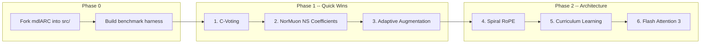

# ARC-AGI Architecture Improvements

## Strategy

Fork mdlARC source into `projects/arcAGIBeater/src/`, implement 6 improvements sequentially with feature flags (so each can be toggled on/off for A/B testing), validate each with a benchmarking harness, and produce a result report per improvement.




---

## Phase 0: Setup

### 0a. Fork mdlARC into `src/`

Copy the 6 source files from `references/mdlARC/src/` into `projects/arcAGIBeater/src/`:

- `tinytransformer.py`, `train.py`, `evaluate.py`, `common.py`, `build.py`, `utils.py`

Also copy `references/mdlARC/run_script.py` to `projects/arcAGIBeater/run.py` as the main entry point. Update imports to use relative paths within `src/`.

Add `src/__init__.py` so it's a proper package. Update `pyproject.toml` to include `torch>=2.5` in main deps (not just optional) since we're now actively developing.

### 0b. Benchmarking harness + result report template

Create `scripts/benchmark.py` -- a script that:

- Accepts `--preset` (low/medium/high), `--flags` (comma-separated feature flags to enable), `--seeds` (list of random seeds for multi-run)
- Runs training + evaluation using `run.py` logic
- Records: wall-clock time, peak GPU memory, per-task accuracy, total score, augmentation stats
- Outputs a JSON results file to `results/<run_name>/metrics.json`
- Generates a markdown report to `results/<run_name>/report.md`

Create `docs/reports/TEMPLATE.md` -- standardized report format:

- **Improvement name**, date, git commit
- **Hypothesis**: what we expect and why
- **Change summary**: files modified, lines changed, feature flag name
- **Methodology**: preset, seeds, hardware, dataset
- **Results**: accuracy table (baseline vs improved), timing, memory
- **Analysis**: what worked, what didn't, unexpected findings
- **Conclusion**: keep/discard, recommended default

Each improvement adds a feature flag to `run.py`'s config namespace so it can be toggled. The baseline is all flags off (vanilla mdlARC behavior).

---

## Phase 1: Quick Wins

### Improvement 1: C-Voting in AAIVR

**Flag**: `--cvoting` (default: off)

**File**: [src/evaluate.py](projects/arcAGIBeater/src/evaluate.py)

**What changes**: Currently AAIVR ranks candidates purely by vote count (frequency of identical normalized grids). C-voting adds a confidence dimension: during greedy decoding, compute average top-1 softmax probability per token for each generated candidate. Use this confidence as a tiebreaker when vote counts are equal, or optionally as a weighted vote.

**Code changes**:

- In `_select_next_token()` (line ~96): return the top-1 probability alongside the selected token
- In `batched_greedy_generate()`: accumulate per-sequence average confidence across all generated tokens
- In `run_aaivr_on_results()`: when `cvoting=True`, break ties using average confidence instead of random shuffle. Specifically, change the sort key from `count` to `(count, avg_confidence)`.

**Validation**:

- Run baseline (low preset, seed 42) on ARC-1 eval
- Run with `--cvoting` (same preset, seed)
- Compare: total score, per-task wins/losses, tiebreak situations

**Report**: `docs/reports/01-cvoting.md`

---

### Improvement 2: NorMuon NS Coefficient Optimization

**Flag**: `--ns-per-step` (default: off, uses fixed coefficients)

**File**: [src/train.py](projects/arcAGIBeater/src/train.py)

**What changes**: The current Newton-Schulz iteration uses fixed coefficients `(a, b, c) = (3.4445, -4.7750, 2.0315)` for all 5 steps. Research shows per-step coefficients can improve convergence by 1-2%. Specifically, early steps benefit from steeper curves while later steps benefit from noise reduction.

**Code changes**:

- In `_zeropower_via_newtonschulz5()` (line ~34): accept an optional `coefficients` parameter (list of 5 (a,b,c) tuples)
- When `ns_per_step=True`, use optimized per-step coefficients from the Muon optimizer research:
  - Step 1: `(3.4445, -4.7750, 2.0315)` (original -- good for initial approximation)
  - Steps 2-5: slightly adjusted values tuned for the singular value distribution at each iteration (we'll derive these from the leloykun research or grid-search a small set)
- Add a config flag to `run.py` args dict

**Validation**:

- Run baseline (medium preset, seed 42) -- record training loss curve
- Run with `--ns-per-step` (same preset, seed)
- Compare: final loss, convergence speed (steps to reach baseline final loss), eval accuracy

**Report**: `docs/reports/02-normuon-ns.md`

---

### Improvement 3: Adaptive Augmentation Budget

**Flag**: `--adaptive-aug` (default: off, uses fixed `max_augments`)

**Files**: [src/evaluate.py](projects/arcAGIBeater/src/evaluate.py), [src/common.py](projects/arcAGIBeater/src/common.py)

**What changes**: Currently every test task gets the same `max_augments` budget. Some tasks are solvable with 10 augmentations; others need 300. Adaptive augmentation allocates budget based on model confidence after an initial small batch of augmented predictions.

**Code changes**:

- In `run_split_inference()`: add an adaptive mode:
  1. Run initial batch of ~20 augmentations per task
  2. Compute agreement rate (fraction of augmentations producing the same top grid)
  3. If agreement > 80%: early-stop (task is "easy"), use remaining budget on other tasks
  4. If agreement < 30%: allocate up to 2x the per-task budget (task is "hard")
  5. Redistribute saved budget from easy tasks to hard tasks
- Add `adaptive_aug` flag to run config

**Validation**:

- Run baseline (high preset, seed 42, max_augments=300)
- Run with `--adaptive-aug` (same preset, seed)
- Compare: total score, total inference time, per-task augmentation usage distribution

**Report**: `docs/reports/03-adaptive-aug.md`

---

## Phase 2: Architecture Changes

### Improvement 4: Spiral RoPE

**Flag**: `--spiral-rope` (default: off, uses axial 2D RoPE)

**File**: [src/tinytransformer.py](projects/arcAGIBeater/src/tinytransformer.py)

**What changes**: Replace the axial 2D portion (x, y slices) of `RotaryEmbedding3D` with Spiral RoPE -- multi-directional 2D encoding that partitions channels into K direction groups at uniformly distributed angles instead of just horizontal/vertical.

**Code changes**:

- Add `SpiralRotaryEmbedding3D` class alongside existing `RotaryEmbedding3D`
- Channel split: keep `d_z` slice for region type encoding (unchanged). Split the remaining `d_x + d_y` channels into K=4 directional groups (0, 45, 90, 135 degrees)
- For each group k with angle `theta_k = k * pi / K`:
  - `projected_pos = x * cos(theta_k) + y * sin(theta_k)`
  - Apply standard RoPE rotation using `projected_pos` as the 1D position
- Cache construction: precompute cos/sin for projected positions across all (x, y) combinations
- In `MultiHeadSelfAttention.__init__()`: select `SpiralRotaryEmbedding3D` when config flag is set
- The z-slice for region type remains unchanged

**Validation**:

- Run baseline (medium preset, seed 42)
- Run with `--spiral-rope` (same preset, seed)
- Compare: total accuracy, accuracy by task category (if available), attention pattern visualization on sample tasks

**Report**: `docs/reports/04-spiral-rope.md`

---

### Improvement 5: Curriculum Learning Warmup

**Flag**: `--curriculum` (default: off, uses random batching)

**Files**: [src/common.py](projects/arcAGIBeater/src/common.py), [src/train.py](projects/arcAGIBeater/src/train.py)

**What changes**: Train on easier tasks first, gradually introduce harder ones during the warmup phase (first 20% of training). After warmup, switch to normal random batching.

**Code changes**:

- Add difficulty scoring function in `common.py`:
  - `compute_task_difficulty(task)` based on: grid size (max input + output dimensions), number of unique colors, number of demonstration pairs, output/input size ratio
  - Returns a float 0-1 (easy to hard)
- In `ARCExampleDataset`: add `difficulty_scores` dict mapping task_id to difficulty
- Add `CurriculumSampler` in `common.py`:
  - During warmup (epochs 0 to `warmup_pct * total_epochs`): sample with probability inversely proportional to difficulty. Linearly anneal from "easy-only" to "uniform" over the warmup window.
  - After warmup: standard random sampling (same as current behavior)
- In `create_dataloader()`: accept optional `sampler` parameter, use `CurriculumSampler` when `curriculum=True`
- In `train.py` `train_model()`: pass curriculum sampler when flag is set

**Validation**:

- Run baseline (medium preset, seed 42) -- record per-epoch training loss
- Run with `--curriculum` (same preset, seed)
- Compare: convergence speed, final accuracy, loss curve shape (should converge faster early)

**Report**: `docs/reports/05-curriculum.md`

---

### Improvement 6: Flash Attention 3

**Flag**: `--fa3` (default: auto-detect)

**File**: [src/tinytransformer.py](projects/arcAGIBeater/src/tinytransformer.py)

**What changes**: Upgrade Flash Attention from v2 to v3 for H100 GPUs. FA3 achieves 1.5-2x speedup via asynchronous warp-specialized execution. The API is the same (`flash_attn_varlen_qkvpacked_func`), so this is primarily a library version bump with minor import changes.

**Code changes**:

- In `MultiHeadSelfAttention._forward_packed_varlen()`: detect FA3 availability and use it when present
- Update `pyproject.toml`: add `flash-attn>=2.7` (FA3 is shipped as flash-attn 2.7+ for Hopper GPUs)
- Add FP8 mode support (optional): when `--fa3-fp8` is set and hardware supports it, enable FP8 attention for ~2x additional speedup
- Graceful fallback: if FA3 is not available, fall back to FA2, then to SDPA

**Validation**:

- Run baseline on H100 (medium preset) -- record wall-clock time per epoch
- Run with FA3 (same preset, same GPU)
- Compare: training speed (tokens/sec), peak memory, accuracy (should be identical)

**Report**: `docs/reports/06-flash-attention-3.md`

---

## File Structure After Implementation

```
projects/arcAGIBeater/
  src/
    __init__.py
    tinytransformer.py    (+ SpiralRotaryEmbedding3D, FA3 support)
    train.py              (+ per-step NS coefficients)
    evaluate.py           (+ C-voting, adaptive augmentation)
    common.py             (+ CurriculumSampler, difficulty scoring)
    build.py              (unchanged)
    utils.py              (unchanged)
  scripts/
    download_datasets.py  (existing)
    build_datasets.py     (existing)
    benchmark.py          (NEW -- benchmarking harness)
  docs/
    research.md           (existing)
    reports/
      TEMPLATE.md         (NEW -- report template)
      01-cvoting.md       (generated after validation)
      02-normuon-ns.md
      03-adaptive-aug.md
      04-spiral-rope.md
      05-curriculum.md
      06-flash-attention-3.md
  run.py                  (NEW -- main entry point with feature flags)
  Makefile                (updated with new targets)
  pyproject.toml          (updated deps)
```

## Updated Makefile Targets

- `make train PRESET=low` -- train with default settings
- `make train PRESET=low FLAGS=cvoting,spiral-rope` -- train with specific improvements
- `make eval` -- evaluate latest checkpoint
- `make benchmark PRESET=low FLAGS=cvoting` -- run benchmark + generate report
- `make benchmark-all PRESET=low` -- run baseline + all individual flags + generate comparison

## Execution Order

Each improvement is implemented, validated, and reported before moving to the next. The order is: fork, harness, then improvements 1-6 sequentially. Each improvement builds on the codebase with the previous ones already integrated (but feature-flagged off by default), so we can test combinations later.