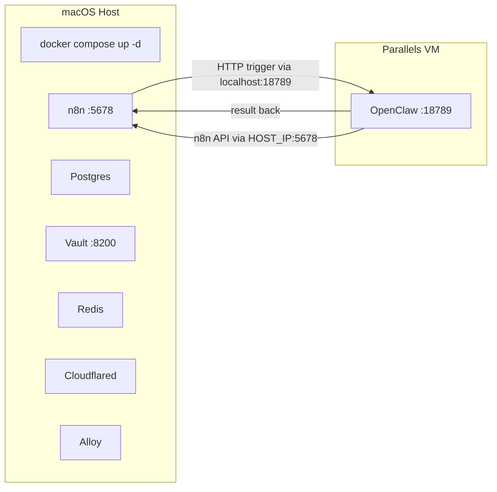

# Move Docker Stack to Host, VM for OpenClaw Only

## Architecture




**Before**: Everything (Docker stack + OpenClaw) runs inside the VM; host port-forwards all services.
**After**: Docker stack runs natively on macOS; VM only runs OpenClaw. n8n triggers OpenClaw as a tool.

## Key Changes

### 1. docker-compose.yml -- cosmetic only

Update header comment from "Runs inside the Parallels Ubuntu 24.04 VM" to "Runs on the macOS host". No structural changes needed -- Docker Desktop for Mac runs these containers fine.

### 2. Makefile -- major restructuring

**Variables**: Remove `PROJECT_DIR` (no longer needed, compose runs from repo root). Keep `VM_SSH` for OpenClaw management.

`**up` target** -- new dependency chain:
`check-env sudo-cache ensure-prldevops tf-init tf-apply docker-up vm-create vm-ports vm-provision-openclaw health`

- `**docker-up`** (new): `docker compose up -d` on the host, wait for Vault healthy, run `vault-seed`
- `**vm-create**`: Same as now (clone template, SSH keys, sudo, password)
- `**vm-ports**`: Only forward SSH (2222) and OpenClaw (18789). Remove n8n/Vault port forwards (they're on the host now)
- `**vm-provision-openclaw**` (replaces `vm-provision`): Only install Node.js + OpenClaw + basic tools (curl, jq). No Docker, no docker-compose-plugin, no full apt upgrade. Much faster.
- `**vm-setup-openclaw**` (replaces `setup-noninteractive` OpenClaw part): Copy OpenClaw workspace files to VM, write config, start gateway. OpenClaw MCP URL points to `HOST_IP:5678` (not localhost, since n8n is on the host).

`**start/stop/down/restart**`: Direct `docker compose` on host + `prlctl start/stop` for VM.

`**destroy**`: `docker compose down` on host + `vm-destroy` + Terraform destroy.

**Workflow/logs/backup targets**: All run directly on the host (remove `$(VM_SSH)` wrapper). Scripts like `n8n-ctl.sh`, `health-check.sh`, `backup.sh` run locally.

### 3. vm-provision-openclaw -- simplified

```bash
# Only what OpenClaw needs:
sudo apt-get update
curl -fsSL https://deb.nodesource.com/setup_22.x | sudo -E bash -
sudo apt-get install -y nodejs jq curl
sudo npm install -g openclaw@latest
```

No Docker, no docker-compose-plugin, no system upgrade, no data directory setup.

### 4. Port forwarding -- reduced

Only 2 rules instead of 4:

- `n8n-ssh`: `localhost:2222` -> `VM_IP:22` (SSH into VM)
- `n8n-openclaw`: `localhost:18789` -> `VM_IP:18789` (n8n triggers OpenClaw)

Remove `n8n-web` and `n8n-vault` rules (services are on the host now).

### 5. OpenClaw MCP config -- point to host

Inside the VM, OpenClaw needs to reach n8n on the host. In Parallels shared networking the host is at `10.211.55.2` (or configurable via `HOST_IP` in `.env`). The `openclaw-setup.sh` MCP URL becomes:

```
http://${HOST_IP:-10.211.55.2}:5678/mcp/sse
```

### 6. scripts/health-check.sh -- run locally

All checks run on the macOS host directly:

- Docker container checks: `docker compose ps` locally
- n8n/Vault/Redis: `curl localhost:PORT` locally
- OpenClaw: `curl localhost:18789` (via port forward to VM)
- Remove disk/memory checks (or adapt for macOS)

### 7. n8n data directory permissions

Since Docker Desktop for Mac handles volume mounts differently than Linux Docker, the `data/n8n` permission issue we hit earlier likely won't occur. But keep a `mkdir -p data/n8n` in `docker-up` as a precaution.

### 8. Files unchanged

- `terraform/` -- no changes (manages DevOps API, Cloudflare, GitHub, S3)
- `config/` -- no changes (Alloy, Vault, Grafana Cloud configs)
- `.env` / `.env.example` -- no changes (HOST_IP already exists as optional)

