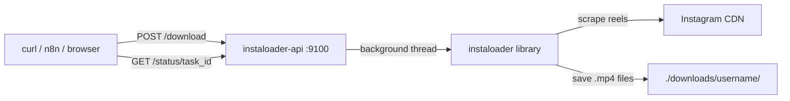

# Instagram Reels Downloader -- Standalone Service

## Architecture




## Why Instaloader

- 11.5k GitHub stars, actively maintained (v4.15, Jan 2026)
- Native `--reels` flag for public profiles -- no login needed
- Python API for programmatic control
- Clean output: saves videos as `.mp4` with metadata `.json` sidecar files

## Project Structure

All files go in `external/instaloader-api/`:

```
external/instaloader-api/
  app.py              # FastAPI application
  Dockerfile          # Python 3.12-slim based
  docker-compose.yml  # Standalone compose file
  requirements.txt    # instaloader, fastapi, uvicorn
  README.md           # Usage documentation
  downloads/          # Downloaded media (gitignored, volume-mounted)
```

## API Endpoints (`app.py`)

- `**POST /download**` -- accepts `{"username": "...", "media_type": "reels"|"all"}`, starts async download in background thread, returns `{"task_id": "...", "status": "running"}`
- `**GET /status/{task_id}**` -- returns task progress: `{"status": "running|completed|failed", "files_downloaded": N, "errors": [...], "download_path": "..."}`
- `**GET /tasks**` -- list all tasks with their status
- `**GET /health**` -- health check

Downloads run in a background thread using `threading.Thread` so the API remains responsive. Each task gets a UUID. Files are saved to `/downloads/{username}/` inside the container.

## Docker Compose (`docker-compose.yml`)

Standalone file exposing port 9100 on host:

```yaml
services:
  instaloader-api:
    build: .
    container_name: instaloader-api
    restart: unless-stopped
    ports:
      - "9100:8000"
    volumes:
      - ./downloads:/downloads
    environment:
      - INSTAGRAM_LOGIN=${INSTAGRAM_LOGIN:-}
      - INSTAGRAM_PASSWORD=${INSTAGRAM_PASSWORD:-}
    healthcheck:
      test: ["CMD-SHELL", "python -c 'import urllib.request; urllib.request.urlopen(\"http://localhost:8000/health\")'"]
      interval: 30s
      timeout: 10s
      retries: 3
```

## Usage

```bash
# Build and start
cd external/instaloader-api
docker compose up -d --build

# Download reels from a public profile
curl -X POST http://localhost:9100/download \
  -H 'Content-Type: application/json' \
  -d '{"username": "dubaiflyingdresses.uae", "media_type": "reels"}'

# Check status
curl http://localhost:9100/status/<task_id>

# Files appear in ./downloads/dubaiflyingdresses.uae/
```

## Later: n8n Integration

When ready, connect to n8n by either:

- Adding to the main `docker-compose.yml` with shared `n8n-net` network
- Or calling via `http://host.docker.internal:9100` from n8n

