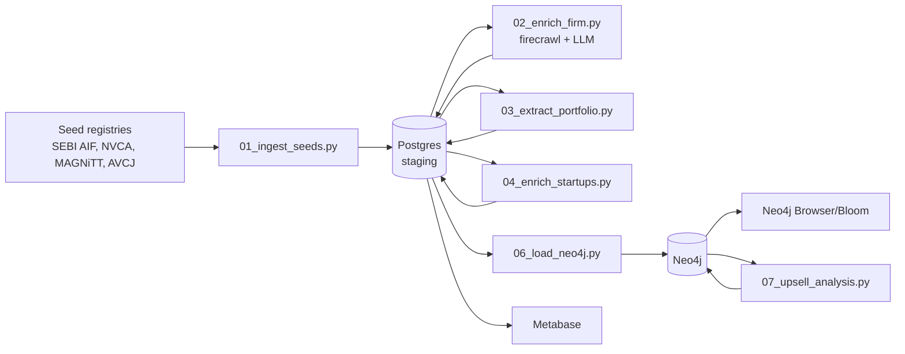

## Architecture



Staging in Postgres gives idempotent re-runs; Neo4j is the analytical/graph layer. Metabase + Neo4j Browser replaces a custom UI for v1 (per your choice).

## Graph Model

Nodes: `InvestorFirm`, `Fund`, `Person` (labels `Partner` or `Founder`), `Startup`, `Sector`, `Geography`, `Round`.

Relationships:
- `(InvestorFirm)-[:MANAGES]->(Fund)` with props `{vintage, totalSize, remainingSize, currency}`
- `(Fund)-[:PARTICIPATED_IN]->(Round)` with props `{amount, percentage, leadInvestor}`
- `(Round)-[:FOR]->(Startup)` with props `{stage, date, totalRoundSize, valuation}`
- `(Person)-[:FOUNDED]->(Startup)`, `(Person)-[:PARTNER_AT]->(InvestorFirm)`
- `(InvestorFirm)-[:FOCUSES_ON]->(Sector)`, `(InvestorFirm)-[:BASED_IN]->(Geography)`
- `(InvestorFirm)-[:CO_INVESTED_WITH]->(InvestorFirm)` (derived, weighted)

This model directly enables the upsell/cross-sell queries described below.

## Directory Layout

```
projects/investor-database/
├── README.md
├── docker-compose.yml          # neo4j + postgres + metabase
├── .env.example
├── pyproject.toml              # uv / pip project
├── schema/
│   ├── postgres_ddl.sql        # staging tables
│   └── neo4j_constraints.cypher
├── sources/
│   ├── india_sebi_aif.csv
│   ├── india_curated.yaml      # Peak XV, Accel India, Blume, 3one4, Chiratae, Elevation, Nexus, Lightspeed India, Kalaari, Inflection, Stellaris, Matrix, Prime, Fireside
│   ├── mena_curated.yaml       # Mubadala, ADIA, STV, BECO, Wamda, Shorooq, MSA, Beco, Raed, 500 MENA
│   ├── apac_curated.yaml       # Vertex, B Capital, Openspace, Monk's Hill, Golden Gate, AC Ventures, East, Jungle, Wavemaker, Sequoia China/SEA, Hillhouse, IDG, 5Y
│   └── global_top.yaml         # a16z, Sequoia, Benchmark, Founders Fund, Accel, Lightspeed, General Catalyst, Index, GV, Tiger, Coatue, Softbank Vision, Insight, KKR, Blackstone GP
├── pipeline/
│   ├── 01_ingest_seeds.py
│   ├── 02_enrich_firm.py       # firecrawl scrape firm site → LLM extract structured
│   ├── 03_extract_portfolio.py # enumerate portfolio pages
│   ├── 04_enrich_startups.py   # startup website + founders
│   ├── 05_reconcile.py         # dedupe, normalize, entity resolution
│   ├── 06_load_neo4j.py
│   ├── 07_upsell_analysis.py   # GDS: co-investment, sector gaps, follow-on candidates
│   └── lib/
│       ├── firecrawl_client.py
│       ├── llm_extract.py      # pydantic schemas + LLM
│       └── models.py
├── neo4j/
│   ├── queries/                # saved Cypher: top co-investors, sector gaps, upsell list
│   └── bloom_perspectives.json
├── metabase/
│   └── dashboards.json
└── docs/
    ├── schema.md
    ├── pipeline-runbook.md
    └── upsell-cookbook.md
```

## Pydantic Extraction Schema (core of the LLM pipeline)

Single structured output contract used by `02_enrich_firm.py`:

```python
class InvestorFirm(BaseModel):
    name: str
    website: HttpUrl
    short_description: str
    hq_city: str; hq_country: str; regions_active: list[str]
    firm_type: Literal["VC","PE","CVC","AngelNetwork","FamilyOffice","SovereignWealth"]
    sector_focus: list[str]; stage_focus: list[str]
    aum_usd: float | None
    funds: list[Fund]          # name, vintage, total_size_usd, remaining_size_usd
    partners: list[Person]     # name, role, linkedin, email
    portfolio: list[Investment]# startup_name, round, amount_usd, equity_pct, date
    sources: list[HttpUrl]     # provenance URLs
```

LLM call uses firecrawl markdown of firm homepage + `/team` + `/portfolio` as context; JSON-mode / tool-use enforces the schema. Each field carries `sources` for provenance.

## Upsell / Cross-Sell Queries (`07_upsell_analysis.py`)

Concrete Cypher queries shipped in `neo4j/queries/`:

1. **Co-investment graph** — populate `CO_INVESTED_WITH` edges weighted by shared deals; surface warm-intro candidates.
2. **Sector-gap cross-sell** — firms with strong `FOCUSES_ON` in a sector but < N portfolio companies there → prospects for placing portfolio startups.
3. **Follow-on upsell** — portfolio startups last-funded > 18 months ago whose lead investors have `Fund` with `remainingSize > 0` at matching stage.
4. **Founder-cluster cross-sell** — founders who previously raised from firm A, now founding new startup raising at stage matching firm A's mandate.
5. **Geo-expansion** — firm active in region X with portfolio expanding into region Y; surface firms in Y who co-invest with firm X.

All five are one Cypher file each, runnable from Neo4j Browser and materialized into `Recommendation` nodes for Metabase dashboards.

## Stack Decisions (confirmed with you)

- Sources: hybrid curated public lists + LLM enrichment
- Coverage: schema-first, all regions ingested in parallel
- DB: Neo4j Community (self-hosted in the project's docker-compose) + Postgres staging
- UI: Neo4j Browser / Bloom for graph, Metabase for tabular — no custom frontend in v1
- Pipeline: standalone Python scripts in `pipeline/`, runnable via `make` targets; can be wired into n8n later

## Out of Scope (v1)

- Paid API integrations (Crunchbase/PitchBook) — can plug into `02_enrich_firm.py` later
- Custom Next.js frontend — Metabase/Bloom cover v1; noted as phase 2
- Real-time updates — pipeline is batch (weekly cron)
