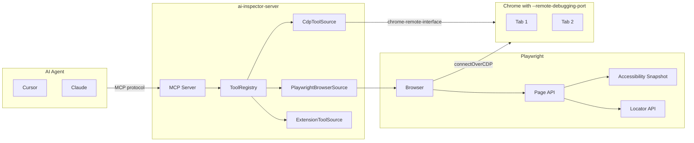

# Browser Automation via Playwright + MCP

## Design Decision

Use **Playwright as a library** (`playwright` core package) in `ai-inspector-server` rather than raw CDP. Playwright handles all complex browser automation (element location, waiting, retries, scrolling into view, screenshots) while we define our own tool schemas and handlers.

**Why `ai-inspector-server` and not `webmcp-cdp`**: Playwright is a heavy dependency (~100MB). Keeping it in the server package means `webmcp-cdp` stays lightweight and focused on WebMCP tool discovery. Browser automation is a server concern -- it's another `ToolSource` alongside `CdpToolSource` and `ExtensionToolSource`.

## Architecture




Both `CdpToolSource` (WebMCP tools) and `PlaywrightBrowserSource` (browser automation) connect to the **same Chrome instance** -- Chrome supports multiple CDP clients simultaneously.

## Changes by Package

### 1. `ai-inspector-types` -- New result content type

**Problem**: `ToolSource.callTool()` returns `Promise<string | null>`, but screenshots need `{ type: "image", data, mimeType }` (matching MCP's `ImageContent`).

**File: `[src/tool-source.ts](projects/webmcp/ai-inspector-types/src/tool-source.ts)`**

Add a new type and update the `callTool` return signature:

```typescript
export type ToolCallResultContent =
  | { type: "text"; text: string }
  | { type: "image"; data: string; mimeType: string };

export interface ToolSource {
  connect(config: ToolSourceConfig): Promise<void>;
  disconnect(): Promise<void>;
  listTools(): DiscoveredTool[];
  callTool(name: string, inputArguments: string): Promise<ToolCallResultContent[]>;
  onToolsChanged(cb: (tools: DiscoveredTool[]) => void): void;
}
```

**File: `[src/index.ts](projects/webmcp/ai-inspector-types/src/index.ts)`** -- Export `ToolCallResultContent`.

### 2. `webmcp-cdp` -- Update return type only

**File: `[src/cdp-tool-source.ts](projects/webmcp/webmcp-cdp/src/cdp-tool-source.ts)`**

Wrap the existing string result in a content array:

```typescript
async callTool(name: string, inputArguments: string): Promise<ToolCallResultContent[]> {
  // ... existing logic ...
  const value = (response.result.value as string) ?? null;
  return [{ type: "text", text: value ?? "null" }];
}
```

No new dependencies. Minimal change.

### 3. `ai-inspector-server` -- Core implementation

#### 3a. Add `playwright` dependency

**File: `[package.json](projects/webmcp/ai-inspector-server/package.json)`** -- Add `"playwright": "^1.52.0"` to dependencies.

#### 3b. New `src/sources/browser.ts` -- `PlaywrightBrowserSource`

The main new file. Implements `ToolSource` using Playwright's Page API.

**Connection**: Uses `chromium.connectOverCDP()` to attach to existing Chrome:

```typescript
import { chromium, Browser, BrowserContext, Page } from "playwright";

export class PlaywrightBrowserSource implements ToolSource {
  private browser: Browser | null = null;
  private page: Page | null = null;
  private refMap = new Map<number, { role: string; name: string }>();
  private nextRef = 1;
  private consoleLogs: string[] = [];
  private networkRequests: { method: string; url: string; status?: number }[] = [];

  async connect(config: ToolSourceConfig): Promise<void> {
    const endpoint = `http://${config.host ?? "localhost"}:${config.port ?? 9222}`;
    this.browser = await chromium.connectOverCDP(endpoint);
    const contexts = this.browser.contexts();
    this.page = contexts[0]?.pages()[0] ?? await contexts[0]?.newPage();
    // Set up console/network listeners
  }
}
```

**Tool list** (~20 tools, `browser_`* prefix, static definitions):


| Tool | Params | Playwright API |
| ---- | ------ | -------------- |


Navigation:

- `browser_navigate` -- `{ url }` -- `page.goto(url)`
- `browser_back` -- `{}` -- `page.goBack()`
- `browser_forward` -- `{}` -- `page.goForward()`
- `browser_reload` -- `{}` -- `page.reload()`

Page state:

- `browser_url` -- `{}` -- `page.url()` + `page.title()`
- `browser_snapshot` -- `{}` -- `page.accessibility.snapshot()`, assign refs, format as text
- `browser_screenshot` -- `{ fullPage? }` -- `page.screenshot()`, return as `{ type: "image" }`
- `browser_console_logs` -- `{}` -- Return buffered `page.on("console")` messages
- `browser_network_requests` -- `{}` -- Return buffered `page.on("request"/"response")` data

Element interaction (all take `ref` from latest `browser_snapshot`):

- `browser_click` -- `{ ref, doubleClick? }` -- Resolve ref to `page.getByRole(role, { name })`, `.click()`
- `browser_type` -- `{ ref, text, submit? }` -- Resolve ref, `.pressSequentially(text)` then optional Enter
- `browser_fill` -- `{ ref, value }` -- Resolve ref, `.fill(value)`
- `browser_hover` -- `{ ref }` -- Resolve ref, `.hover()`
- `browser_select_option` -- `{ ref, value }` -- Resolve ref, `.selectOption(value)`
- `browser_press_key` -- `{ key }` -- `page.keyboard.press(key)`
- `browser_focus` -- `{ ref }` -- Resolve ref, `.focus()`

Scrolling:

- `browser_scroll` -- `{ direction, amount?, ref? }` -- `page.mouse.wheel()` or `element.evaluate(el => el.scrollBy(...))`

Tab management:

- `browser_tab_list` -- `{}` -- Enumerate `context.pages()`
- `browser_tab_new` -- `{ url? }` -- `context.newPage()`, optionally `goto(url)`
- `browser_tab_select` -- `{ index }` -- `pages[index].bringToFront()`, update `this.page`
- `browser_tab_close` -- `{ index? }` -- `pages[index].close()`

JavaScript:

- `browser_evaluate` -- `{ expression }` -- `page.evaluate(expression)`

Wait:

- `browser_wait` -- `{ time?, selector? }` -- `page.waitForTimeout()` or `page.waitForSelector()`

**Snapshot and ref resolution strategy**:

```typescript
async takeSnapshot(): Promise<string> {
  const snapshot = await this.page.accessibility.snapshot({ interestingOnly: false });
  this.refMap.clear();
  this.nextRef = 1;
  return this.formatNode(snapshot, 0);
}

private formatNode(node: AccessibilityNode, depth: number): string {
  const ref = this.nextRef++;
  this.refMap.set(ref, { role: node.role, name: node.name ?? "" });
  const indent = "  ".repeat(depth);
  let line = `${indent}- ${node.role}`;
  if (node.name) line += ` "${node.name}"`;
  line += ` [ref=${ref}]`;
  if (node.value) line += `: ${node.value}`;
  const children = (node.children ?? []).map(c => this.formatNode(c, depth + 1));
  return [line, ...children].join("\n");
}

private resolveRef(ref: number): Locator {
  const entry = this.refMap.get(ref);
  if (!entry) throw new Error(`Invalid ref ${ref}. Run browser_snapshot first.`);
  return this.page.getByRole(entry.role as any, { name: entry.name, exact: true });
}
```

`**callTool` dispatch** -- A switch/map dispatching tool name to handler functions, each returning `ToolCallResultContent[]`.

#### 3c. Update existing files for new return type

- `**[src/tool-registry.ts](projects/webmcp/ai-inspector-server/src/tool-registry.ts)`** -- Change `callTool` return type to `Promise<ToolCallResultContent[]>`
- `**[src/sources/extension.ts](projects/webmcp/ai-inspector-server/src/sources/extension.ts)**` -- Wrap string results in `[{ type: "text", text }]`
- `**[src/mcp-server.ts](projects/webmcp/ai-inspector-server/src/mcp-server.ts)**` -- Pass content array directly instead of wrapping:

```typescript
server.setRequestHandler(CallToolRequestSchema, async (req) => {
  const content = await registry.callTool(
    req.params.name,
    JSON.stringify(req.params.arguments ?? {}),
  );
  return { content };
});
```

#### 3d. Update CLI

**File: `[src/cli.ts](projects/webmcp/ai-inspector-server/src/cli.ts)`**

Add `--browser-tools` / `--no-browser-tools` flag (default: enabled when CDP is active):

```typescript
.option("--no-browser-tools", "Disable Playwright browser automation tools")

// In action handler:
if (opts.browserTools !== false && opts.cdp !== false) {
  const browserSource = new PlaywrightBrowserSource();
  await browserSource.connect({ host: opts.cdpHost, port: parseInt(opts.cdpPort, 10) });
  registry.addTools(browserSource, browserSource.listTools());
  console.log(`[AI Inspector] Browser tools enabled: ${browserSource.listTools().length} tools`);
}
```

#### 3e. Update exports

**File: `[src/index.ts](projects/webmcp/ai-inspector-server/src/index.ts)`** -- Export `PlaywrightBrowserSource`.

### 4. Tests

- `ai-inspector-server/__tests__/browser-source.test.ts` -- Unit tests for `PlaywrightBrowserSource` with Playwright mocked
- Update existing `mcp-server.test.ts` and `tool-registry.test.ts` for `ToolCallResultContent[]` return type

## Execution Order

1. `**ai-inspector-types**`: Add `ToolCallResultContent`, update `ToolSource` interface
2. `**webmcp-cdp**`: Update `CdpToolSource.callTool()` return type (wrap in content array)
3. `**ai-inspector-server**`: Add `playwright` dep, create `PlaywrightBrowserSource`, update registry/server/CLI/extension-source for new types, add tests

