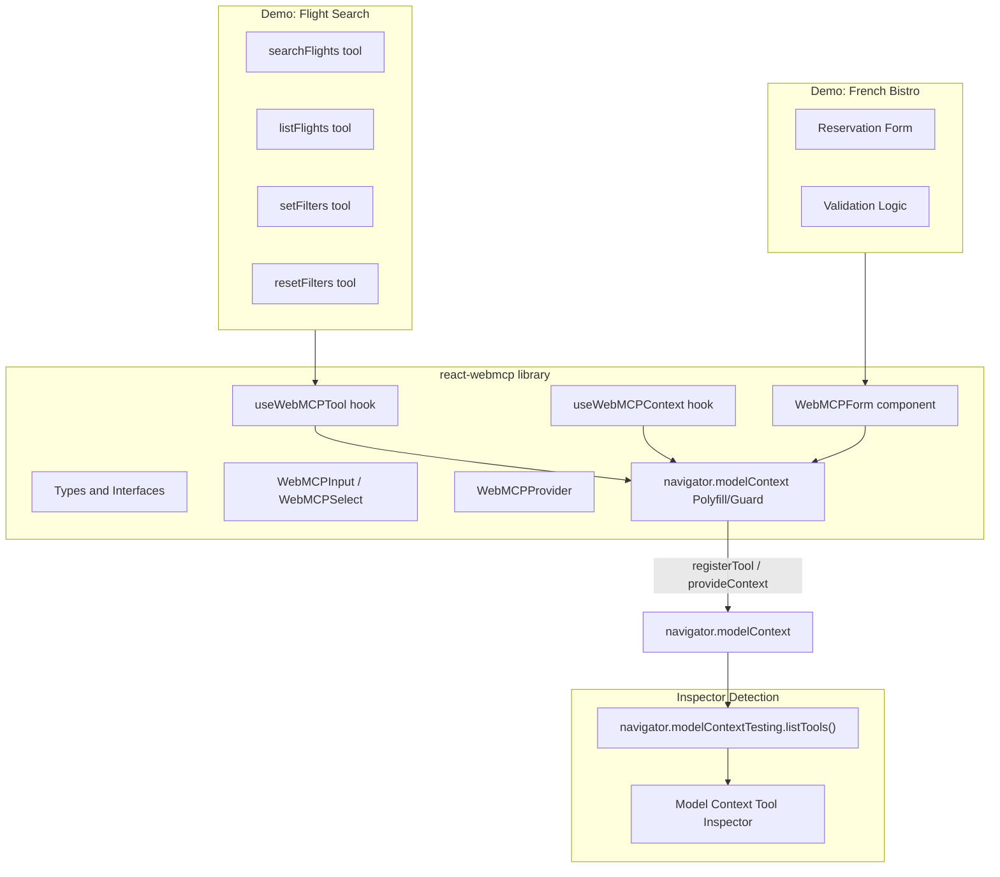

# React WebMCP Library

## Context

WebMCP is a W3C-proposed web standard (Chrome 146+) that lets websites expose structured tools for AI agents via `navigator.modelContext`. The spec has two API modes:

- **Imperative API** -- JavaScript: `navigator.modelContext.registerTool()`, `unregisterTool()`, `provideContext()`, `clearContext()`
- **Declarative API** -- HTML form attributes: `toolname`, `tooldescription`, `toolparamdescription`, `toolparamtitle`, `toolautosubmit`

The Model Context Tool Inspector extension detects tools via `navigator.modelContextTesting.listTools()` and executes them via `navigator.modelContextTesting.executeTool()`. Both imperative and declarative tools are discovered through this single API.

We have reference implementations:

- [webmcp-tools/demos/react-flightsearch](projects/webmcp/sources/webmcp-tools/demos/react-flightsearch/src/webmcp.ts) -- imperative React demo
- [webmcp-tools/demos/french-bistro](projects/webmcp/sources/webmcp-tools/demos/french-bistro/index.html) -- declarative HTML demo
- [mcp-b/newWebsite/hooks/useWebMCPTools.tsx](projects/webmcp/sources/mcp-b/newWebsite/hooks/useWebMCPTools.tsx) -- hook-based pattern from mcp-b predecessor

## Architecture




## Library Package Structure

All code under `projects/webmcp/library/`:

```
projects/webmcp/library/
  package.json           # npm package: react-webmcp
  tsconfig.json
  tsup.config.ts         # Build config (ESM + CJS)
  README.md
  LICENSE
  src/
    index.ts             # Public exports
    types.ts             # WebMCP types (Tool, Schema, Annotations, etc.)
    context.tsx          # WebMCPProvider + React context
    hooks/
      useWebMCPTool.ts   # Register single tool (imperative)
      useWebMCPContext.ts # provideContext/clearContext (bulk tools)
      useToolEvent.ts    # Listen to toolactivated/toolcancel events
    components/
      WebMCPForm.tsx     # <form toolname=...> declarative wrapper
      WebMCPInput.tsx    # <input> with toolparam* attributes
      WebMCPSelect.tsx   # <select> with toolparam* attributes
      WebMCPTextarea.tsx # <textarea> with toolparam* attributes
    utils/
      modelContext.ts    # navigator.modelContext guard + type augmentation
  demos/
    flight-search/       # React imperative demo (replicates react-flightsearch)
    french-bistro/       # React declarative demo (replicates french-bistro)
```

## Key Design Decisions

### 1. `useWebMCPTool` Hook (core primitive)

Inspired by the `useWebMCP` pattern from [mcp-b](projects/webmcp/sources/mcp-b/newWebsite/hooks/useWebMCPTools.tsx), but targeting the W3C `navigator.modelContext` API directly:

```typescript
function useWebMCPTool(config: {
  name: string;
  description: string;
  inputSchema: JSONSchema;
  outputSchema?: JSONSchema;
  annotations?: ToolAnnotations;
  execute: (input: any) => any | Promise<any>;
}): void
```

- Calls `navigator.modelContext.registerTool()` on mount
- Calls `navigator.modelContext.unregisterTool()` on unmount
- Re-registers when config changes (via `name` as key)
- Matches the tool shape from the [webmcp.ts reference](projects/webmcp/sources/webmcp-tools/demos/react-flightsearch/src/webmcp.ts) (lines 54-112)

### 2. `WebMCPForm` Component (declarative wrapper)

Renders a `<form>` with the WebMCP HTML attributes, handling:

- `toolname`, `tooldescription`, `toolautosubmit` props mapped to attributes
- `onToolActivated` / `onToolCancel` event callbacks
- `onSubmit` with `agentInvoked` and `respondWith` support
- CSS pseudo-class compatibility (`:tool-form-active`, `:tool-submit-active`)

### 3. TypeScript Type Augmentation

Extend `Navigator` interface to include `modelContext` and `modelContextTesting`, similar to [webmcp.ts](projects/webmcp/sources/webmcp-tools/demos/react-flightsearch/src/webmcp.ts) lines 3-9 but more complete.

### 4. Detection by Inspector

The Inspector uses `navigator.modelContextTesting.listTools()` (see [content.js](projects/webmcp/sources/model-context-tool-inspector/content.js) line 57). Both imperative (`registerTool`) and declarative (HTML attributes) tools are automatically surfaced through this testing API by the browser. Our library just needs to correctly call the standard APIs -- no special inspector integration required.

## Demos

### Flight Search Demo (Imperative)

Replicates [react-flightsearch](projects/webmcp/sources/webmcp-tools/demos/react-flightsearch/) using the library hooks instead of raw `navigator.modelContext` calls. Same 4 tools: `searchFlights`, `listFlights`, `setFilters`, `resetFilters`. Uses Vite + React + TypeScript.

### French Bistro Demo (Declarative)

Replicates [french-bistro](projects/webmcp/sources/webmcp-tools/demos/french-bistro/) using `WebMCPForm` + `WebMCPInput`/`WebMCPSelect` components instead of raw HTML attributes. Same `book_table_le_petit_bistro` tool with validation.

## Git Setup

Initialize a standalone git repo under `projects/webmcp/library/`, push to `https://github.com/tech-sumit/react-webmcp.git` on `master` branch with a comprehensive README covering installation, API reference, and examples.