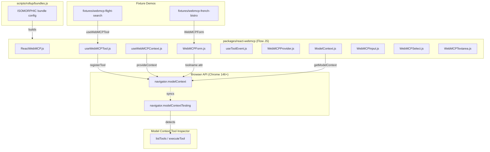

# React WebMCP Package -- Contribution Plan

## Context

- **React fork**: `[projects/webmcp/react/](projects/webmcp/react/)` (origin: `https://github.com/tech-sumit/react`, branch: `main`)
- **Reference library**: `[projects/webmcp/library/](projects/webmcp/library/)` -- standalone TypeScript implementation (used as design reference only)
- **Google reference demos**: `[projects/webmcp/sources/webmcp-tools/demos/](projects/webmcp/sources/webmcp-tools/demos/)` -- `react-flightsearch` (imperative) and `french-bistro` (declarative)
- **Inspector**: `[projects/webmcp/sources/model-context-tool-inspector/](projects/webmcp/sources/model-context-tool-inspector/)` -- Chrome extension using `navigator.modelContextTesting`

## Critical React Monorepo Conventions

Based on `[.claude/instructions.md](projects/webmcp/react/.claude/instructions.md)`, `[.claude/skills/](projects/webmcp/react/.claude/skills/)`, and the existing codebase:

- **Language**: JavaScript with **Flow** type annotations (NOT TypeScript). Every file has `@flow` pragma.
- **Package manager**: **yarn** only (npm/pnpm/bun are denied)
- **Imports**: Namespace imports for React: `import * as React from 'react';` (Rollup CommonJS interop requires this)
- **License header**: Meta Platforms MIT header on every source file
- **Code style**: Prettier with `singleQuote: true`, `bracketSpacing: false`, `trailingComma: 'es5'`, `arrowParens: 'avoid'`, Flow parser
- **Dev warnings**: Use `if (__DEV__) { ... }` pattern (not `process.env.NODE_ENV`)
- **Console**: Use bracket notation `console['warn'](...)` to avoid Rollup transforms
- **Build**: Managed via `scripts/rollup/bundles.js` -- no tsup, no tsconfig, no custom build tooling
- **Verification**: Run `yarn prettier` then `yarn linc` then `yarn flow dom-node` before committing

## 1. Package Scaffolding

**Path**: `packages/react-webmcp/`

Following the pattern of `[packages/use-sync-external-store/](projects/webmcp/react/packages/use-sync-external-store/)`:

```
packages/react-webmcp/
  package.json
  index.js                          # export * from './src/ReactWebMCP';
  README.md
  npm/
    index.js                        # CommonJS dev/prod switching wrapper
  src/
    ReactWebMCP.js                  # Main exports barrel
    ModelContext.js                  # getModelContext(), isWebMCPAvailable(), etc.
    useWebMCPTool.js                # Single tool registration hook
    useWebMCPContext.js             # Bulk tool registration (provideContext)
    useToolEvent.js                 # toolactivated/toolcancel listener
    WebMCPProvider.js               # React context provider + useWebMCPStatus
    WebMCPForm.js                   # <form> with toolname/tooldescription attrs
    WebMCPInput.js                  # <input> with toolparamdescription
    WebMCPSelect.js                 # <select> with toolparamdescription
    WebMCPTextarea.js               # <textarea> with toolparamdescription
    __tests__/
      useWebMCPTool-test.js
      WebMCPForm-test.js
```

`**package.json**` (modeled after use-sync-external-store):

```json
{
  "name": "react-webmcp",
  "description": "React hooks and components for the WebMCP standard",
  "version": "0.1.0",
  "exports": {
    ".": "./index.js",
    "./package.json": "./package.json",
    "./src/*": "./src/*.js"
  },
  "repository": {
    "type": "git",
    "url": "https://github.com/tech-sumit/react.git",
    "directory": "packages/react-webmcp"
  },
  "files": ["LICENSE", "README.md", "index.js", "cjs/"],
  "license": "MIT",
  "peerDependencies": {
    "react": "^18.0.0 || ^19.0.0"
  }
}
```

`**index.js**` (entry point):

```javascript
'use strict';

export {
  // Hooks
  useWebMCPTool,
  useWebMCPContext,
  useToolEvent,
  // Provider
  WebMCPProvider,
  useWebMCPStatus,
  // Declarative components
  WebMCPForm,
  WebMCPInput,
  WebMCPSelect,
  WebMCPTextarea,
  // Utilities
  getModelContext,
  isWebMCPAvailable,
  isWebMCPTestingAvailable,
} from './src/ReactWebMCP';
```

`**npm/index.js**` (CommonJS entry for published package):

```javascript
'use strict';

if (process.env.NODE_ENV === 'production') {
  module.exports = require('./cjs/react-webmcp.production.js');
} else {
  module.exports = require('./cjs/react-webmcp.development.js');
}
```

## 2. Build System Integration

Add to `[scripts/rollup/bundles.js](projects/webmcp/react/scripts/rollup/bundles.js)`:

```javascript
/******* react-webmcp *******/
{
  bundleTypes: [NODE_DEV, NODE_PROD],
  moduleType: ISOMORPHIC,
  entry: 'react-webmcp',
  global: 'ReactWebMCP',
  minifyWithProdErrorCodes: false,
  wrapWithModuleBoundaries: true,
  externals: ['react'],
},
```

Note: only `react` in externals -- no ISOMORPHIC package in the React monorepo lists `react-dom` as an external. No forks needed (`scripts/rollup/forks.js`). No host config needed (`scripts/shared/inlinedHostConfigs.js`) since this is ISOMORPHIC.

## 3. Source Files -- TypeScript-to-Flow Conversion

Each file from the reference library at `[library/src/](projects/webmcp/library/src/)` is rewritten to Flow. Key conversions:


| TypeScript (library)                         | Flow (react-webmcp)                         |
| -------------------------------------------- | ------------------------------------------- |
| `interface Foo { ... }`                      | `type Foo = { ... }`                        |
| `Record<string, unknown>`                    | `{[string]: mixed}`                         |
| `React.forwardRef<El, Props>`                | `React.forwardRef<Props, El>`               |
| `event: CustomEvent & { toolName?: string }` | `event: Event` with `(event: any).toolName` |
| `React.FormHTMLAttributes<...>`              | Explicit prop type                          |
| `.tsx` files                                 | `.js` files with `@flow`                    |


**Example: `src/ModelContext.js`** (converted from `utils/modelContext.ts`):

```javascript
/**
 * Copyright (c) Meta Platforms, Inc. and affiliates.
 *
 * This source code is licensed under the MIT license found in the
 * LICENSE file in the root directory of this source tree.
 *
 * @flow
 */

export function getModelContext(): ?{
  registerTool: (tool: {...}) => void,
  unregisterTool: (name: string) => void,
  provideContext: (config: {tools: Array<{...}>}) => void,
  clearContext: () => void,
} {
  if (
    typeof window !== 'undefined' &&
    typeof window.navigator !== 'undefined' &&
    window.navigator.modelContext
  ) {
    return window.navigator.modelContext;
  }
  return null;
}

export function isWebMCPAvailable(): boolean {
  return getModelContext() !== null;
}

export function isWebMCPTestingAvailable(): boolean {
  return (
    typeof window !== 'undefined' &&
    typeof window.navigator !== 'undefined' &&
    !!window.navigator.modelContextTesting
  );
}
```

**Example: `src/useWebMCPTool.js`** (converted from `hooks/useWebMCPTool.ts`):

```javascript
/**
 * Copyright (c) Meta Platforms, Inc. and affiliates.
 *
 * This source code is licensed under the MIT license found in the
 * LICENSE file in the root directory of this source tree.
 *
 * @flow
 */

import * as React from 'react';
import {getModelContext} from './ModelContext';

const {useEffect, useRef} = React;

type WebMCPToolConfig = {
  name: string,
  description: string,
  inputSchema: {...},
  outputSchema?: {...},
  annotations?: {
    readOnlyHint?: string,
    destructiveHint?: string,
    idempotentHint?: string,
    cache?: boolean,
  },
  execute: (input: {[string]: mixed}) => mixed | Promise<mixed>,
};

export function useWebMCPTool(config: WebMCPToolConfig): void {
  const registeredNameRef = useRef<string | null>(null);
  const configRef = useRef(config);
  configRef.current = config;

  useEffect(() => {
    const mc = getModelContext();
    if (!mc) {
      if (__DEV__) {
        console['warn'](
          'useWebMCPTool: navigator.modelContext is not available. ' +
            'Ensure you are running Chrome 146+ with the ' +
            '"WebMCP for testing" flag enabled.'
        );
      }
      return;
    }

    if (registeredNameRef.current && registeredNameRef.current !== config.name) {
      try {
        mc.unregisterTool(registeredNameRef.current);
      } catch (e) {
        // Tool may have already been unregistered
      }
    }

    const toolDef = {
      name: config.name,
      description: config.description,
      inputSchema: config.inputSchema,
      execute: (input: {[string]: mixed}) => {
        return configRef.current.execute(input);
      },
    };
    if (config.outputSchema) {
      toolDef.outputSchema = config.outputSchema;
    }
    if (config.annotations) {
      toolDef.annotations = config.annotations;
    }

    try {
      mc.registerTool(toolDef);
      registeredNameRef.current = config.name;
    } catch (err) {
      if (__DEV__) {
        console['error'](
          'Failed to register WebMCP tool "%s": %s',
          config.name,
          err
        );
      }
    }

    return () => {
      try {
        mc.unregisterTool(config.name);
      } catch (e) {
        // Tool may have already been unregistered
      }
      registeredNameRef.current = null;
    };
  }, [config.name, config.description, config.inputSchema,
      config.outputSchema, config.annotations]);
}
```

All remaining files (`useWebMCPContext.js`, `useToolEvent.js`, `WebMCPProvider.js`, `WebMCPForm.js`, `WebMCPInput.js`, `WebMCPSelect.js`, `WebMCPTextarea.js`) follow the same conversion pattern.

## 4. Flight Search Fixture (Imperative API Demo)

**Path**: `fixtures/webmcp-flight-search/`

Uses `react-scripts` (CRA) following the React fixture pattern from `[fixtures/dom/](projects/webmcp/react/fixtures/dom/)`.

```
fixtures/webmcp-flight-search/
  package.json
  public/
    index.html
  src/
    index.js
    App.js
    App.css
    components/
      FlightSearch.js       # useWebMCPTool for 'searchFlights'
      FlightResults.js      # useWebMCPTool x4 (list, setFilters, resetFilters, search)
      FilterPanel.js
      FlightList.js
      FlightCard.js
      AppliedFilters.js
      Header.js
      Toast.js
      PriceRangeFilter.js
      TimeRangeFilter.js
    data/
      flights.js            # 100 flights, LON to NYC (from Google demo)
      airports.js
    utils/
      dispatchAndWait.js    # Async event dispatch pattern
```

`**package.json**` (follows fixture convention):

```json
{
  "name": "webmcp-flight-search-fixture",
  "private": true,
  "dependencies": {
    "react": "^19.0.0",
    "react-dom": "^19.0.0",
    "react-webmcp": "^0.1.0",
    "react-router-dom": "^7.13.0",
    "rc-slider": "^11.0.0",
    "react-scripts": "^5.0.0"
  },
  "scripts": {
    "predev": "cp -a ../../build/oss-experimental/. node_modules",
    "dev": "react-scripts start"
  }
}
```

Key: Components use `import {useWebMCPTool} from 'react-webmcp'` instead of raw `navigator.modelContext` calls. Tool schemas and behavior match Google's reference demo exactly.

## 5. French Bistro Fixture (Declarative API Demo)

**Path**: `fixtures/webmcp-french-bistro/`

```
fixtures/webmcp-french-bistro/
  package.json
  public/
    index.html
  src/
    index.js
    App.js
    components/
      ReservationForm.js     # WebMCPForm + WebMCPInput/Select/Textarea
      BookingModal.js
    styles/
      bistro.css             # Gold/cream theme from Google demo
```

Uses `<WebMCPForm>`, `<WebMCPInput>`, `<WebMCPSelect>`, `<WebMCPTextarea>` from `react-webmcp`. Ports the gold/cream CSS theme including `:tool-form-active` and `:tool-submit-active` pseudo-class styles. Same validation logic (name min 2 chars, phone min 10 digits, future date).

## Architecture




## Key Implementation Notes

- **No TypeScript anywhere** -- all `.js` with `@flow`. The library reference implementation at `library/src/` is used for logic/design only; every file is rewritten in Flow-typed JS.
- **Rollup build, not tsup** -- the package is built by the React monorepo Rollup system via `scripts/rollup/bundles.js`. No custom build config inside the package.
- `**__DEV__` guards** -- all console warnings and dev-only checks use `if (__DEV__) { ... }`, which the build system strips in production bundles.
- `**console['warn']`** -- bracket notation to avoid Rollup's console method transforms.
- **Namespace imports** -- always `import * as React from 'react'` then destructure: `const {useEffect, useRef} = React;`
- **Fixture `predev` script** -- copies from `../../build/oss-experimental/` into `node_modules/` so fixtures use the locally built React + react-webmcp.
- **Inspector compatibility** -- imperative tools via `registerTool()` and declarative tools via `toolname` HTML attributes are both detected by the inspector's `navigator.modelContextTesting.listTools()`.
- `**dispatchAndWait` pattern** -- bridge between WebMCP tool execution (async) and React state updates (via CustomEvent dispatch + completion event). Same pattern as Google's reference at `[webmcp.ts:19-50](projects/webmcp/sources/webmcp-tools/demos/react-flightsearch/src/webmcp.ts)`.

