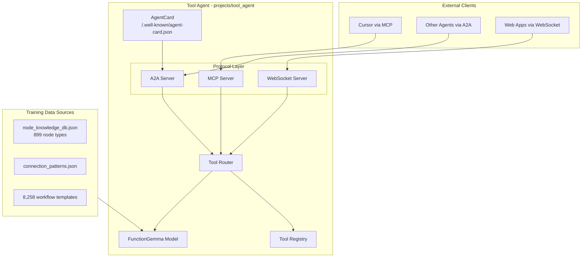

# Tool Agent: FunctionGemma Integration Expert

## Key Decision: FunctionGemma over raw Gemma 3 270M

Google already released **[FunctionGemma](https://huggingface.co/google/functiongemma-270m-it)** -- a specialized Gemma 3 270M variant explicitly fine-tuned for function calling. It outputs structured calls like `<start_function_call>call:tool_name{param:<escape>value<escape>}<end_function_call>`. This is our base model; we further fine-tune it on n8n integration knowledge.

## Architecture




## Project Structure

```
projects/tool_agent/
├── pyproject.toml                    # Python project config (Python 3.10+)
├── Makefile                          # CLI interface
├── README.md
├── training/
│   ├── generate_training_data.py     # Convert knowledge_db -> FunctionGemma format
│   ├── finetune.py                   # Fine-tune with Unsloth/TRL
│   ├── evaluate.py                   # Evaluate tool selection accuracy
│   ├── export_gguf.py                # Export to GGUF for Ollama
│   └── configs/
│       └── default.yaml              # Hyperparameters
├── agent/
│   ├── __init__.py
│   ├── server.py                     # FastAPI main server
│   ├── model.py                      # Model loading (Ollama, transformers, GGUF)
│   ├── tool_registry.py              # Dynamic tool registration + discovery
│   ├── router.py                     # Intent -> tool routing via FunctionGemma
│   ├── composer.py                   # Multi-step tool chain composition
│   ├── config.py                     # Configuration
│   ├── protocols/
│   │   ├── a2a.py                    # A2A server (a2a-sdk)
│   │   ├── mcp.py                    # MCP server (FastMCP)
│   │   └── websocket.py              # WebSocket handler
│   └── tools/
│       ├── base.py                   # Tool base class
│       ├── n8n.py                    # n8n workflow/node tools
│       └── http.py                   # Generic HTTP/API tools
├── docker/
│   ├── Dockerfile
│   └── docker-compose.yml
└── tests/
    └── test_router.py
```

## Phase 1: Training Data Pipeline

The richest asset is `[n8n-templates/knowledge_db/](n8n-templates/knowledge_db/)` -- 899 node types with full parameter specs, credential requirements, and connection patterns from 8,258 templates.

**Training data generation** (`training/generate_training_data.py`):

- Parse `node_knowledge_db.json` to extract function schemas for each node type (name, description, parameters, required credentials)
- Parse `connection_patterns.json` to generate multi-step composition examples
- Use model distillation: send schemas + sample queries to a larger model (Claude/GPT-4) to generate synthetic training pairs in FunctionGemma's expected format
- Output: JSONL dataset with `user_prompt`, `available_tools`, `expected_tool_call` columns
- Target: ~5,000-10,000 training examples covering tool selection, parameter filling, and multi-tool composition

**FunctionGemma training data format** (from [the fine-tuning guide](https://developers.googleblog.com/en/a-guide-to-fine-tuning-functiongemma/)):

```python
# Conversation format with tool schemas
[
    {"role": "developer", "content": "You are a model that can do function calling with the following functions"},
    {"role": "user", "content": "Send a Slack message to #engineering when a new GitHub issue is created"}
]
# + tools=[{schema1}, {schema2}, ...] passed via apply_chat_template
```

## Phase 2: Fine-Tuning

**Framework: [Unsloth](https://docs.unsloth.ai/models/functiongemma)**

- Base model: `unsloth/functiongemma-270m-it` (pre-quantized, optimized)
- Supports free T4 GPU on Colab, or local with any GPU
- LoRA fine-tuning for parameter efficiency
- Export to GGUF for Ollama deployment

**Alternative: [FunctionGemma Tuning Lab](https://huggingface.co/spaces/google/functiongemma-tuning-lab)**

- No-code UI for quick iteration
- Upload CSV, configure hyperparams, train

**Key hyperparameters** (from Google's guide):

- Learning rate: 2e-4
- Epochs: 8
- Batch size: 4-8
- Method: SFT (Supervised Fine-Tuning) via TRL's `SFTTrainer`

## Phase 3: Agent Server

**Core framework: FastAPI** -- serves as the HTTP backbone for all three protocols.

### Protocol 1: A2A (Agent-to-Agent)

- **SDK**: `a2a-sdk` (Google's official Python SDK, v0.3.24)
- **Discovery**: Serve `AgentCard` at `/.well-known/agent-card.json` with skills, auth, capabilities
- **Transport**: JSON-RPC over HTTP (primary), with streaming support
- **Skills advertised**: Each registered tool becomes an A2A skill

### Protocol 2: MCP (Model Context Protocol)

- **SDK**: `mcp` Python SDK v1.26.0 with FastMCP high-level API
- **Tools**: Each registered tool exposed as an MCP tool via `@mcp.tool()` decorator
- **Resources**: Tool registry metadata, n8n node catalog
- **Transport**: Streamable HTTP at `/mcp`

### Protocol 3: WebSocket

- **FastAPI WebSocket** endpoint at `/ws`
- JSON-RPC message format (aligned with A2A)
- Real-time streaming of tool execution results
- Session management for multi-turn interactions

### Tool Registry

- Central registry where tools are registered with schemas (JSON Schema for params)
- Dynamic registration: add/remove tools at runtime
- Auto-generates AgentCard skills and MCP tool descriptors from registry
- Built-in tools: n8n node operations, HTTP requests, workflow composition

### Model Integration (`model.py`)

- **Primary**: Ollama backend (after GGUF export) for local inference
- **Fallback**: HuggingFace `transformers` for direct model loading
- Swappable: design allows upgrading to 1B/4B models by changing config

## Phase 4: Deployment

- **Docker**: Single container with FastAPI + model inference
- **Ollama sidecar**: Ollama container for model serving (or use host Ollama)
- **Ports**: HTTP/A2A on `:8888`, MCP on `:8888/mcp`, WebSocket on `:8888/ws`
- **Integration with n8n stack**: Add to `docker-compose.yml` as optional service

## Dependencies

```
# Core server
fastapi
uvicorn
websockets

# A2A Protocol
a2a-sdk[http-server]

# MCP Protocol
mcp[cli]

# Model / Training
unsloth            # fine-tuning (training only)
transformers       # inference
torch
trl                # SFT trainer (training only)

# Data processing
pyyaml
pydantic
```

## Makefile Targets (added to root Makefile)

```makefile
# Training
tool-agent-data:     generate training data from knowledge_db
tool-agent-train:    fine-tune FunctionGemma
tool-agent-eval:     evaluate model accuracy
tool-agent-export:   export to GGUF for Ollama

# Server
tool-agent-up:       start tool agent server
tool-agent-down:     stop tool agent server
tool-agent-status:   check agent status + registered tools
```

