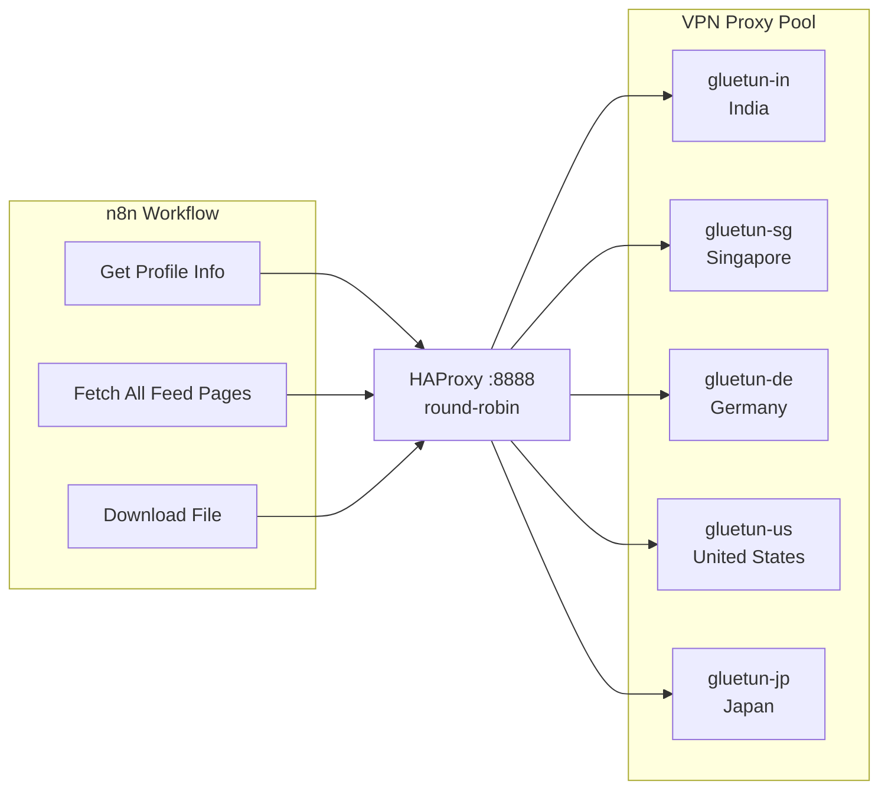

# HAProxy + 5 VPN Containers -- Round-Robin IP Rotation

## Why this approach?

Gluetun has no API to dynamically switch countries. Running 5 instances behind a load balancer means:

- **Workflow stays simple** -- single proxy URL, no counter logic, no extra Code nodes
- **Automatic rotation** -- HAProxy distributes each new TCP connection round-robin
- **Fault tolerance** -- HAProxy health-checks backends; if one VPN drops, traffic shifts to the rest
- NordVPN allows 10 simultaneous connections; 5 is well within limits

## Architecture




## Changes

### 1. Create `haproxy/haproxy.cfg`

Minimal TCP-mode config. HAProxy listens on `:8888` and round-robins across 5 gluetun backends on their `:8888` proxy ports. Health checks ensure dead VPN tunnels are skipped.

```
global
    log stdout format raw local0

defaults
    mode tcp
    timeout connect 5s
    timeout client  60s
    timeout server  60s
    retries 3

frontend vpn_proxy
    bind *:8888
    default_backend vpn_pool

backend vpn_pool
    balance roundrobin
    option tcp-check
    server gluetun-in n8n-gluetun-in:8888 check inter 10s fall 3 rise 2
    server gluetun-sg n8n-gluetun-sg:8888 check inter 10s fall 3 rise 2
    server gluetun-de n8n-gluetun-de:8888 check inter 10s fall 3 rise 2
    server gluetun-us n8n-gluetun-us:8888 check inter 10s fall 3 rise 2
    server gluetun-jp n8n-gluetun-jp:8888 check inter 10s fall 3 rise 2
```

### 2. `docker-compose.yml` -- 5 gluetun instances + HAProxy

Replace single `gluetun` service. Use YAML extension field `x-gluetun-base` to avoid duplication.

**5 gluetun services** (each differing only in `container_name` and `SERVER_COUNTRIES`):

- `gluetun-in` -- India
- `gluetun-sg` -- Singapore
- `gluetun-de` -- Germany
- `gluetun-us` -- United States
- `gluetun-jp` -- Japan

**1 HAProxy service** (`vpn-lb`):

- Image: `haproxy:lts-alpine`
- Container: `n8n-vpn-lb`
- Mounts `./haproxy/haproxy.cfg:/usr/local/etc/haproxy/haproxy.cfg:ro`
- `depends_on` all 5 gluetun services
- Same `n8n-net` network

### 3. Workflow -- Update proxy URLs

All 3 HTTP Request nodes (`Get Profile Info`, `Fetch All Feed Pages`, `Download File`) change proxy from `http://n8n-gluetun:8888` to:

```
http://n8n-vpn-lb:8888
```

No other workflow changes needed. No `Select Proxy` node, no index tracking, no dynamic expressions.

### 4. Start and verify

- `docker compose up -d gluetun-in gluetun-sg gluetun-de gluetun-us gluetun-jp vpn-lb`
- `docker rm -f n8n-gluetun` (remove old single instance)
- Verify round-robin: `for i in $(seq 1 5); do docker exec n8n wget -qO- --proxy on -Y on http://n8n-vpn-lb:8888 https://api.ipify.org; echo; done` -- should show rotating IPs
- Execute workflow with test profile

