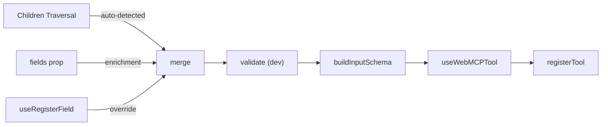

# Runtime Schema Collector Engine




## Usage

```tsx
// Auto-detection: enum values detected from MenuItem children
<WebMCP.Tool name="send_email" description="Send an email" onExecute={handler}>
  <FormControl>
    <InputLabel>Email</InputLabel>
    <Input name="email" type="email" required />
  </FormControl>
  <FormControl>
    <Select name="priority">
      <MenuItem value="low">Low</MenuItem>
      <MenuItem value="normal">Normal</MenuItem>
      <MenuItem value="high">High</MenuItem>
    </Select>
  </FormControl>
</WebMCP.Tool>

// With descriptions via fields prop
<WebMCP.Tool
  name="send_email"
  description="Send an email"
  fields={{
    email: { description: "Recipient's email address" },
    priority: { description: "Email priority level" },
  }}
  onExecute={handler}
>
  {/* same children */}
</WebMCP.Tool>

// Strict mode: schema issues throw instead of warn
<WebMCP.Tool name="send_email" description="..." onExecute={handler} strict>
  {/* ... */}
</WebMCP.Tool>

// Escape hatch for custom components
<WebMCP.Field name="email" type="email" required description="Recipient email">
  <MyCustomEmailInput />
</WebMCP.Field>
```

## Conventions

Follows all existing library patterns from `[src/](projects/webmcp/library/src/)`:

- `process.env.NODE_ENV !== "production"` inline (no `__DEV__` constant)
- `[react-webmcp]` prefix on all console messages
- Try/catch around browser API calls, silent failure in cleanup
- `import type` for type-only imports
- Fingerprint strings for deep comparison (`name::type::JSON.stringify(...)`)
- Ref pattern for stable callbacks (`configRef.current = config`)
- JSDoc with `@example` on all public exports
- Props interfaces named `ComponentNameProps`
- `displayName` on all components
- `React.Children.toArray` for safe traversal

## Files

All in `[src/adapters/](projects/webmcp/library/src/adapters/)`. 9 files.

### `[types.ts](projects/webmcp/library/src/adapters/types.ts)`

Section-commented like existing `[types.ts](projects/webmcp/library/src/types.ts)`.

```typescript
export interface FieldDefinition {
  name: string;
  type?: string;
  required?: boolean;
  title?: string;
  description?: string;
  min?: number;
  max?: number;
  minLength?: number;
  maxLength?: number;
  pattern?: string;
  enumValues?: (string | number | boolean)[];
  oneOf?: { value: string | number | boolean; label: string }[];
}

export interface ToolContextValue {
  registerField: (field: FieldDefinition) => void;
  unregisterField: (name: string) => void;
}
```

### `[extractFields.ts](projects/webmcp/library/src/adapters/extractFields.ts)`

Two pure functions, no side effects, no mutations.

- `**extractFields(children): FieldDefinition[]**` -- `React.Children.toArray` traversal. Detects name via `props.name ?? props.inputProps?.name ?? props.slotProps?.input?.name`. If name found: build `FieldDefinition` from `type`, `required`, `min`, `max`, `minLength`, `maxLength`, `pattern` + call `extractOptions` on element's children. If no name: recurse into `props.children`.
- `**extractOptions(children): { value, label }[]**` -- `React.Children.toArray` traversal. Collects elements with `value` prop. Label from string `children` or `String(value)` fallback. Recurses into nested children.

### `[buildSchema.ts](projects/webmcp/library/src/adapters/buildSchema.ts)`

- `**mapHtmlTypeToSchemaType(htmlType?)**` -- `number/range` -> `"number"`, `checkbox` -> `"boolean"`, default `"string"`.
- `**buildInputSchema(fields): JSONSchema**` -- deterministic: sorts property names alphabetically, sorts `required` array. Maps `min`/`max` -> `minimum`/`maximum`, `enumValues` -> `enum`, `oneOf` -> JSON Schema `oneOf`.

### `[validateSchema.ts](projects/webmcp/library/src/adapters/validateSchema.ts)`

- `**validateSchema(fields, options?: { strict? }): void**` -- no-op in production. Checks: duplicate names, `pattern` on non-string, `min`/`max` on non-number, `minLength`/`maxLength` on non-string, enum values not matching declared type. `console.warn` with `[react-webmcp]` prefix. If `strict: true`: throws `Error`.

### `[useSchemaCollector.ts](projects/webmcp/library/src/adapters/useSchemaCollector.ts)`

The engine. Accepts `{ children, fields?, strict? }`, returns `{ schema, registerField, unregisterField }`.

Contains private helpers (not exported, same pattern as `toolFingerprint` in `[useWebMCPTool.ts](projects/webmcp/library/src/hooks/useWebMCPTool.ts)`):

- `**fieldsFingerprint(fields)**` -- stable string for change detection.
- `**mergeField(base, override)**` -- skips `undefined` in override, replaces `enumValues`/`oneOf` wholesale (no concat).

Also defines `ToolContext = createContext<ToolContextValue | null>(null)` at module level (single consumer, no separate file needed).

Engine flow:

1. `extractFields(children)` every render (cheap O(n)), fingerprinted to detect changes.
2. Context fields via `useRef<Map>` + version counter, `registerField`/`unregisterField` via `useCallback`.
3. Merge in `useMemo` keyed on `[childrenFingerprint, fields, version]`. Priority: children < `fields` prop < context.
4. Validate in dev mode inside the merge memo.
5. Schema via `useMemo(() => buildInputSchema(merged), [mergedFingerprint])`.

No two-render cycle when only Sources 1+2 are used.

### `[useRegisterField.ts](projects/webmcp/library/src/adapters/useRegisterField.ts)`

Same structure as `[useWebMCPTool](projects/webmcp/library/src/hooks/useWebMCPTool.ts)`:

- Reads `ToolContext` from `useSchemaCollector` module via `useContext`.
- `useEffect` (SSR-safe) with fingerprint-based deps.
- Cleanup calls `unregisterField`.
- Dev warning if no context: `console.warn("[react-webmcp] useRegisterField: ...")`.

### `[WebMCPTool.tsx](projects/webmcp/library/src/adapters/WebMCPTool.tsx)`

```typescript
export interface WebMCPToolProps {
  name: string;
  description: string;
  onExecute: (input: Record<string, unknown>) => unknown | Promise<unknown>;
  fields?: Record<string, Partial<FieldDefinition>>;
  strict?: boolean;
  autoSubmit?: boolean;
  annotations?: ToolAnnotations;
  onToolActivated?: (toolName: string) => void;
  onToolCancel?: (toolName: string) => void;
  children: React.ReactNode;
}
```

SSR safety: event listeners inside `useEffect` guarded by `typeof window !== "undefined"`. The existing `useWebMCPTool` already guards via `getModelContext()` returning null on server.

Calls `useSchemaCollector`, delegates to `useWebMCPTool`, listens for `toolactivated`/`toolcancel` (same pattern as [WebMCPForm lines 61-87](projects/webmcp/library/src/components/WebMCPForm.tsx)). Renders `<ToolContext.Provider>{children}</ToolContext.Provider>`.

### `[WebMCPField.tsx](projects/webmcp/library/src/adapters/WebMCPField.tsx)`

```typescript
export interface WebMCPFieldProps extends Omit<FieldDefinition, "name"> {
  name: string;
  children: React.ReactNode;
}
```

Auto-detects enums from children via `extractOptions`, calls `useRegisterField`, renders `<>{children}</>`. Sets `displayName = "WebMCP.Field"`.

### `[index.ts](projects/webmcp/library/src/adapters/index.ts)`

```typescript
import { WebMCPTool } from "./WebMCPTool";
import { WebMCPField } from "./WebMCPField";

export const WebMCP = { Tool: WebMCPTool, Field: WebMCPField } as const;

export { WebMCPTool, WebMCPField };
export type { WebMCPToolProps } from "./WebMCPTool";
export type { WebMCPFieldProps } from "./WebMCPField";
export { useRegisterField } from "./useRegisterField";
export { useSchemaCollector } from "./useSchemaCollector";
export { extractFields, extractOptions } from "./extractFields";
export { buildInputSchema } from "./buildSchema";
export { validateSchema } from "./validateSchema";
export type { FieldDefinition, ToolContextValue } from "./types";
```

### Modified: `[src/index.ts](projects/webmcp/library/src/index.ts)`

```typescript
// Adapter API (third-party component library support)
export {
  WebMCP, WebMCPTool, WebMCPField,
  useRegisterField, useSchemaCollector,
  extractFields, extractOptions, buildInputSchema, validateSchema,
} from "./adapters";
export type { WebMCPToolProps, WebMCPFieldProps, FieldDefinition } from "./adapters";
```

## Tests

In `[src/__tests__/](projects/webmcp/library/src/__tests__/)`, following existing patterns: vitest + `@testing-library/react`, mock helpers in `helpers.ts`, `afterEach` cleanup.

- **extractFields.test.ts** -- name detection from `props.name`, `inputProps.name`, `slotProps.input.name`. Enum auto-detection from children with `value` props. Container recursion.
- **buildSchema.test.ts** -- deterministic property ordering. Type mapping. Constraint mapping.
- **validateSchema.test.ts** -- each warning rule. Strict mode throws. Production no-op.
- **useSchemaCollector.test.tsx** -- merge priority. Fingerprint stability. Context field registration/unregistration.
- **WebMCPTool.test.tsx** -- SSR safety (no `registerTool` when `window` undefined). Event listener setup/cleanup. Strict prop forwarding.
- **WebMCPField.test.tsx** -- enum auto-detection. Context registration. Fragment rendering.

