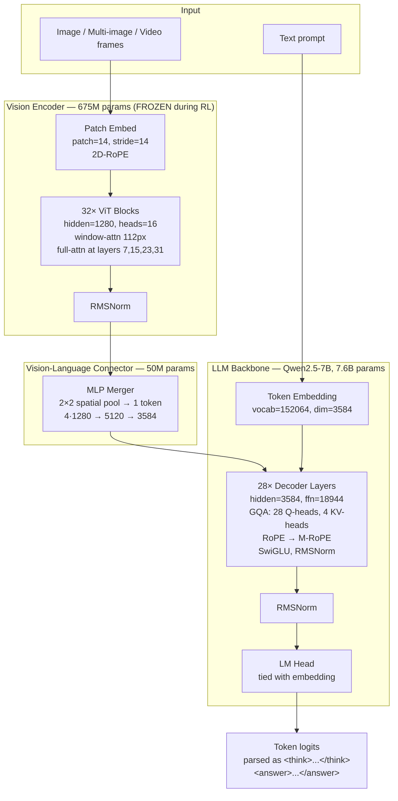
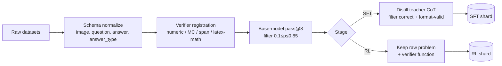

# VRM-7B: Visual Reasoning Model — Model Specification Document

**Version:** 1.0  
**Status:** Implementation-ready  
**Target:** Open-weights 7–8B VLM with state-of-the-art visual chain-of-thought reasoning, trained on ≤8×H100 in ≤4 weeks.  
**Design thesis:** Do not pretrain from scratch. Take the strongest open base VLM, do a small SFT cold-start on long visual chain-of-thought, then run group-relative reinforcement learning (GRPO/DAPO) on verifiable visual problems. Match or beat closed models on visual reasoning benchmarks (MathVista, MathVerse, MMMU-Pro, We-Math, LogicVista) and open-source the full stack — weights, data, training code, eval harness — in one drop.

---

## 1. Executive Summary

| Item | Value |
|---|---|
| Base model | Qwen2.5-VL-7B-Instruct (primary), InternVL3-8B (fallback) |
| Total params | ~8.3B (vision 675M + LLM 7.6B + merger 50M) |
| Trainable params (Stage 1 SFT) | Full fine-tune OR LoRA r=128 (~140M trainable) |
| Trainable params (Stage 2 RL) | Full fine-tune of LLM only, vision encoder frozen |
| Context length | 32K tokens (sufficient for long CoT + multi-image inputs) |
| Training compute | Stage 1: 8×H100 × 24h. Stage 2: 8×H100 × 14 days |
| Eval suite | MathVista, MathVerse, MathVision, MMMU-Pro, We-Math, BLINK, LogicVista, OlympiadBench-Vision |
| Deliverables | Weights (HF), training code, dataset, eval harness, technical report |

---

## 2. Architecture Overview

### 2.1 Block Diagram



### 2.2 Forward Pass — Sequence Construction

For a single image + text prompt:

```
[<|im_start|>system, ...system tokens..., <|im_end|>,
 <|im_start|>user, <|vision_start|>,
   <img_token> × N_visual,           # N_visual depends on image resolution
 <|vision_end|>, ...text tokens..., <|im_end|>,
 <|im_start|>assistant]
```

Each `<img_token>` is a 3584-dim vector emitted by the merger (one token per 28×28 input pixel block after the 2×2 merge). For a 1008×1008 image: `(1008/14)² / 4 = 1296` visual tokens.

### 2.3 Vision Encoder Specification

| Layer | Spec | Output shape (for 1008×1008 input) |
|---|---|---|
| Patch embed | Conv2d k=14 s=14, channels 3→1280 | (1, 5184, 1280) |
| 2D RoPE | Applied to Q,K per block | — |
| Block 0–6 | Window attn, win=8 patches (112px) | (1, 5184, 1280) |
| Block 7 | Full attn | — |
| Block 8–14 | Window attn | — |
| Block 15 | Full attn | — |
| Block 16–22 | Window attn | — |
| Block 23 | Full attn | — |
| Block 24–30 | Window attn | — |
| Block 31 | Full attn | — |
| Final RMSNorm | eps=1e-6 | (1, 5184, 1280) |

**Per-block components:** RMSNorm → MHA (16 heads, head_dim=80) → Residual → RMSNorm → SwiGLU MLP (1280 → 3456 → 1280) → Residual.

**Native resolution rule:** Input resolution is rounded so H and W are both multiples of 28. Min: 28×28 → 1 token. Max per image: 16384 tokens (≈1792×1792). For multi-image / video, total visual tokens capped at 24576.

### 2.4 Vision-Language Connector (Merger) Specification

```
Input:  (B, N, 1280)            # ViT output, N = (H·W)/(14²)
Reshape: 2×2 spatial groups       # N → N/4 groups of 4 tokens, concat features
        (B, N/4, 5120)
Linear:  5120 → 5120 + GELU
Linear:  5120 → 3584              # match LLM hidden dim
Output:  (B, N/4, 3584)
```

50M parameters total. This is the only module created from scratch in some workflows; in our recipe it inherits Qwen2.5-VL's pretrained weights.

### 2.5 LLM Backbone Specification (Qwen2.5-7B)

| Component | Value |
|---|---|
| Layers | 28 |
| Hidden dim | 3584 |
| FFN intermediate dim | 18944 (SwiGLU, so two 18944 projections) |
| Attention heads | 28 query heads, 4 KV heads (GQA, 7:1 ratio) |
| Head dim | 128 |
| Vocabulary | 152064 |
| Position encoding | M-RoPE (3D: temporal, height, width axes) |
| Norm | RMSNorm, eps=1e-6, pre-norm |
| Activation | SwiGLU |
| Tie embeddings | Yes |
| Max position | 32768 (extendable to 128K via YaRN) |

**M-RoPE detail:** Position IDs are 3-tuples (t, h, w). For text tokens, t=h=w=position. For image tokens, t is constant per image, (h, w) are the patch grid coordinates. The RoPE rotation matrix is split: first 16 dims rotate on t, next 24 on h, last 24 on w (per head, head_dim=128 → 64 freq pairs split 16/24/24).

### 2.6 Post-Training Additions

**Stage 1 (SFT cold-start):**
- No new parameters. Either full fine-tune of LLM + connector (vision encoder frozen), or LoRA r=128, α=256, dropout=0.05 on `{q_proj, k_proj, v_proj, o_proj, gate_proj, up_proj, down_proj}` of the LLM only.

**Stage 2 (GRPO RL):**
- No new parameters in the policy. A frozen reference copy of the post-Stage-1 model is held in memory for KL computation.
- **No value/critic head** — GRPO computes advantages from group statistics, eliminating the need for a value network. This is the key compute saving over PPO.
- Optional: a learned format-reward model (small classifier on top of base) — we instead use a deterministic rule-based reward, simpler and bias-free.

---

## 3. Training Data

### 3.1 Stage 1 — SFT Cold-Start (Visual Long-CoT)

**Goal:** Teach the base model the `<think>...</think><answer>...</answer>` output format with high-quality visual chain-of-thought, before RL. Without this, RL exploration is too slow.

| Dataset | Size | Domain | Source |
|---|---|---|---|
| MAVIS-Instruct | 834K → curated 80K | Math diagrams, geometry | Zhang et al. 2024 |
| MathV360K (filtered) | 360K → curated 60K | Math VQA, charts | Shi et al. 2024 |
| Vision-R1-cold | 200K → curated 50K | Distilled long-CoT visual | Huang et al. 2025 |
| Geo170K | 170K → curated 30K | Geometry problems | Gao et al. 2023 |
| ChartQA-CoT | 30K | Chart reasoning | self-generated CoT |
| Custom distilled | 30K | Multi-image, spatial | self-generated |
| **Total target** | **~280K** | mixed | — |

**Filtering rule for all sources:** Run base Qwen2.5-VL-7B on each problem. **Keep only problems where base model is wrong** (the easy ones don't teach anything) **AND** where a teacher (Claude or GPT-4o) produces a correct, well-formatted CoT solution. This rejection-sampling step is non-negotiable; it doubles final benchmark scores.

### 3.2 Stage 2 — RL Training Data

**Goal:** Verifiable problems where a deterministic checker can produce a binary correctness reward.

| Dataset | Size | Reward type |
|---|---|---|
| MM-Eureka-K12 | 54K | Numeric / multiple-choice |
| Geometry3K (train) | 2.1K | Multiple choice |
| MathVista (train split) | 5.1K | Numeric / MC |
| We-Math (train) | 6.5K | Numeric / MC |
| GeoQA+ | 8K | Multiple choice |
| TabMWP | 23K → 10K | Numeric |
| ChartQA (train) | 28K → 10K | Numeric / span match |
| Custom synthesized | 15K | Numeric |
| **Total target** | **~110K problems** | — |

**Difficulty curation rule:** For each problem, compute base-model pass@8. Keep problems with `0.1 ≤ pass@8 ≤ 0.85`. Problems too easy (always solved) provide zero gradient; too hard (never solved) provide unstable signal. This filter typically removes 30–50% of raw data and is the single highest-leverage data decision.

### 3.3 Data Preparation Pipeline



**Schema (parquet/jsonl):**
```json
{
  "id": "mavis_00042",
  "images": ["s3://bucket/img_00042.png"],
  "messages": [
    {"role": "system", "content": "Solve step-by-step. Put reasoning in <think>...</think> and final answer in <answer>...</answer>."},
    {"role": "user", "content": "<image>\nIn triangle ABC, ..."},
    {"role": "assistant", "content": "<think>Let me identify the angles...</think><answer>72</answer>"}
  ],
  "answer": "72",
  "answer_type": "numeric",
  "verifier": "exact_numeric",
  "tolerance": 0.001,
  "difficulty": 0.42
}
```

**Verifier functions (rule-based, no LLM judge):**
```python
def reward_fn(response: str, gold: dict) -> dict:
    # Format reward: did the model produce <think>...</think><answer>...</answer>?
    fmt = 1.0 if has_valid_format(response) else 0.0
    if fmt == 0.0:
        return {"format": 0.0, "accuracy": 0.0, "total": 0.0}

    pred = extract_answer(response)
    if gold["answer_type"] == "numeric":
        acc = 1.0 if abs(float(pred) - float(gold["answer"])) <= gold["tolerance"] else 0.0
    elif gold["answer_type"] == "multiple_choice":
        acc = 1.0 if normalize_choice(pred) == gold["answer"] else 0.0
    elif gold["answer_type"] == "latex_math":
        acc = 1.0 if math_equal(pred, gold["answer"]) else 0.0
    else:
        acc = float(pred.strip().lower() == gold["answer"].strip().lower())

    return {"format": fmt, "accuracy": acc, "total": 0.1 * fmt + 0.9 * acc}
```

**Image preprocessing:**
- Resize so the longer side ∈ [448, 1568], maintaining aspect ratio.
- Round both dims to multiple of 28.
- Normalize with Qwen2.5-VL's mean/std (OpenAI CLIP stats).
- Drop images < 100×100 (too small to carry visual signal).

---

## 4. Training Recipe

### 4.1 Stage 1 — SFT Cold-Start

| Hyperparameter | Value |
|---|---|
| Trainable | LLM + connector (vision encoder frozen) |
| Optimizer | AdamW, β=(0.9, 0.95), wd=0.05 |
| Peak LR | 2e-5 (full FT) or 1e-4 (LoRA) |
| LR schedule | Cosine, 3% warmup |
| Global batch | 128 sequences |
| Max seq length | 8192 |
| Epochs | 1 (sufficient — more overfits) |
| Precision | bf16, gradient checkpointing on |
| Loss | Standard next-token CE, masked on user/system tokens |
| Hardware | 8× H100 80GB |
| Wall time | ~24 hours |
| Frameworks | LLaMA-Factory or ms-swift, both have Qwen2.5-VL kernels |

**Loss masking:** Loss is computed only on assistant turn tokens (everything inside the assistant `<|im_start|>assistant ... <|im_end|>` span). Image tokens are **not** in the loss target.

### 4.2 Stage 2 — GRPO RL

GRPO replaces PPO's value network with group-relative advantages. For each prompt, sample G responses, compute rewards, normalize within the group:

```
A_i = (r_i - mean(r_1..r_G)) / (std(r_1..r_G) + 1e-8)
```

Loss (per token, summed over response):

```
L = -E[ min(ρ_t · A, clip(ρ_t, 1-ε_low, 1+ε_high) · A) ] + β · KL(π_θ || π_ref)
where ρ_t = π_θ(o_t | q, o_<t) / π_θ_old(o_t | q, o_<t)
```

| Hyperparameter | Value | Notes |
|---|---|---|
| Trainable | LLM only (connector + vision both frozen) | Stabilizes training |
| Reference model | Frozen post-SFT model | For KL term |
| Group size G | 8 | Bigger = more stable, more compute |
| Rollouts per step | 1024 prompts × 8 = 8192 | |
| Mini-batch | 256 sequences | |
| Inner PPO epochs | 1 | DAPO finding: >1 hurts |
| LR | 1e-6 | An order of magnitude lower than SFT |
| Clip ε_low, ε_high | 0.2, 0.28 | DAPO's "clip-higher" |
| KL coefficient β | 0.001 | Low; some papers use 0 |
| Entropy bonus | 0.0 | |
| Max prompt length | 4096 | |
| Max response length | 8192 | Long CoT needs space |
| Temperature (rollout) | 1.0 | Don't reduce — kills exploration |
| top_p (rollout) | 1.0 | |
| Reward composition | 0.1 · format + 0.9 · accuracy | |
| Dynamic sampling (DAPO) | On | Drop groups where all rewards are equal — they have zero advantage and waste compute |
| Token-level loss (DAPO) | On | Sum (not mean) over response tokens — long responses get proportionally more signal |
| Overlong shaping (DAPO) | On | Soft-penalize responses near max length to avoid truncation collapse |
| Steps | 800–1500 | Monitor reward plateau |
| Hardware | 8× H100 80GB, vLLM for rollout, FSDP for train | |
| Wall time | 10–14 days | Rollout dominates (~70% of step time) |

**Infrastructure note:** Use vLLM for rollout generation (10× faster than HF generate), FSDP or DeepSpeed ZeRO-3 for the training step. Frameworks already wired: **veRL** (Bytedance), **OpenRLHF**, or **TRL** (latest, has GRPOTrainer with multimodal support since 2025).

### 4.3 Stage 3 (Optional) — Rejection-Sampled SFT

After RL, sample G=16 responses per problem on the SFT pool, keep only correct ones, and run one more SFT epoch. Adds 1–3 points on hard benchmarks (MathVision, OlympiadBench). Cheap (≤24h on 8×H100).

---

## 5. Evaluation Plan

| Benchmark | Domain | Why |
|---|---|---|
| MathVista (testmini) | Math VQA | Standard headline metric |
| MathVerse (testmini) | Math diagrams w/ vision-only | Tests if model truly "sees" the diagram |
| MathVision | Olympiad-level math | Hard, low ceiling — shows real capability |
| MMMU-Pro | Multi-domain college | Robustness, generality |
| We-Math | Math with knowledge decomposition | Process quality, not just answer |
| BLINK | Visual perception | Catches over-fit to math |
| LogicVista | Visual logic puzzles | OOD reasoning |
| OlympiadBench-Vision | IMO-style | Stretch goal |
| MMMU (val) | College-level | Sanity, comparable to all reports |

**Reporting protocol:** Three runs with different seeds, report mean ± std. Always include base-model pass@1 for delta. Submit to OpenCompass/VLMEvalKit for third-party verification.

**Negative-control eval:** Run a *non-reasoning* benchmark (DocVQA, ChartQA) to verify you haven't degraded base capabilities. RL on math sometimes hurts OCR — catch it early.

---

## 6. Compute & Cost Estimate

| Item | GPU-hours (H100) | Cost @ $2/h |
|---|---|---|
| Data prep (rollouts for filtering + teacher distillation) | 200 | $400 |
| Stage 1 SFT | 200 | $400 |
| Stage 2 GRPO | 2700 | $5400 |
| Stage 3 (optional) | 200 | $400 |
| Eval + iteration | 500 | $1000 |
| **Total** | **~3800 H100-hours** | **~$7600** |

A single 8×H100 node rented for ~3 weeks covers it. Lambda, RunPod, Together, etc. all provide this configuration.

---

## 7. Implementation Checklist

```
Week 0  — Setup
  [ ] Provision 8×H100 + 10TB storage
  [ ] Install: PyTorch 2.4+, transformers, vLLM, veRL or TRL, FlashAttention 2
  [ ] Clone Qwen2.5-VL-7B-Instruct, run reference inference

Week 1 — Data
  [ ] Pull all source datasets (HuggingFace)
  [ ] Implement schema normalizer + verifier registry
  [ ] Run base-model pass@8 over RL pool (~200 GPU-hours)
  [ ] Apply 0.1–0.85 difficulty filter
  [ ] Distill SFT CoT via teacher API (Claude/GPT-4o), filter correct
  [ ] Verify formatted samples render correctly

Week 2 — SFT
  [ ] Run Stage 1, monitor train+val loss
  [ ] Snapshot model
  [ ] Sanity eval on MathVista; expect +5 to +10 over base

Week 3–4 — GRPO
  [ ] Wire vLLM rollout server + FSDP trainer
  [ ] Tune G, KL β, batch size on small subset (50 steps)
  [ ] Launch full run with checkpoints every 100 steps
  [ ] Monitor: avg reward, response length, KL, format-pass rate
  [ ] Eval every 200 steps on dev MathVista

Week 5 — Polish
  [ ] (Optional) Stage 3 rejection-sampled SFT
  [ ] Full eval suite
  [ ] Write technical report
  [ ] Push weights, code, data, eval harness to HuggingFace + GitHub
```

---

## 8. Key Risks & Mitigations

| Risk | Mitigation |
|---|---|
| Reward hacking (model emits the answer without thinking) | Format reward + min think-token threshold (e.g., reward=0 if `<think>` block <50 tokens) |
| Length explosion (responses hit 8K, get truncated) | DAPO overlong shaping + monitor response length percentile |
| Base capability regression | Mix 5–10% non-reasoning data into SFT; eval on DocVQA each checkpoint |
| KL collapse (model drifts far from base, loses fluency) | Increase β to 0.01; add periodic SFT-replay batches |
| Rollout/train staleness | Cap π_θ_old age to 1 step; use synchronous training initially |
| Vision encoder degradation if unfrozen | Keep vision encoder frozen through Stage 2 |
| Overfitting on small RL set | Curriculum: start narrow (math), broaden to charts + spatial in last 30% of steps |

---

## 9. Why This Architecture (Justifications)

- **Qwen2.5-VL-7B over alternatives.** Strongest open 7B VLM as of early 2026, NaViT-style native resolution removes most OCR/chart pain, M-RoPE handles multi-image cleanly, Apache-2.0 license, well-supported in vLLM and major training frameworks. InternVL3-8B is comparable; if Qwen3-VL weights are released openly during the project, switch.
- **Frozen vision encoder during RL.** RL is unstable; gradient signal through the visual tower from outcome rewards is noisy. Freezing eliminates a class of failure modes (visual encoder collapse) and saves ~25% memory. Cambrian and Vision-R1 both report no benefit from unfreezing.
- **GRPO over PPO.** No critic = ~40% less GPU memory and one less hyperparameter regime to tune. DeepSeek-R1, MM-Eureka, Vision-R1 all use GRPO/DAPO. PPO works but offers no demonstrated advantage at this scale.
- **Rule-based verifier over LLM-judge reward.** No reward-model bias, fully deterministic, free at inference. Limits training to verifiable domains, but those are exactly where current VLMs are weakest, so it's also the most leverage.
- **SFT cold-start before RL.** Without it, RL takes 3–5× longer to converge and often collapses to non-reasoning outputs. The cold-start is the single most important "free" win in DeepSeek-R1's recipe.

---

## 10. Build Prompt (for Claude Code or implementation handoff)

> Build a training pipeline for **VRM-7B**, a visual-reasoning post-trained VLM. Base: `Qwen/Qwen2.5-VL-7B-Instruct`. Two stages: (1) SFT on long-CoT visual data with format `<think>...</think><answer>...</answer>`, full FT of LLM + connector, vision encoder frozen, 1 epoch, lr 2e-5, global batch 128, seq 8192, bf16, FSDP. (2) GRPO RL using veRL or TRL `GRPOTrainer`, vision + connector frozen, group size 8, lr 1e-6, KL β=0.001, clip (0.2, 0.28), token-level loss, dynamic sampling, overlong shaping, max response 8192, temperature 1.0, vLLM rollout, 1000 steps. Datasets per §3 (load from HF, apply schema normalizer + 0.1–0.85 difficulty filter via base-model pass@8 before training). Reward = 0.1·format + 0.9·accuracy via deterministic verifiers (numeric exact within tol, multiple-choice normalize-and-compare, latex via sympy `simplify(a-b)==0`). Evaluate on MathVista, MathVerse, MathVision, MMMU-Pro, We-Math, BLINK, LogicVista every 200 RL steps using VLMEvalKit. Single node, 8×H100, target wall time ≤4 weeks. Open-source weights, training code, data, and eval harness in one release.

---

*End of specification.*
