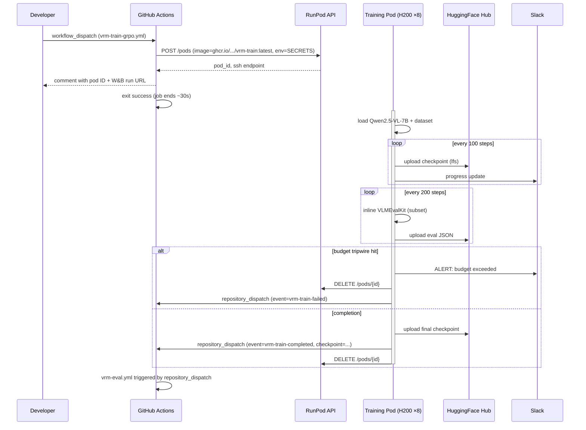

# VRM-7B Toolchain Design

**Status:** Approved 2026-05-02
**Owner:** Sumit Agrawal
**Spec:** [`../VRM-7B_model_spec.md`](../VRM-7B_model_spec.md)

This document captures the implementation toolchain decisions for shipping VRM-7B per spec. The model design is locked by the spec; this document only covers *how* we build, train, evaluate, and ship.

---

## 1. Stack

| Layer | Choice | Rationale |
|---|---|---|
| Base model | `Qwen/Qwen2.5-VL-7B-Instruct` | Per spec §1 |
| Compute | RunPod **Secure Cloud** 8×H200 SXM 141GB | SOC-2 dedicated hosts; H200 gives 141 GB HBM3e (vs H100's 80 GB), avoiding gradient-checkpointing for full FT |
| Stage 1 SFT framework | **LLaMA-Factory** (full-FT primary, LoRA r=128 fallback) | Has Qwen2.5-VL kernels; declarative YAML; spec §4.1 mentions it explicitly |
| Stage 2 RL framework | **TRL `GRPOTrainer`** + vLLM rollout server | HF native, multimodal landed 2025; rest of pipeline already uses HF stack |
| Stage 3 framework | LLaMA-Factory (same image) | Rejection-sampled SFT is structurally identical to Stage 1 |
| Eval | **VLMEvalKit** + custom negative-control runner | Canonical, OpenCompass-compatible; spec §10 |
| Teacher distillation | **Claude (Sonnet/Opus) + GPT-4o ensemble** | 2 candidates per problem; pick one with longer CoT that passes verifier |
| Storage (datasets) | **HuggingFace Hub** under `tech-sumit/` org | Versioned by data-build run number |
| Storage (training I/O) | **RunPod network volume** (~2 TB) | Persists across pod restarts; faster than HF Hub for hot data |
| Storage (final weights) | **HuggingFace Hub** | Public release at end |
| Secrets (CI) | **GitHub Actions repository secrets** | No Vault dependency for VRM |
| Secrets (local dev) | `.env` from `.env.example` | gitignored |
| Python deps | **uv** (lock file in repo) | 10× faster than pip; standard in 2026 ML projects |
| Container registry | **GHCR** (`ghcr.io/tech-sumit/vrm-train:<sha>` and `:latest`) | Free for public; OIDC auth from GH Actions |
| Code quality | **ruff** (lint+format), **pyright** (types), **pytest** | Standard Python toolchain |
| Tracking | **Weights & Biases** + JSON metrics dump per step | W&B for curves; JSON for offline analysis + release notes |
| Notifications | **Slack webhook** (optional) on milestones/failures | Pod self-reports |
| Interpretability (optional, Week 5) | **Qwen-Scope** SAE analysis | For technical report only; not on hot path |

## 2. Repo layout

Code lives in `projects/VRM-model/`. CI workflows live at repo root (`.github/workflows/`) but **path-filter** to `projects/VRM-model/**` so they don't fire on unrelated monorepo changes.

```
projects/VRM-model/
├── README.md                       # quickstart + ops cheatsheet
├── VRM-7B_model_spec.md           # locked model spec (don't edit without versioning)
├── pyproject.toml + uv.lock       # uv-managed Python project
├── .python-version                # 3.11
├── .env.example                   # template; .env is gitignored
├── Makefile                       # local CLI mirror of CI workflows
├── docker/
│   ├── train.Dockerfile           # CUDA 12.4 + PyTorch 2.4 + LF + TRL + vLLM + flash-attn
│   ├── eval.Dockerfile            # leaner; just inference + VLMEvalKit
│   └── dataprep.Dockerfile        # CPU; for filtering + teacher API calls
├── configs/
│   ├── stage1_sft_full.yaml       # LLaMA-Factory full-FT YAML
│   ├── stage1_sft_lora.yaml       # LoRA fallback
│   ├── stage2_grpo.yaml           # TRL GRPOTrainer + vLLM rollout config
│   ├── stage3_rejection_sft.yaml
│   ├── eval/
│   │   ├── full.yaml              # all benchmarks per spec §5
│   │   ├── quick.yaml             # MathVista only (CI smoke)
│   │   └── negative_control.yaml  # DocVQA, ChartQA — capability regression
│   └── data/
│       ├── sft_recipe.yaml        # SFT dataset mix + filter thresholds
│       └── rl_recipe.yaml         # RL dataset mix + verifier mapping
├── src/vrm/
│   ├── __init__.py
│   ├── data/
│   │   ├── schema.py              # Pydantic record schema (per spec §3.3)
│   │   ├── normalize/             # one module per source dataset
│   │   │   ├── mavis.py
│   │   │   ├── mathv360k.py
│   │   │   ├── vision_r1_cold.py
│   │   │   ├── geo170k.py
│   │   │   ├── chartqa.py
│   │   │   ├── mm_eureka.py
│   │   │   ├── geometry3k.py
│   │   │   ├── mathvista.py
│   │   │   ├── we_math.py
│   │   │   ├── geoqa.py
│   │   │   └── tabmwp.py
│   │   ├── filter.py              # base-model pass@8 difficulty filter
│   │   ├── distill.py             # Claude+GPT-4o teacher ensemble
│   │   └── verifiers/
│   │       ├── numeric.py
│   │       ├── multiple_choice.py
│   │       ├── latex_math.py      # via sympy
│   │       └── span.py
│   ├── train/
│   │   ├── stage1_sft.py          # thin LF wrapper (spawns llamafactory-cli)
│   │   ├── stage2_grpo.py         # TRL wrapper, wires reward fn + vLLM rollout
│   │   ├── stage3_rejection.py
│   │   └── reward.py              # composite 0.1·format + 0.9·acc per spec §3.3
│   ├── eval/
│   │   ├── run_vlmevalkit.py      # spawns vlmeval CLI, parses JSON
│   │   ├── parse_results.py       # JSON → markdown report
│   │   └── compare.py             # delta vs base / vs prior checkpoint
│   └── infra/
│       ├── runpod.py              # pod create/destroy/ssh via RunPod REST API
│       ├── hf_hub.py              # checkpoint upload helpers
│       ├── budget.py              # GPU-hour tripwire / Slack alerts
│       └── webhook.py             # post status back to GH via repository_dispatch
├── scripts/
│   ├── runpod-up.sh               # provision pod + mount volume + pull image
│   ├── runpod-down.sh
│   ├── pod-entrypoint.sh          # what runs INSIDE the pod (training driver)
│   ├── smoke-base-inference.sh    # sanity-check Qwen2.5-VL-7B reference inference
│   └── push-to-hf.sh
├── tests/
│   ├── unit/
│   │   ├── test_schema.py
│   │   ├── test_verifiers.py
│   │   ├── test_filter.py
│   │   └── test_reward.py
│   └── integration/
│       └── test_normalize_one_per_source.py
└── docs/
    ├── design.md                  # this doc
    ├── plan.md                    # implementation plan (bite-sized tasks)
    ├── runbook.md                 # how to operate end-to-end
    └── budgets.md                 # GPU-hour / $ tripwire policy

# At monorepo root:
.github/workflows/
├── vrm-ci.yml                     # PR lint/test/typecheck + image build on main
├── vrm-data-build.yml             # workflow_dispatch: build dataset shards
├── vrm-train-sft.yml              # workflow_dispatch: kick off Stage 1
├── vrm-train-grpo.yml             # workflow_dispatch: kick off Stage 2
├── vrm-eval.yml                   # repository_dispatch + manual: eval a checkpoint
└── vrm-release.yml                # on tag: promote to public HF + GH Release
```

## 3. CI/CD on GitHub Actions

All workflows live at `.github/workflows/` (monorepo root) and use:

```yaml
on:
  pull_request:
    paths: ['projects/VRM-model/**', '.github/workflows/vrm-*.yml']
  push:
    branches: [main]
    paths: ['projects/VRM-model/**', '.github/workflows/vrm-*.yml']
```

…or `workflow_dispatch` / `repository_dispatch` for the manual + pod-callback workflows.

### 3.1 Workflow inventory

| Workflow | Trigger | Runner | Job |
|---|---|---|---|
| `vrm-ci.yml` | PR / push | `ubuntu-latest` | uv install · ruff · pyright · pytest unit + integration · build `train.Dockerfile` to GHCR (only on `main`) |
| `vrm-data-build.yml` | `workflow_dispatch` (inputs: `recipe`, `data_version`) | `ubuntu-latest` | Provisions a CPU-only RunPod pod, runs `vrm.data.{normalize,filter,distill}`, pushes shards to HF Hub `tech-sumit/vrm-7b-{sft,rl}-v{N}` |
| `vrm-train-sft.yml` | `workflow_dispatch` (inputs: `data_version`, `run_name`, `mode={full,lora}`) | `ubuntu-latest` | Calls RunPod API → 8×H200 pod with `train` image; pod runs Stage 1; checkpoints to HF Hub; webhook back to GH on completion |
| `vrm-train-grpo.yml` | `workflow_dispatch` (inputs: `sft_checkpoint`, `data_version`, `run_name`, `steps`) | `ubuntu-latest` | Same pattern; Stage 2; periodic eval inline every 200 steps |
| `vrm-eval.yml` | `repository_dispatch` (from pod) OR `workflow_dispatch` | `ubuntu-latest` | 1×H200 eval pod; runs VLMEvalKit; comments results on PR or attaches to GH release |
| `vrm-release.yml` | git tag matching `vrm-7b-v*.*.*` | `ubuntu-latest` | Copies weights from internal HF repo to public org repo; generates report from eval JSON; creates GH Release |

### 3.2 Pod-driven training pattern

GH Actions runners only **start and monitor**; the pod **drives its own lifecycle**.



This pattern gives us:
- **No GH Actions 6h job timeout** — the kicker job exits quickly.
- **Cost visibility** — pod self-tracks GPU-hours; budget tripwire is enforced at pod level (cannot be bypassed by stuck CI).
- **Resumability** — if pod dies, latest HF Hub checkpoint can be used to launch a fresh pod from the last step.

### 3.3 Required GitHub Actions secrets

| Secret | Used by | Notes |
|---|---|---|
| `RUNPOD_API_KEY` | All workflows that touch pods | RunPod console → Settings → API Keys |
| `HF_TOKEN` | All workflows | HuggingFace token with write scope on `tech-sumit/` org |
| `ANTHROPIC_API_KEY` | `vrm-data-build.yml` (distill phase) | Optional; only needed for SFT distillation |
| `OPENAI_API_KEY` | `vrm-data-build.yml` (distill phase) | Optional |
| `WANDB_API_KEY` | All training workflows | If absent, training falls back to JSON-only logging |
| `SLACK_WEBHOOK_VRM` | All workflows (notifications) | Optional |
| `GHCR_PAT` | `vrm-ci.yml` (image push) | Or use `${{ secrets.GITHUB_TOKEN }}` with `packages: write` permission |

## 4. Local developer workflow

```bash
cd projects/VRM-model
cp .env.example .env       # fill in tokens for local testing
uv sync                    # install deps from uv.lock
make smoke                 # validate base Qwen2.5-VL-7B inference works locally (CPU/MPS)
make test                  # run pytest
make lint                  # ruff + pyright

# Operations against RunPod (uses .env tokens, mirrors CI):
make data DATA_VERSION=v1
make train-sft DATA_VERSION=v1 RUN_NAME=sft-2026-05-03
make train-grpo SFT_CHECKPOINT=tech-sumit/vrm-7b-sft-2026-05-03 DATA_VERSION=v1 RUN_NAME=grpo-2026-05-04
make eval CHECKPOINT=tech-sumit/vrm-7b-grpo-2026-05-04 SUITE=full
```

## 5. Key trade-offs

1. **Pod-driven, not GH-driven training.** Trade: less centralized log streaming (you check W&B / HF Hub commit log instead of GH Actions log). Gain: no 6h job timeout, no self-hosted runner overhead.
2. **Pre-built Docker image to GHCR.** Trade: ~10min CI on every merge. Gain: ~5min faster pod cold start (×~10 pods over project lifetime = ~50min saved).
3. **HF Hub for everything (no S3/R2).** Trade: HF Hub has ~300 GB free org storage; large checkpoint runs may need a paid tier (~$20/mo for 1 TB). Gain: one fewer credential, integrated with HF model card workflow.
4. **Inline eval during Stage 2.** Trade: eval pauses training. Gain: no separate eval pod cold start; only ~3h total over 14 days.
5. **`uv` not `pip`.** Trade: contributors need to install uv (one curl line). Gain: 10× faster, deterministic lockfile.
6. **TRL GRPO over veRL.** Trade: veRL is faster on async rollout (~20% step time). Gain: TRL is the HF standard, integrates with our HF stack, easier to debug.
7. **Both Claude + GPT-4o for distillation.** Trade: ~2× teacher API cost (~$2-5K). Gain: more diverse CoT, fewer rejected samples.
8. **Budget tripwire baked in.** Default `MAX_USD_SPEND` per pod: $1500 (SFT), $7500 (RL). Pod self-destructs if exceeded; cannot be disabled by Cl bug.

## 6. Estimated cost

| Phase | GPU-hours (H200-equiv) | $ @ $4/hr/GPU on H200 |
|---|---|---|
| Smoke + reference inference | 4 | $32 |
| Data prep (filter rollouts + teacher API) | 200 GPU-h + ~$2-5K teacher API | $1.6K + $3K = ~$4.6K |
| Stage 1 SFT | 200 | $800 |
| Stage 2 GRPO | 2700 | $10,800 |
| Stage 3 (optional) | 200 | $800 |
| Eval iterations | 500 | $2,000 |
| **Total (with optional Stage 3)** | **~3800 GPU-h + APIs** | **~$19K** |
| **Total (skip Stage 3)** | **~3600 GPU-h + APIs** | **~$18K** |

Spec §6 budget was $7.6K on H100 — we're at ~2.4× because of (a) H200 vs H100 pricing premium, (b) ensemble teacher distillation. Worth it for memory headroom and CoT diversity.

## 7. Out of scope

- Multi-node training (single 8×H200 node sufficient per spec).
- Quantization / INT8 inference (spec is bf16; quantization is a post-release exercise).
- Dataset construction beyond what spec §3 calls for (no novel data generation pipelines).
- Web UI / serving stack (release is weights + code only; serving is a separate project).
- Cross-cloud failover (RunPod-only; if RunPod is down, training pauses).

## 8. Open questions / future work

- **Qwen-Scope SAE analysis** for technical report (Week 5 stretch). Independent of training.
- **Switch to Qwen3-VL** if released openly during the project (per spec §9). Would require re-running Stage 1 + small RL adjustments.
- **veRL migration** if TRL GRPO performance becomes a bottleneck (>14 day runs).
- **Self-hosted GH runner on RunPod** to stream logs natively if pod webhook pattern proves brittle.

---

*End of design document.*
