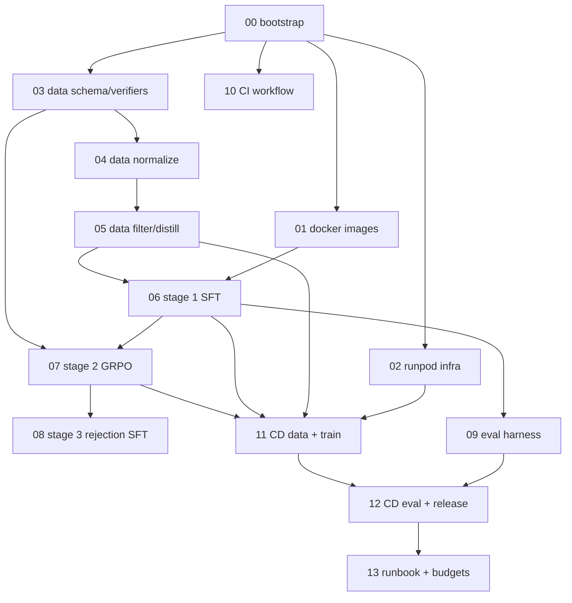

# VRM-7B Implementation Plan — Index

> **For agentic workers:** Each sub-plan is self-contained with bite-sized tasks (2-5 min each) using checkbox (`- [ ]`) syntax. Execute sub-plans in dependency order (see graph below). Frequent commits after each task.

**Goal:** Stand up the complete VRM-7B training, evaluation, and CI/CD toolchain so that the team can run Stage 1 SFT → Stage 2 GRPO → Eval → Public release end-to-end on RunPod Secure Cloud 8×H200.

**Architecture:** Path-gated GitHub Actions orchestrate RunPod pods that drive their own training/eval lifecycle. Pods checkpoint to HuggingFace Hub and webhook back to GitHub on completion. See [`design.md`](design.md) for full architecture rationale.

**Tech Stack:** Python 3.11 (uv) · LLaMA-Factory · TRL GRPOTrainer · vLLM · VLMEvalKit · Docker on GHCR · GitHub Actions · RunPod Secure Cloud H200 · HuggingFace Hub · Weights & Biases.

---

## Sub-plans

| # | Sub-plan | Purpose | Status |
|---|---|---|---|
| 00 | [bootstrap](plans/00-bootstrap.md) | uv project skeleton, pyproject, README, Makefile, .env.example | ✅ |
| 01 | [docker-images](plans/01-docker-images.md) | train / eval / dataprep Dockerfiles for GHCR | ✅ |
| 02 | [runpod-infra](plans/02-runpod-infra.md) | `vrm.infra.{runpod,budget,webhook,hf_hub}` + pod entrypoint scripts | ✅ |
| 03 | [data-schema-verifiers](plans/03-data-schema-verifiers.md) | Pydantic record schema + numeric/MC/latex/span verifiers + tests | ✅ |
| 04 | [data-normalize](plans/04-data-normalize.md) | One normalizer per source dataset (MAVIS, MathV360K, ...) | ✅ |
| 05 | [data-filter-distill](plans/05-data-filter-distill.md) | pass@8 difficulty filter + Claude+GPT-4o teacher ensemble | ✅ |
| 06 | [stage1-sft](plans/06-stage1-sft.md) | LLaMA-Factory wrapper + Stage 1 SFT YAML configs | ✅ |
| 07 | [stage2-grpo](plans/07-stage2-grpo.md) | TRL `GRPOTrainer` wrapper + reward fn + vLLM rollout config | ✅ |
| 08 | [stage3-rejection-sft](plans/08-stage3-rejection-sft.md) | Optional rejection-sampled SFT (Week 5) | ✅ |
| 09 | [eval-harness](plans/09-eval-harness.md) | VLMEvalKit wrapper + report parser + comparator + negative control | ✅ |
| 10 | [ci-workflow](plans/10-ci-workflow.md) | `.github/workflows/vrm-ci.yml` (lint/test/typecheck + image build) | ✅ |
| 11 | [cd-data-and-train](plans/11-cd-data-and-train.md) | `vrm-data-build`, `vrm-train-sft`, `vrm-train-grpo` workflows | ✅ |
| 12 | [cd-eval-release](plans/12-cd-eval-release.md) | `vrm-eval` (dispatch + manual) + `vrm-release` (on tag) workflows | ✅ |
| 13 | [runbook-budgets](plans/13-runbook-budgets.md) | `docs/runbook.md` + `docs/budgets.md` for ops handoff | ✅ |

## Dependency graph

## Recommended execution order

1. **Foundation (parallel-safe):** 00 → then 01, 02, 03, 10 in parallel.
2. **Data pipeline:** 04 → 05.
3. **Stage 1:** 06 → 09 (so eval harness exists by time you snapshot).
4. **CI on green code:** wire 10 to actually run on `main` once tests exist.
5. **Stage 2:** 07.
6. **CD pipeline:** 11 → 12.
7. **Polish:** 08 (optional), 13.

## Status conventions

- ☐ Not started
- 🚧 In progress
- ✅ Done
- ⚠️ Blocked (note in sub-plan)

Update the table above as sub-plans complete. Each sub-plan has its own task checklist for fine-grained progress.

## Acceptance criteria for "shipped"

- [ ] All 14 sub-plans marked ✅.
- [ ] `make smoke && make test && make lint` green locally.
- [ ] `vrm-ci.yml` green on `main`.
- [ ] At least one successful end-to-end pod-driven Stage 1 SFT run (small subset, 100 steps) with checkpoint on HF Hub and eval JSON in W&B.
- [ ] Runbook (sub-plan 13) reviewed by Sumit.

---

*Index version: 1.0 · Created: 2026-05-02 · See [`design.md`](design.md) for architectural rationale.*
