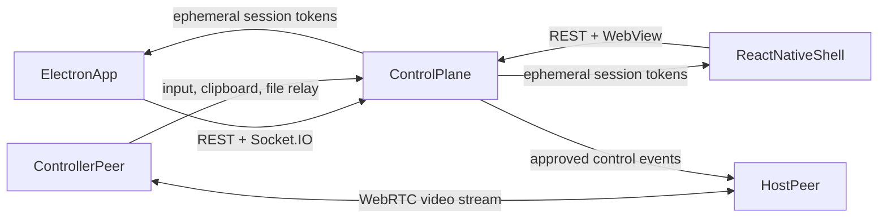

# Architecture

## Workspace Layout

```text
projects/nord-meshnet-remote-desktop/
├── apps/
│   ├── desktop/        # Electron host + controller
│   └── mobile/         # React Native shell for controller + host beta
├── services/
│   └── control-plane/  # Pairing, approvals, registry, signaling, audit
├── packages/
│   ├── crypto/         # Session token signing + pairing helpers
│   ├── native-bridges/ # Host capability and bridge contracts
│   └── protocol/       # Shared session schemas and event types
└── scripts/            # Project helpers
```

## System Flow



## Core Design Choices

- Media transport uses peer-to-peer WebRTC to keep the high-bandwidth path off the control plane.
- Pairing, approvals, audit, device presence, and fallback control channels stay on the private control plane.
- Capabilities are negotiated per device so unsupported host features degrade gracefully instead of breaking the whole session.
- Mobile hosting is explicitly separated into `available`, `beta`, and `gated` capability states.

## Device Capability Model

Every device advertises a `HostCapabilities` object that tells the control plane and clients whether it can:

- capture the screen
- inject pointer input
- inject keyboard input
- sync clipboard
- transfer files
- allow unattended access
- act as a beta mobile host

This lets the desktop path ship first while Android host and iOS host stay truthful about what is and is not available.

## Security Model

- Every device stores a long-lived local `deviceSecret`.
- Pairing codes are short-lived and must be claimed before use.
- Each approved session gets an ephemeral signed token with session ID, device ID, role, and expiry.
- Session audit events are written to the local control-plane log and can be mirrored into n8n or Vault-backed flows.

## Desktop Host Flow

1. Desktop app registers with the control plane and marks itself online.
2. Host creates a pairing code or receives an unattended session request.
3. Once approved, the controller sends a WebRTC offer.
4. Host auto-selects the primary display for capture.
5. Input, clipboard, and small file transfers are relayed through the control plane and executed locally through the desktop host bridge.

## Mobile Controller Flow

1. Mobile shell stores the control-plane base URL and device identity.
2. The device list and pairing actions use REST.
3. A session launches inside a WebView that renders the hosted controller page.
4. The hosted page receives the remote stream and emits normalized touch gestures as remote pointer events.

## Mobile Host Strategy

- `Android`: host bridge contract is implemented now so a native MediaProjection/accessibility bridge can be dropped in without redesigning the rest of the system.
- `iOS`: host control remains capability-gated and documented as an enterprise/private-distribution track.

## Observability

- `/health` returns service and device/session counters for local checks.
- `/metrics` exposes Prometheus metrics for Alloy.
- JSON log files under `services/control-plane/runtime/` can be tailed into Loki.
